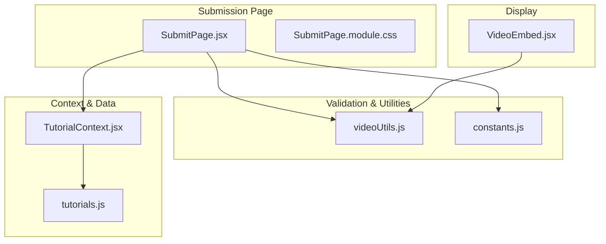
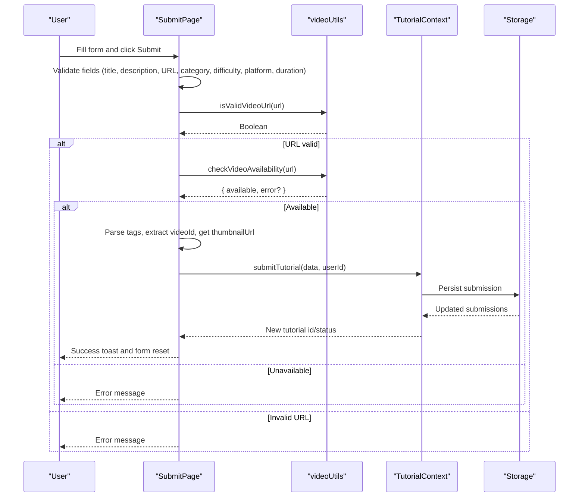
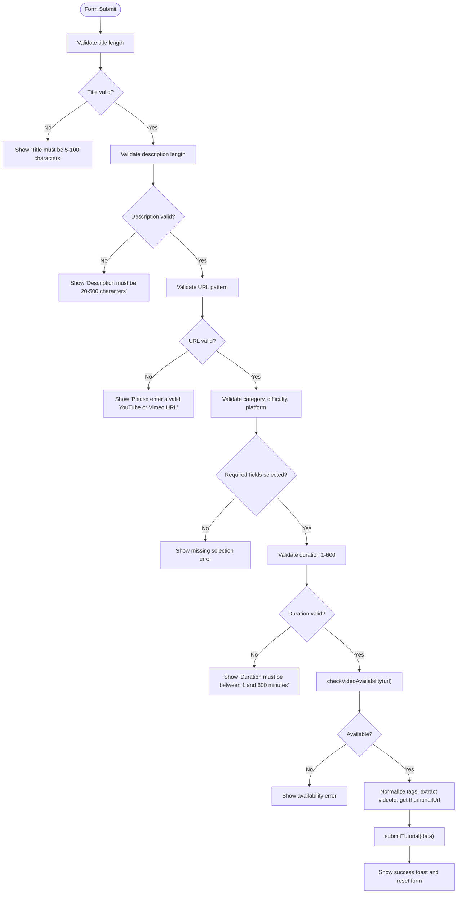
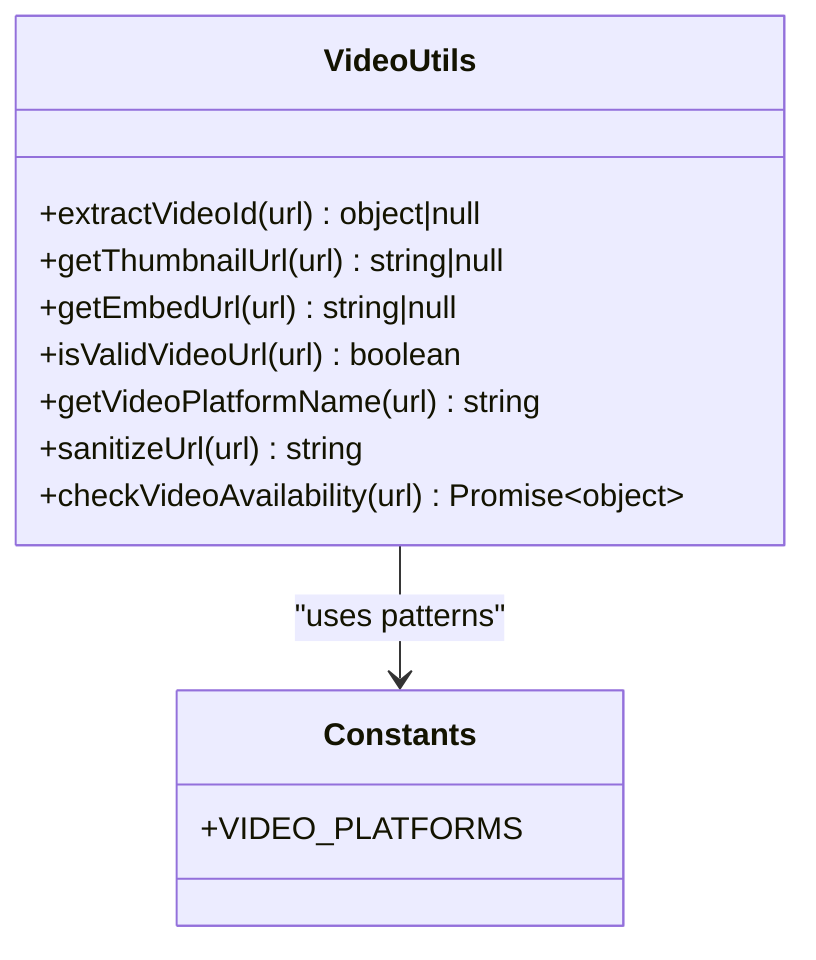
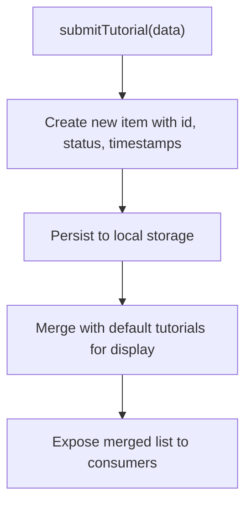
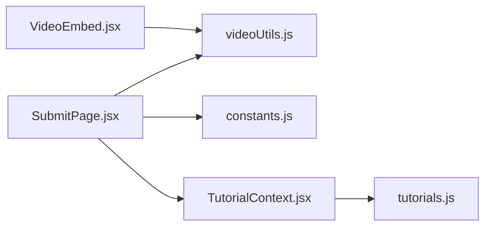

# Tutorial Submission Form

<cite>
**Referenced Files in This Document**
- [SubmitPage.jsx](file://src/pages/SubmitPage.jsx)
- [videoUtils.js](file://src/utils/videoUtils.js)
- [constants.js](file://src/data/constants.js)
- [TutorialContext.jsx](file://src/contexts/TutorialContext.jsx)
- [tutorials.js](file://src/data/tutorials.js)
- [VideoEmbed.jsx](file://src/components/VideoEmbed.jsx)
- [SubmitPage.module.css](file://src/pages/SubmitPage.module.css)
- [useTutorials.js](file://src/hooks/useTutorials.js)
- [videoUtils.test.js](file://src/utils/__tests__/videoUtils.test.js)
</cite>

## Table of Contents
1. [Introduction](#introduction)
2. [Project Structure](#project-structure)
3. [Core Components](#core-components)
4. [Architecture Overview](#architecture-overview)
5. [Detailed Component Analysis](#detailed-component-analysis)
6. [Dependency Analysis](#dependency-analysis)
7. [Performance Considerations](#performance-considerations)
8. [Troubleshooting Guide](#troubleshooting-guide)
9. [Conclusion](#conclusion)

## Introduction
This document explains the tutorial submission process and form functionality. It covers the submission form interface, input validation, category and difficulty selection, difficulty tagging, and video URL processing. It also documents video URL sanitization and validation, supported platforms, and embed code extraction. The guide details form field requirements, validation rules, error handling, the submission workflow from form completion to tutorial availability, metadata collection, examples of valid submission formats, common submission errors, and security measures.

## Project Structure
The tutorial submission feature spans several modules:
- The submission page renders the form and orchestrates validation and submission.
- Utility functions handle video URL parsing, sanitization, availability checks, and embed URL generation.
- Constants define selectable categories, difficulties, platforms, engine versions, and supported video platforms.
- The tutorial context manages submission storage and merges submissions with default tutorials.
- The video embed component displays videos with fallbacks and sanitization.

**Diagram sources**
- [SubmitPage.jsx:1-388](file://src/pages/SubmitPage.jsx#L1-L388)
- [videoUtils.js:1-119](file://src/utils/videoUtils.js#L1-L119)
- [constants.js:1-71](file://src/data/constants.js#L1-L71)
- [TutorialContext.jsx:1-542](file://src/contexts/TutorialContext.jsx#L1-L542)
- [tutorials.js:1-522](file://src/data/tutorials.js#L1-L522)
- [VideoEmbed.jsx:1-87](file://src/components/VideoEmbed.jsx#L1-L87)

**Section sources**
- [SubmitPage.jsx:1-388](file://src/pages/SubmitPage.jsx#L1-L388)
- [videoUtils.js:1-119](file://src/utils/videoUtils.js#L1-L119)
- [constants.js:1-71](file://src/data/constants.js#L1-L71)
- [TutorialContext.jsx:1-542](file://src/contexts/TutorialContext.jsx#L1-L542)
- [tutorials.js:1-522](file://src/data/tutorials.js#L1-L522)
- [VideoEmbed.jsx:1-87](file://src/components/VideoEmbed.jsx#L1-L87)

## Core Components
- Submission Form (SubmitPage): Renders the form, handles user input, performs client-side validation, and submits tutorials.
- Video Utilities (videoUtils): Parses URLs, extracts IDs, generates embed URLs, retrieves thumbnails, validates URLs, and checks availability.
- Constants (constants): Defines categories, difficulties, platforms, engine versions, and supported video platform patterns.
- Tutorial Context (TutorialContext): Stores submissions, merges with default tutorials, and exposes submission APIs.
- Video Embed (VideoEmbed): Displays embedded videos with sanitization and fallbacks.

Key responsibilities:
- Validation: Title length, description length, required fields, duration bounds, and URL validity.
- Metadata: Title, description, URL, category, difficulty, platform, engine version, tags, duration, prerequisites, author.
- Video processing: Extract video ID, derive thumbnail URL, and verify availability via oEmbed endpoints.
- Submission workflow: On successful validation, submit tutorial data and reset the form.

**Section sources**
- [SubmitPage.jsx:10-173](file://src/pages/SubmitPage.jsx#L10-L173)
- [videoUtils.js:3-48](file://src/utils/videoUtils.js#L3-L48)
- [constants.js:1-71](file://src/data/constants.js#L1-L71)
- [TutorialContext.jsx:353-370](file://src/contexts/TutorialContext.jsx#L353-L370)
- [VideoEmbed.jsx:6-81](file://src/components/VideoEmbed.jsx#L6-L81)

## Architecture Overview
The submission flow integrates UI, validation, and persistence:

**Diagram sources**
- [SubmitPage.jsx:78-173](file://src/pages/SubmitPage.jsx#L78-L173)
- [videoUtils.js:41-118](file://src/utils/videoUtils.js#L41-L118)
- [TutorialContext.jsx:353-370](file://src/contexts/TutorialContext.jsx#L353-L370)

## Detailed Component Analysis

### Submission Form (SubmitPage)
Responsibilities:
- Render form fields: title, video URL, description, category, difficulty, platform, engine version, duration, tags, prerequisites.
- Client-side validation: enforce length limits, required selections, numeric duration range, and URL validity.
- Video verification: asynchronously check availability via oEmbed endpoints.
- Metadata preparation: normalize tags, extract video ID and thumbnail URL.
- Submission: call context submit function and show success feedback.

Validation rules:
- Title: 5–100 characters.
- Description: 20–500 characters.
- URL: Must match supported platform patterns.
- Category, difficulty, platform: required selections.
- Duration: integer between 1 and 600 minutes.
- Tags: comma-separated, trimmed, lowercase, max 5.

Prerequisites:
- Optional, up to 5 items.
- Search-as-you-type dropdown with a cap of 5 suggestions.
- Click to add; remove via × button.

Styling:
- Responsive two-column layout for category/difficulty and platform/engine version.
- Required field indicators and hints.
- Disabled submit button during availability check.

**Diagram sources**
- [SubmitPage.jsx:78-173](file://src/pages/SubmitPage.jsx#L78-L173)
- [videoUtils.js:67-118](file://src/utils/videoUtils.js#L67-L118)

**Section sources**
- [SubmitPage.jsx:10-173](file://src/pages/SubmitPage.jsx#L10-L173)
- [SubmitPage.module.css:20-147](file://src/pages/SubmitPage.module.css#L20-L147)

### Video Utilities (videoUtils)
Functions:
- extractVideoId(url): Matches supported platform patterns and returns platform and videoId.
- getThumbnailUrl(url): Generates YouTube thumbnail URL; returns null for Vimeo.
- getEmbedUrl(url): Builds embed URL for YouTube or Vimeo.
- isValidVideoUrl(url): Delegates to extractVideoId.
- getVideoPlatformName(url): Returns platform name or "Unknown".
- sanitizeUrl(url): Validates protocol and blocks unsafe schemes.
- checkVideoAvailability(url): Uses oEmbed endpoints to verify video existence; handles no-cors and network fallbacks.

Supported platforms and patterns:
- YouTube: watch, youtu.be, embed variants.
- Vimeo: numeric video ID.

**Diagram sources**
- [videoUtils.js:3-48](file://src/utils/videoUtils.js#L3-L48)
- [constants.js:55-70](file://src/data/constants.js#L55-L70)

**Section sources**
- [videoUtils.js:3-118](file://src/utils/videoUtils.js#L3-L118)
- [constants.js:55-70](file://src/data/constants.js#L55-L70)

### Constants (categories, difficulties, platforms, engine versions, video platforms)
- Categories: 2D, 3D, Programming, Art, Audio, Game Design.
- Difficulties: Beginner, Intermediate, Advanced.
- Platforms: Unity, Unreal Engine, Godot, GameMaker, Custom.
- Engine versions: LTS and latest versions for supported engines.
- VIDEO_PLATFORMS: Patterns for YouTube and Vimeo.

These lists drive the form dropdowns and validation messages.

**Section sources**
- [constants.js:1-71](file://src/data/constants.js#L1-L71)

### Tutorial Context (submission storage and merging)
- Maintains submissions in local storage.
- Merges submissions with default tutorials for display.
- Provides submitTutorial, getUserSubmissions, editSubmission, deleteSubmission.
- Sets initial status to approved upon submission.

**Diagram sources**
- [TutorialContext.jsx:353-370](file://src/contexts/TutorialContext.jsx#L353-L370)
- [tutorials.js:1-522](file://src/data/tutorials.js#L1-L522)

**Section sources**
- [TutorialContext.jsx:353-370](file://src/contexts/TutorialContext.jsx#L353-L370)
- [tutorials.js:1-522](file://src/data/tutorials.js#L1-L522)

### Video Embed Component (display and fallbacks)
- Generates embed URL from video URL.
- Sanitizes URL to prevent XSS.
- Shows loading state and error fallback with external link.
- Displays a fallback message when embed is not available.

**Section sources**
- [VideoEmbed.jsx:6-81](file://src/components/VideoEmbed.jsx#L6-L81)
- [videoUtils.js:28-60](file://src/utils/videoUtils.js#L28-L60)

## Dependency Analysis
- SubmitPage depends on:
  - useAuth (authentication guard),
  - useTutorials (submit function and tutorial list),
  - useToast (feedback),
  - videoUtils (validation and processing),
  - constants (dropdown options),
  - CSS module (styling).
- videoUtils depends on constants for platform patterns.
- TutorialContext stores submissions and merges with default tutorials.
- VideoEmbed depends on videoUtils for embed URL and sanitization.

**Diagram sources**
- [SubmitPage.jsx:1-8](file://src/pages/SubmitPage.jsx#L1-L8)
- [videoUtils.js:1](file://src/utils/videoUtils.js#L1)
- [constants.js:1](file://src/data/constants.js#L1)
- [TutorialContext.jsx:1-5](file://src/contexts/TutorialContext.jsx#L1-L5)
- [tutorials.js:1](file://src/data/tutorials.js#L1)
- [VideoEmbed.jsx:1-4](file://src/components/VideoEmbed.jsx#L1-L4)

**Section sources**
- [SubmitPage.jsx:1-8](file://src/pages/SubmitPage.jsx#L1-L8)
- [useTutorials.js:1-11](file://src/hooks/useTutorials.js#L1-L11)

## Performance Considerations
- Availability checks use oEmbed endpoints; they may fail under no-cors restrictions. The implementation falls back to a full fetch and tolerates network errors by returning a warning while still allowing submission.
- Tag normalization trims and slices to 5 items to keep metadata compact.
- Prerequisite search caps suggestions to 5 and filters out duplicates.
- Thumbnail generation for YouTube is immediate; Vimeo thumbnails require an API call, so they are not generated client-side.

[No sources needed since this section provides general guidance]

## Troubleshooting Guide
Common submission errors and resolutions:
- Title too short/long: Ensure title is between 5 and 100 characters.
- Description too short/long: Ensure description is between 20 and 500 characters.
- Invalid video URL: Use supported platforms (YouTube or Vimeo) with valid IDs.
- Missing required selections: Choose category, difficulty, and platform.
- Invalid duration: Enter a whole number between 1 and 600 minutes.
- Video unavailable: The system verifies via oEmbed; if removed or private, adjust URL or duration.
- Too many prerequisites: Limit to 5.

Security and moderation notes:
- URL sanitization allows http/https only and blocks dangerous schemes.
- Embed rendering uses sanitized URLs and iframe sandbox attributes.
- Submissions are stored locally and merged with default tutorials; moderation is handled by setting status and filtering in the context.

**Section sources**
- [SubmitPage.jsx:82-126](file://src/pages/SubmitPage.jsx#L82-L126)
- [videoUtils.js:50-60](file://src/utils/videoUtils.js#L50-L60)
- [VideoEmbed.jsx:6-81](file://src/components/VideoEmbed.jsx#L6-L81)
- [TutorialContext.jsx:353-370](file://src/contexts/TutorialContext.jsx#L353-L370)

## Conclusion
The tutorial submission form provides a robust, user-friendly pathway for contributors to share video tutorials. It enforces strict validation rules, sanitizes and verifies video URLs, collects essential metadata, and integrates seamlessly with the tutorial context for display and persistence. The design balances usability with security, offering clear feedback and fallbacks for common issues.