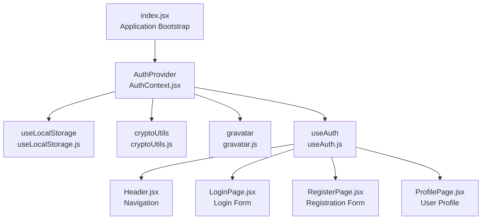
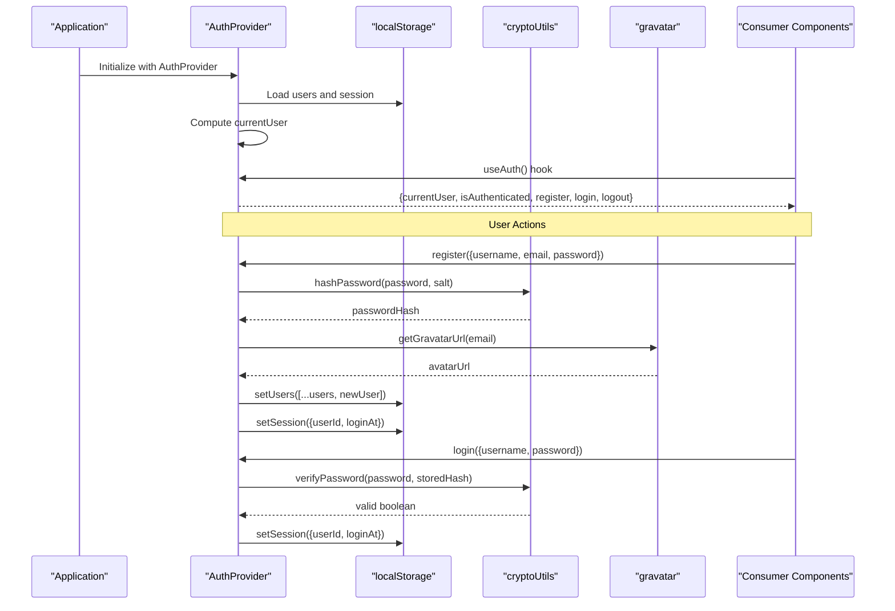
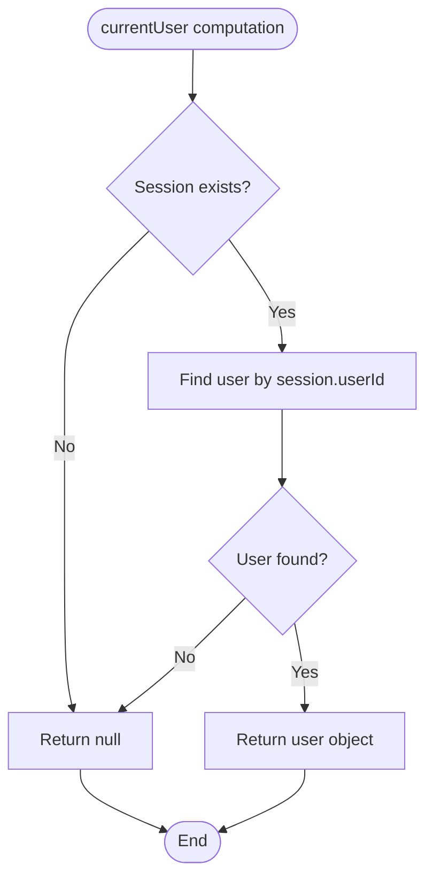
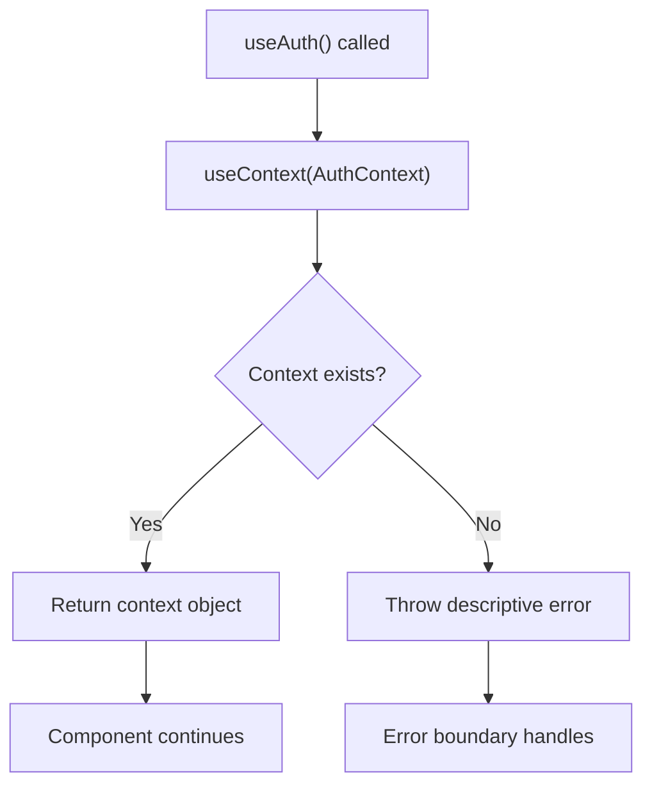
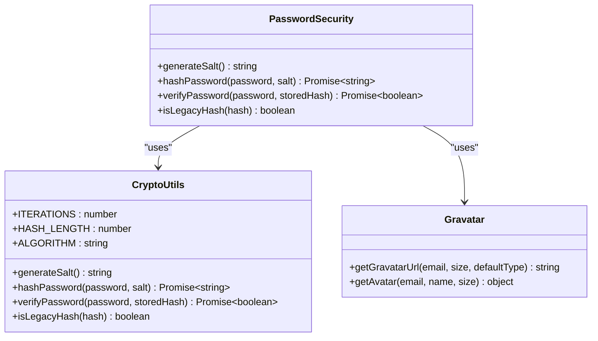
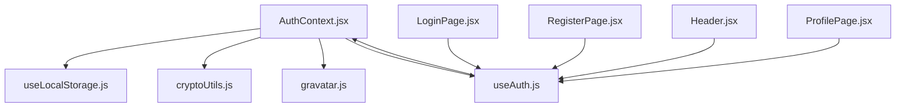

# Authentication State Management

<cite>
**Referenced Files in This Document**
- [AuthContext.jsx](file://src/contexts/AuthContext.jsx)
- [useAuth.js](file://src/hooks/useAuth.js)
- [useLocalStorage.js](file://src/hooks/useLocalStorage.js)
- [cryptoUtils.js](file://src/utils/cryptoUtils.js)
- [gravatar.js](file://src/utils/gravatar.js)
- [index.jsx](file://src/index.jsx)
- [Header.jsx](file://src/components/layout/Header.jsx)
- [LoginPage.jsx](file://src/pages/LoginPage.jsx)
- [RegisterPage.jsx](file://src/pages/RegisterPage.jsx)
- [ProfilePage.jsx](file://src/pages/ProfilePage.jsx)
</cite>

## Table of Contents
1. [Introduction](#introduction)
2. [Project Structure](#project-structure)
3. [Core Components](#core-components)
4. [Architecture Overview](#architecture-overview)
5. [Detailed Component Analysis](#detailed-component-analysis)
6. [Dependency Analysis](#dependency-analysis)
7. [Performance Considerations](#performance-considerations)
8. [Troubleshooting Guide](#troubleshooting-guide)
9. [Conclusion](#conclusion)

## Introduction
This document provides comprehensive documentation for GameDev Hub's authentication state management system. It covers the AuthContext provider pattern, state initialization with localStorage persistence, the currentUser computation logic, the useAuth custom hook, memoization strategies, authentication state structure, localStorage integration for session persistence, error handling patterns, loading states, and practical examples of consuming authentication state across components.

## Project Structure
The authentication system is built around a React Context Provider pattern with localStorage-backed persistence. The key files involved are:

- AuthContext.jsx: Defines the authentication context and provider
- useAuth.js: Custom hook for consuming authentication context
- useLocalStorage.js: Hook for localStorage-backed state
- cryptoUtils.js: Password hashing and verification utilities
- gravatar.js: Avatar URL generation utilities
- index.jsx: Application bootstrap with AuthProvider
- Header.jsx, LoginPage.jsx, RegisterPage.jsx, ProfilePage.jsx: Consumer components

**Diagram sources**
- [index.jsx:11-24](file://src/index.jsx#L11-L24)
- [AuthContext.jsx:13-104](file://src/contexts/AuthContext.jsx#L13-L104)
- [useLocalStorage.js:3-28](file://src/hooks/useLocalStorage.js#L3-L28)
- [cryptoUtils.js:25-65](file://src/utils/cryptoUtils.js#L25-L65)
- [gravatar.js:10-34](file://src/utils/gravatar.js#L10-L34)
- [useAuth.js:4-10](file://src/hooks/useAuth.js#L4-L10)

**Section sources**
- [index.jsx:11-24](file://src/index.jsx#L11-L24)
- [AuthContext.jsx:13-104](file://src/contexts/AuthContext.jsx#L13-L104)

## Core Components
The authentication system consists of four primary components:

### AuthContext Provider
The AuthContext provider manages the complete authentication lifecycle including user registration, login, logout, and session persistence. It maintains two localStorage-backed states:
- `users`: Array of registered users with hashed passwords
- `session`: Current active session containing userId and login timestamp

### useAuth Hook
A custom hook that safely consumes the authentication context, throwing a descriptive error if used outside of AuthProvider.

### useLocalStorage Hook
A generic localStorage wrapper that provides reactive state with persistence, including error handling for localStorage access issues.

### Authentication Utilities
- Password hashing using PBKDF2 with configurable iterations
- Legacy hash detection and migration support
- Gravatar URL generation for user avatars

**Section sources**
- [AuthContext.jsx:13-104](file://src/contexts/AuthContext.jsx#L13-L104)
- [useAuth.js:4-10](file://src/hooks/useAuth.js#L4-L10)
- [useLocalStorage.js:3-28](file://src/hooks/useLocalStorage.js#L3-L28)
- [cryptoUtils.js:25-65](file://src/utils/cryptoUtils.js#L25-L65)
- [gravatar.js:10-34](file://src/utils/gravatar.js#L10-L34)

## Architecture Overview
The authentication architecture follows a layered pattern with clear separation of concerns:

**Diagram sources**
- [AuthContext.jsx:13-104](file://src/contexts/AuthContext.jsx#L13-L104)
- [useLocalStorage.js:3-28](file://src/hooks/useLocalStorage.js#L3-L28)
- [cryptoUtils.js:25-65](file://src/utils/cryptoUtils.js#L25-L65)
- [gravatar.js:10-34](file://src/utils/gravatar.js#L10-L34)

## Detailed Component Analysis

### AuthContext Implementation
The AuthContext provider implements a comprehensive authentication system with the following key features:

#### State Initialization and Persistence
- Uses `useLocalStorage` for both users and session storage
- Automatically restores state from localStorage on component mount
- Provides fallback values for initial state

#### currentUser Computation Logic
The currentUser is computed using `useMemo` with dependencies on both session and users arrays. The computation follows this logic:

**Diagram sources**
- [AuthContext.jsx:17-20](file://src/contexts/AuthContext.jsx#L17-L20)

#### Authentication Methods
The provider exposes five primary methods:

1. **register**: Creates new user accounts with validation and secure password hashing
2. **login**: Authenticates existing users with password verification
3. **logout**: Clears the current session
4. **currentUser**: Computed property based on active session
5. **isAuthenticated**: Boolean flag derived from currentUser

#### Error Handling Patterns
- Validation errors return structured `{success: false, error: string}` objects
- Authentication failures include descriptive error messages
- Password validation uses constant-time comparison to prevent timing attacks

#### Memoization Strategies
- `currentUser` computed with `useMemo` for performance optimization
- Context value composed with `useMemo` to prevent unnecessary re-renders
- All callback methods wrapped with `useCallback` for stable references

**Section sources**
- [AuthContext.jsx:13-104](file://src/contexts/AuthContext.jsx#L13-L104)

### useAuth Custom Hook
The useAuth hook provides a safe way to consume authentication context:

**Diagram sources**
- [useAuth.js:4-10](file://src/hooks/useAuth.js#L4-L10)

**Section sources**
- [useAuth.js:4-10](file://src/hooks/useAuth.js#L4-L10)

### Authentication State Structure
The authentication state consists of several interconnected properties:

#### Session Management
- `session`: Contains `{userId, loginAt}` when authenticated
- `users`: Array of user objects with hashed passwords
- Automatic session restoration on application load

#### User Object Properties
Each user object contains:
- `id`: Unique identifier
- `username`: Unique username
- `email`: User's email address
- `passwordHash`: Securely hashed password
- `displayName`: User's display name
- `avatarUrl`: Gravatar URL or fallback
- `createdAt`: Account creation timestamp

#### Authentication Flags
- `isAuthenticated`: Boolean derived from currentUser existence
- `currentUser`: Active user object or null

**Section sources**
- [AuthContext.jsx:17-20](file://src/contexts/AuthContext.jsx#L17-L20)
- [AuthContext.jsx:37-45](file://src/contexts/AuthContext.jsx#L37-L45)

### Password Security Implementation
The system implements robust password security using PBKDF2:

**Diagram sources**
- [cryptoUtils.js:25-65](file://src/utils/cryptoUtils.js#L25-L65)
- [gravatar.js:10-34](file://src/utils/gravatar.js#L10-L34)

**Section sources**
- [cryptoUtils.js:25-65](file://src/utils/cryptoUtils.js#L25-L65)
- [gravatar.js:10-34](file://src/utils/gravatar.js#L10-L34)

### Consumer Components
Multiple components consume authentication state for different purposes:

#### Navigation Integration
The Header component displays different UI based on authentication state:
- Unauthenticated: Shows login/signup buttons
- Authenticated: Displays user avatar, name, and logout button

#### Form Components
Login and Register pages demonstrate proper error handling and loading states:
- Form validation before submission
- Loading state management during async operations
- Error message display and user feedback

#### Profile Access Control
ProfilePage implements route-level authentication protection:
- Redirects unauthenticated users to login
- Displays user-specific content when authenticated

**Section sources**
- [Header.jsx:37-73](file://src/components/layout/Header.jsx#L37-L73)
- [LoginPage.jsx:14-17](file://src/pages/LoginPage.jsx#L14-L17)
- [RegisterPage.jsx:16-19](file://src/pages/RegisterPage.jsx#L16-L19)
- [ProfilePage.jsx:44-52](file://src/pages/ProfilePage.jsx#L44-L52)

## Dependency Analysis
The authentication system has minimal external dependencies and clear internal relationships:

**Diagram sources**
- [AuthContext.jsx:1-11](file://src/contexts/AuthContext.jsx#L1-L11)
- [useLocalStorage.js:1-29](file://src/hooks/useLocalStorage.js#L1-L29)
- [cryptoUtils.js:1-70](file://src/utils/cryptoUtils.js#L1-L70)
- [gravatar.js:1-35](file://src/utils/gravatar.js#L1-L35)
- [useAuth.js:1-11](file://src/hooks/useAuth.js#L1-L11)

**Section sources**
- [AuthContext.jsx:1-11](file://src/contexts/AuthContext.jsx#L1-L11)
- [useLocalStorage.js:1-29](file://src/hooks/useLocalStorage.js#L1-L29)
- [cryptoUtils.js:1-70](file://src/utils/cryptoUtils.js#L1-L70)
- [gravatar.js:1-35](file://src/utils/gravatar.js#L1-L35)
- [useAuth.js:1-11](file://src/hooks/useAuth.js#L1-L11)

## Performance Considerations
The authentication system implements several performance optimization strategies:

### Memoization Strategy
- `currentUser` computed with `useMemo` to avoid expensive recomputation
- Context value composed with `useMemo` to prevent unnecessary re-renders
- All callback methods wrapped with `useCallback` for stable references

### Lazy Loading Integration
- Application routes are lazy-loaded to minimize initial bundle size
- Authentication state is available globally without prop drilling

### Memory Management
- localStorage-backed state prevents memory leaks
- Proper cleanup of event listeners and subscriptions

## Troubleshooting Guide

### Common Authentication Issues
1. **Session Not Persisting**: Check localStorage availability and permissions
2. **Login Failures**: Verify password hash format and migration status
3. **User Not Found**: Confirm username/email uniqueness validation
4. **Avatar Issues**: Test Gravatar URL generation and fallback logic

### Error Handling Patterns
The system provides structured error handling:
- Validation errors return `{success: false, error: string}`
- Authentication failures include descriptive messages
- Network/storage errors are caught and logged gracefully

### Debugging Tips
- Monitor localStorage keys: `kaz_users`, `kaz_session`
- Check browser developer tools for authentication flow
- Verify password hash format (should start with `pbkdf2:`)
- Test Gravatar URL generation with various email formats

**Section sources**
- [AuthContext.jsx:27-32](file://src/contexts/AuthContext.jsx#L27-L32)
- [AuthContext.jsx:59-60](file://src/contexts/AuthContext.jsx#L59-L60)
- [useLocalStorage.js:8-11](file://src/hooks/useLocalStorage.js#L8-L11)

## Conclusion
GameDev Hub's authentication state management system provides a robust, secure, and performant solution for user authentication. The implementation demonstrates best practices in React context usage, localStorage persistence, password security, and error handling. The system's modular design allows for easy maintenance and extension while maintaining excellent user experience through proper loading states and error feedback.

The combination of secure password hashing, session persistence, and clean consumer patterns creates a solid foundation for the application's authentication needs. The memoization strategies ensure optimal performance, while the error handling patterns provide clear feedback for both developers and end users.