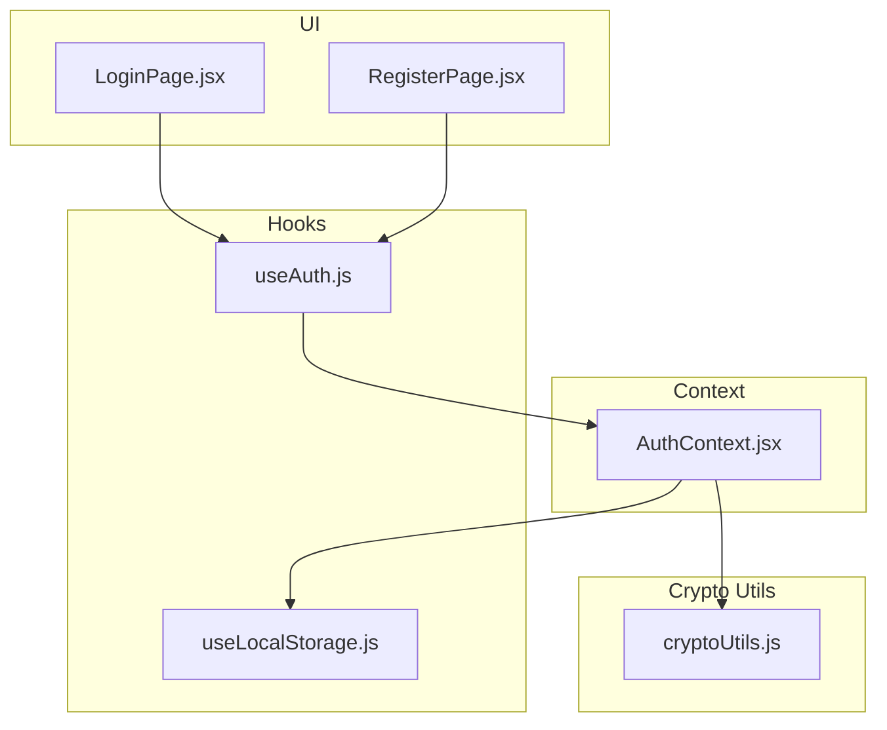
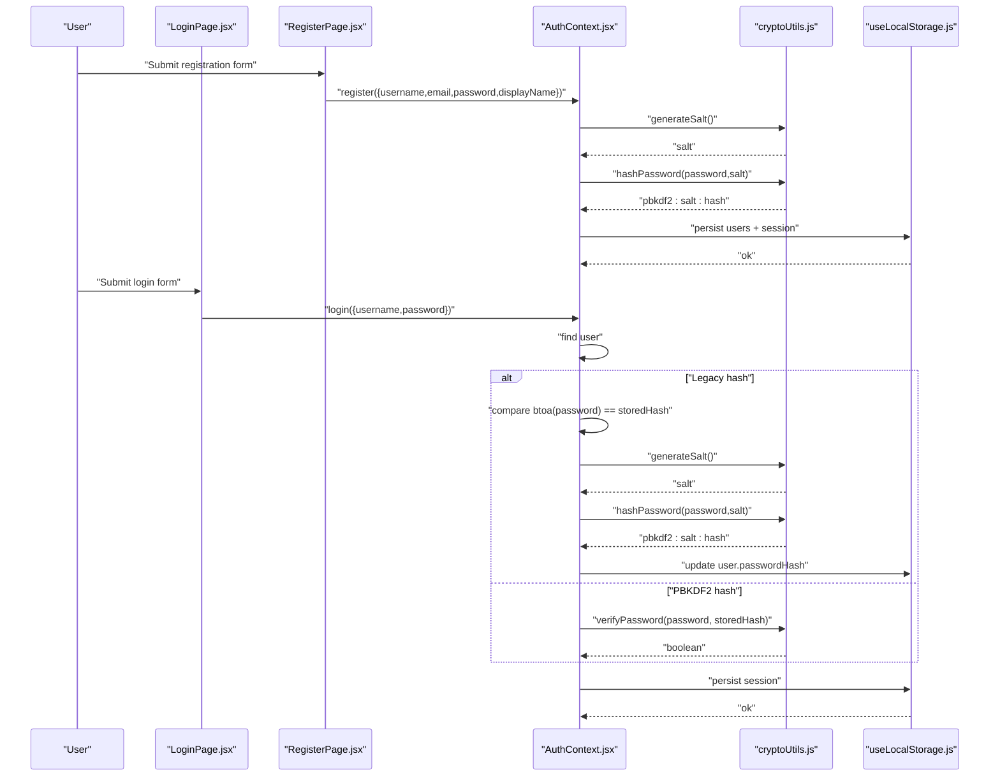
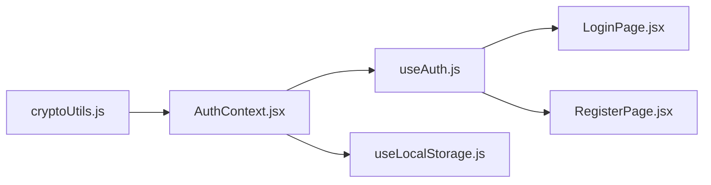

# Password Security & Cryptography

<cite>
**Referenced Files in This Document**
- [cryptoUtils.js](file://src/utils/cryptoUtils.js)
- [AuthContext.jsx](file://src/contexts/AuthContext.jsx)
- [useAuth.js](file://src/hooks/useAuth.js)
- [LoginPage.jsx](file://src/pages/LoginPage.jsx)
- [RegisterPage.jsx](file://src/pages/RegisterPage.jsx)
- [useLocalStorage.js](file://src/hooks/useLocalStorage.js)
- [README.md](file://README.md)
</cite>

## Table of Contents
1. [Introduction](#introduction)
2. [Project Structure](#project-structure)
3. [Core Components](#core-components)
4. [Architecture Overview](#architecture-overview)
5. [Detailed Component Analysis](#detailed-component-analysis)
6. [Dependency Analysis](#dependency-analysis)
7. [Performance Considerations](#performance-considerations)
8. [Troubleshooting Guide](#troubleshooting-guide)
9. [Conclusion](#conclusion)
10. [Appendices](#appendices)

## Introduction
This document explains GameDev Hub’s password security and cryptographic implementation. It focuses on the PBKDF2 password hashing algorithm using the Web Crypto API with 100,000 iterations and SHA-256 digest, the salt generation process, password verification workflow, and the legacy hash migration system for accounts using base64 encoding. It also documents the cryptographic utilities, security considerations, and practical guidance for deployment and maintenance.

## Project Structure
The password security implementation spans several modules:
- Cryptographic utilities: PBKDF2 hashing, salt generation, verification, and legacy detection
- Authentication provider: Registration, login, session management, and migration
- UI pages: Login and registration forms with client-side validation
- Local storage hook: Persistent storage of users and sessions

**Diagram sources**
- [LoginPage.jsx:1-82](file://src/pages/LoginPage.jsx#L1-L82)
- [RegisterPage.jsx:1-132](file://src/pages/RegisterPage.jsx#L1-L132)
- [useAuth.js:1-11](file://src/hooks/useAuth.js#L1-L11)
- [useLocalStorage.js:1-29](file://src/hooks/useLocalStorage.js#L1-L29)
- [AuthContext.jsx:1-105](file://src/contexts/AuthContext.jsx#L1-L105)
- [cryptoUtils.js:1-70](file://src/utils/cryptoUtils.js#L1-L70)

**Section sources**
- [README.md:100-128](file://README.md#L100-L128)

## Core Components
- PBKDF2 hashing with Web Crypto API
- Salt generation using cryptographically secure randomness
- Constant-time password verification
- Legacy hash detection and migration
- Client-side authentication flow with session persistence

Key implementation references:
- PBKDF2 parameters and hashing: [cryptoUtils.js:1-48](file://src/utils/cryptoUtils.js#L1-L48)
- Salt generation: [cryptoUtils.js:5-9](file://src/utils/cryptoUtils.js#L5-L9)
- Verification with constant-time comparison: [cryptoUtils.js:50-65](file://src/utils/cryptoUtils.js#L50-L65)
- Legacy hash detection: [cryptoUtils.js:67-69](file://src/utils/cryptoUtils.js#L67-L69)
- Registration and login flow: [AuthContext.jsx:22-86](file://src/contexts/AuthContext.jsx#L22-L86)
- Migration on login: [AuthContext.jsx:63-75](file://src/contexts/AuthContext.jsx#L63-L75)

**Section sources**
- [cryptoUtils.js:1-70](file://src/utils/cryptoUtils.js#L1-L70)
- [AuthContext.jsx:22-86](file://src/contexts/AuthContext.jsx#L22-L86)

## Architecture Overview
The authentication flow integrates UI, context, and cryptographic utilities. On registration, a random salt is generated and used to derive a PBKDF2 hash. On login, the system detects legacy hashes and migrates them to PBKDF2 while authenticating the user.

**Diagram sources**
- [RegisterPage.jsx:21-67](file://src/pages/RegisterPage.jsx#L21-L67)
- [LoginPage.jsx:19-39](file://src/pages/LoginPage.jsx#L19-L39)
- [AuthContext.jsx:22-86](file://src/contexts/AuthContext.jsx#L22-L86)
- [cryptoUtils.js:5-69](file://src/utils/cryptoUtils.js#L5-L69)
- [useLocalStorage.js:3-28](file://src/hooks/useLocalStorage.js#L3-L28)

## Detailed Component Analysis

### PBKDF2 Implementation and Parameters
- Algorithm: PBKDF2 with SHA-256 digest
- Iteration count: 100,000
- Key length: 256 bits
- Salt: 16-byte random value encoded as lowercase hex string

Implementation highlights:
- Import raw password as key material
- Derive bits with PBKDF2 using the provided salt, iterations, and hash
- Encode derived bits to hex and prefix with “pbkdf2:salt:”

References:
- Constants and algorithm selection: [cryptoUtils.js:1-3](file://src/utils/cryptoUtils.js#L1-L3)
- PBKDF2 derivation: [cryptoUtils.js:25-47](file://src/utils/cryptoUtils.js#L25-L47)

Security characteristics:
- High iteration count increases computational cost for brute-force attempts
- SHA-256 provides strong cryptographic digest
- 256-bit output ensures sufficient entropy for secure verification

**Section sources**
- [cryptoUtils.js:1-48](file://src/utils/cryptoUtils.js#L1-L48)

### Salt Generation
- Uses cryptographically secure random number generator
- Produces 16 random bytes and encodes them as a 32-character lowercase hex string
- Unique per-password, ensuring rainbow table and precomputation resistance

References:
- Random generation and encoding: [cryptoUtils.js:5-9](file://src/utils/cryptoUtils.js#L5-L9)

Security characteristics:
- Uniqueness per password prevents hash reuse across accounts
- Hex encoding ensures compact representation suitable for storage and transport

**Section sources**
- [cryptoUtils.js:5-9](file://src/utils/cryptoUtils.js#L5-L9)

### Password Verification Workflow
- Parses stored hash to extract scheme, salt, and derived hash
- Re-computes hash using the provided password and extracted salt
- Performs constant-time bitwise comparison to prevent timing attacks

References:
- Parsing and verification: [cryptoUtils.js:50-65](file://src/utils/cryptoUtils.js#L50-L65)

Timing attack mitigation:
- Constant-time comparison avoids leaking information via timing differences
- Length check precedes comparison to avoid early exit based on length alone

**Section sources**
- [cryptoUtils.js:50-65](file://src/utils/cryptoUtils.js#L50-L65)

### Legacy Hash Migration System
- Detection: Legacy hashes do not start with “pbkdf2:”
- Migration: On successful legacy verification, replace stored hash with PBKDF2-derived hash
- Silent migration: No user-visible prompt during migration

References:
- Legacy detection: [cryptoUtils.js:67-69](file://src/utils/cryptoUtils.js#L67-L69)
- Migration logic: [AuthContext.jsx:63-75](file://src/contexts/AuthContext.jsx#L63-L75)

Fallback mechanism:
- Legacy comparison uses base64 encoding of the plaintext password
- Ensures backward compatibility for existing users

**Section sources**
- [cryptoUtils.js:67-69](file://src/utils/cryptoUtils.js#L67-L69)
- [AuthContext.jsx:63-75](file://src/contexts/AuthContext.jsx#L63-L75)

### Authentication Provider and Session Management
- Registration:
  - Validates uniqueness of username and email
  - Generates salt and derives PBKDF2 hash
  - Persists user and starts session
- Login:
  - Locates user by username or email
  - Handles legacy hashes with silent migration
  - Verifies PBKDF2 hashes securely
  - Starts session upon successful authentication

References:
- Registration: [AuthContext.jsx:22-52](file://src/contexts/AuthContext.jsx#L22-L52)
- Login and migration: [AuthContext.jsx:54-86](file://src/contexts/AuthContext.jsx#L54-L86)
- Session persistence: [useLocalStorage.js:3-28](file://src/hooks/useLocalStorage.js#L3-L28)

**Section sources**
- [AuthContext.jsx:22-86](file://src/contexts/AuthContext.jsx#L22-L86)
- [useLocalStorage.js:3-28](file://src/hooks/useLocalStorage.js#L3-L28)

### UI Forms and Validation
- Login form:
  - Requires non-empty username and password
  - Navigates authenticated users away from login
- Registration form:
  - Enforces field presence and validity
  - Username length and character constraints
  - Email format validation
  - Minimum password length

References:
- Login validation: [LoginPage.jsx:19-39](file://src/pages/LoginPage.jsx#L19-L39)
- Registration validation: [RegisterPage.jsx:21-67](file://src/pages/RegisterPage.jsx#L21-L67)

**Section sources**
- [LoginPage.jsx:19-39](file://src/pages/LoginPage.jsx#L19-L39)
- [RegisterPage.jsx:21-67](file://src/pages/RegisterPage.jsx#L21-L67)

## Dependency Analysis
The cryptographic utilities are consumed by the authentication context, which orchestrates registration, login, and migration. UI pages depend on the authentication hook to interact with the context.

**Diagram sources**
- [cryptoUtils.js:1-70](file://src/utils/cryptoUtils.js#L1-L70)
- [AuthContext.jsx:1-105](file://src/contexts/AuthContext.jsx#L1-L105)
- [useAuth.js:1-11](file://src/hooks/useAuth.js#L1-L11)
- [LoginPage.jsx:1-82](file://src/pages/LoginPage.jsx#L1-L82)
- [RegisterPage.jsx:1-132](file://src/pages/RegisterPage.jsx#L1-L132)
- [useLocalStorage.js:1-29](file://src/hooks/useLocalStorage.js#L1-L29)

**Section sources**
- [AuthContext.jsx:1-105](file://src/contexts/AuthContext.jsx#L1-L105)
- [cryptoUtils.js:1-70](file://src/utils/cryptoUtils.js#L1-L70)

## Performance Considerations
- PBKDF2 iteration count: 100,000 provides strong security against brute-force attacks while remaining practical for client-side verification.
- Constant-time comparison: Prevents timing-based side-channel leakage.
- Salt uniqueness: Ensures each password hash is independent, reducing cross-account correlation.
- Migration overhead: Single-time migration per legacy user on successful login.

[No sources needed since this section provides general guidance]

## Troubleshooting Guide
Common issues and mitigations:
- Incorrect password errors:
  - Verify that the legacy hash detection and migration path executes correctly for legacy users.
  - Ensure PBKDF2 verification uses the same salt extracted from the stored hash.
- Migration failures:
  - Confirm that PBKDF2 hashing produces the expected “pbkdf2:salt:hash” format.
  - Validate that the updated user record is persisted after migration.
- Timing attack concerns:
  - Ensure constant-time comparison is used and that length checks occur before bitwise comparison.
- Storage errors:
  - Confirm that local storage operations succeed and that errors are handled gracefully.

**Section sources**
- [AuthContext.jsx:63-75](file://src/contexts/AuthContext.jsx#L63-L75)
- [cryptoUtils.js:50-65](file://src/utils/cryptoUtils.js#L50-L65)
- [useLocalStorage.js:3-28](file://src/hooks/useLocalStorage.js#L3-L28)

## Conclusion
GameDev Hub’s password security model leverages PBKDF2 with Web Crypto API, a high iteration count, and per-user salts to protect credentials. The system includes robust verification with constant-time comparison and a seamless migration path for legacy base64-encoded hashes. Together with client-side validation and session persistence, this design balances usability, security, and maintainability.

[No sources needed since this section summarizes without analyzing specific files]

## Appendices

### Security Best Practices
- Keep PBKDF2 iteration count aligned with performance budgets and threat models.
- Ensure salts remain secret and are stored alongside hashes.
- Prefer constant-time comparisons for all cryptographic comparisons.
- Regularly review and update cryptographic parameters as standards evolve.
- Limit exposure of sensitive data in logs and error messages.

[No sources needed since this section provides general guidance]

### Potential Attack Vectors and Mitigations
- Brute-force attacks:
  - Mitigation: High iteration count and slow hashing reduce feasibility.
- Timing attacks:
  - Mitigation: Constant-time comparison prevents leakage of hash positions.
- Rainbow table attacks:
  - Mitigation: Unique per-password salts eliminate precomputation benefits.
- Legacy hash exposure:
  - Mitigation: Immediate migration to PBKDF2 upon successful authentication.

[No sources needed since this section provides general guidance]

### Implementation References
- PBKDF2 hashing and verification: [cryptoUtils.js:25-65](file://src/utils/cryptoUtils.js#L25-L65)
- Salt generation: [cryptoUtils.js:5-9](file://src/utils/cryptoUtils.js#L5-L9)
- Legacy detection: [cryptoUtils.js:67-69](file://src/utils/cryptoUtils.js#L67-L69)
- Registration and login: [AuthContext.jsx:22-86](file://src/contexts/AuthContext.jsx#L22-L86)
- Migration on login: [AuthContext.jsx:63-75](file://src/contexts/AuthContext.jsx#L63-L75)
- UI validation: [LoginPage.jsx:23-26](file://src/pages/LoginPage.jsx#L23-L26), [RegisterPage.jsx:30-48](file://src/pages/RegisterPage.jsx#L30-L48)

**Section sources**
- [cryptoUtils.js:5-69](file://src/utils/cryptoUtils.js#L5-L69)
- [AuthContext.jsx:22-86](file://src/contexts/AuthContext.jsx#L22-L86)
- [LoginPage.jsx:23-26](file://src/pages/LoginPage.jsx#L23-L26)
- [RegisterPage.jsx:30-48](file://src/pages/RegisterPage.jsx#L30-L48)