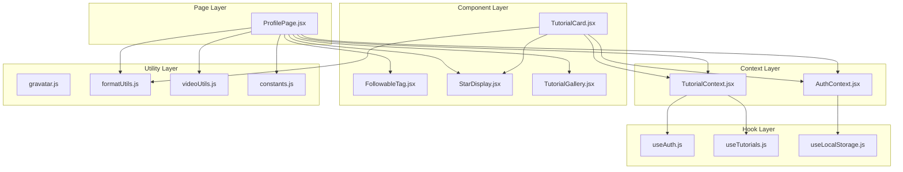
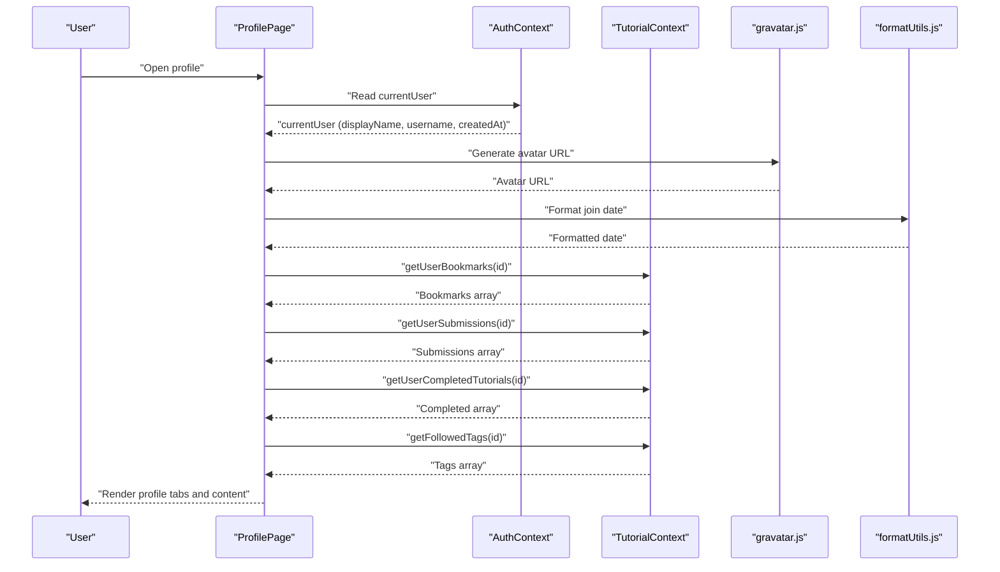
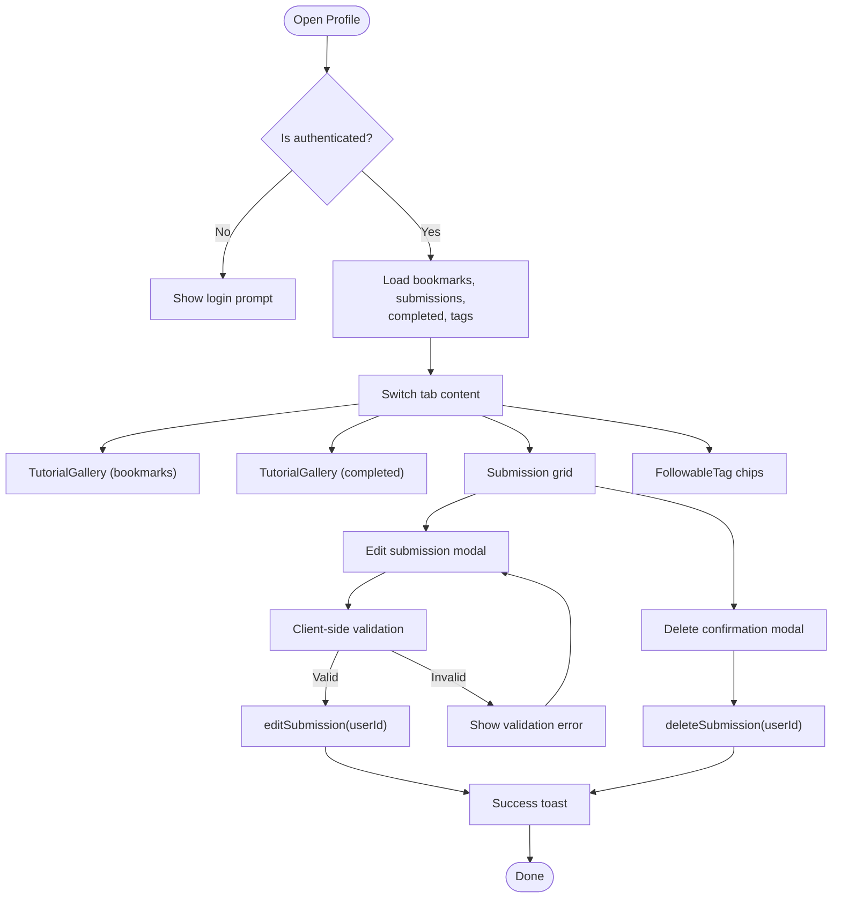
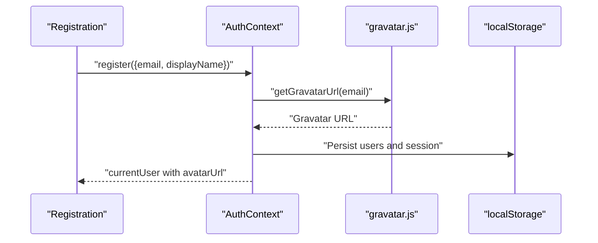
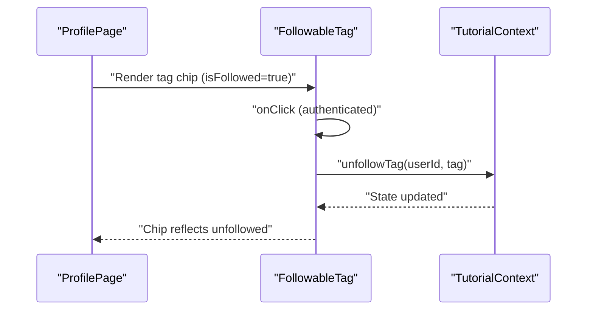
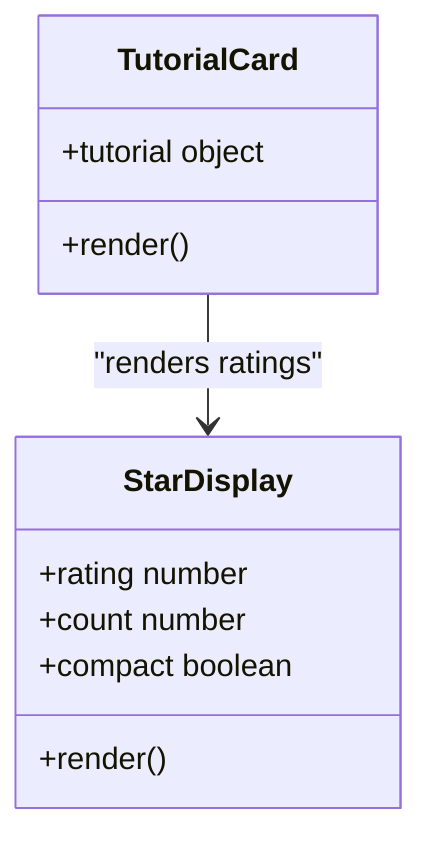
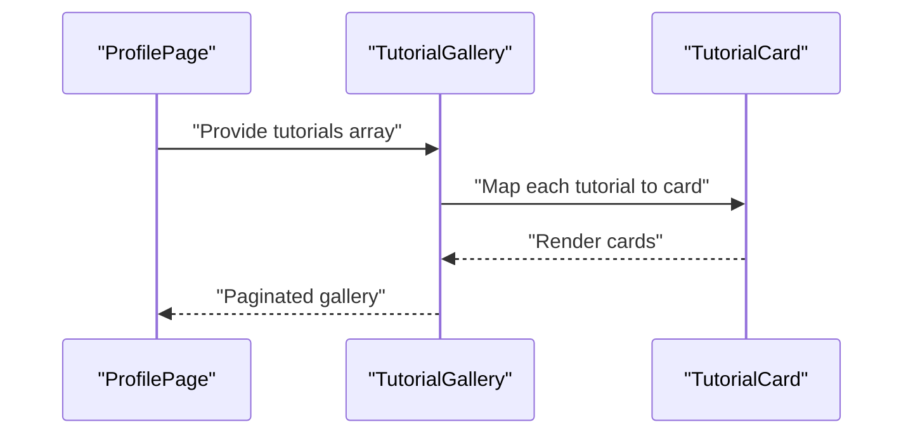
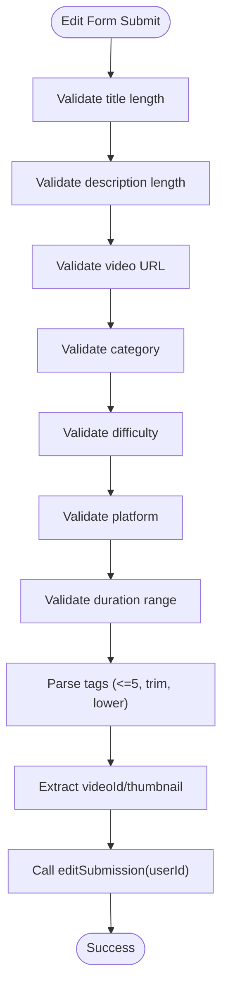
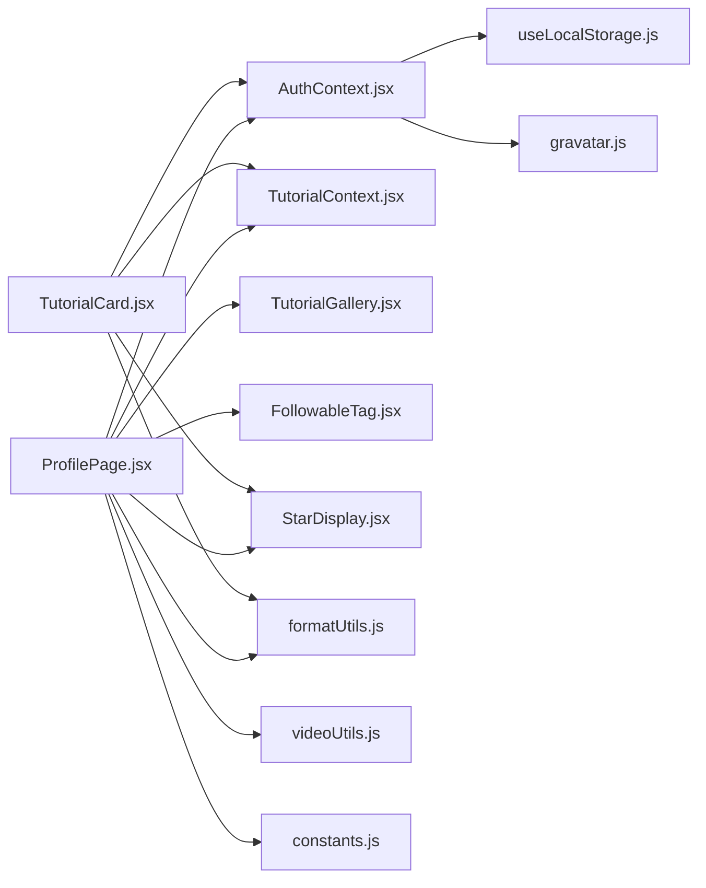

# Profile Management

<cite>
**Referenced Files in This Document**
- [ProfilePage.jsx](file://src/pages/ProfilePage.jsx)
- [ProfilePage.module.css](file://src/pages/ProfilePage.module.css)
- [AuthContext.jsx](file://src/contexts/AuthContext.jsx)
- [useAuth.js](file://src/hooks/useAuth.js)
- [TutorialContext.jsx](file://src/contexts/TutorialContext.jsx)
- [useTutorials.js](file://src/hooks/useTutorials.js)
- [FollowableTag.jsx](file://src/components/FollowableTag.jsx)
- [StarDisplay.jsx](file://src/components/StarDisplay.jsx)
- [TutorialCard.jsx](file://src/components/TutorialCard.jsx)
- [TutorialGallery.jsx](file://src/components/TutorialGallery.jsx)
- [gravatar.js](file://src/utils/gravatar.js)
- [formatUtils.js](file://src/utils/formatUtils.js)
- [videoUtils.js](file://src/utils/videoUtils.js)
- [constants.js](file://src/data/constants.js)
- [useLocalStorage.js](file://src/hooks/useLocalStorage.js)
</cite>

## Table of Contents
1. [Introduction](#introduction)
2. [Project Structure](#project-structure)
3. [Core Components](#core-components)
4. [Architecture Overview](#architecture-overview)
5. [Detailed Component Analysis](#detailed-component-analysis)
6. [Dependency Analysis](#dependency-analysis)
7. [Performance Considerations](#performance-considerations)
8. [Privacy and Security](#privacy-and-security)
9. [Troubleshooting Guide](#troubleshooting-guide)
10. [Conclusion](#conclusion)

## Introduction
This document describes the user profile management system in GameDev Hub. It covers profile viewing, editing capabilities, personal data management, and the integration with followable tags, star display components, and avatar management via Gravatar. It also explains the profile data structure, update mechanisms, validation patterns, and the relationship between authenticated user data and profile display components. Examples of customization options, data persistence, and integrations with tutorial bookmarks and ratings are included.

## Project Structure
The profile system spans several layers:
- Page layer: ProfilePage renders user-specific content and manages tabs for bookmarks, completed tutorials, submissions, and followed tags.
- Context layer: AuthContext provides authenticated user data and session state; TutorialContext exposes tutorial-related operations (bookmarks, submissions, tags).
- Component layer: Reusable UI components (FollowableTag, StarDisplay) support profile features.
- Utility layer: Formatting, video parsing, and Gravatar helpers support profile rendering and data normalization.
- Hook layer: useAuth and useTutorials provide context consumption for functional components.

**Diagram sources**
- [ProfilePage.jsx:1-387](file://src/pages/ProfilePage.jsx#L1-L387)
- [AuthContext.jsx:1-105](file://src/contexts/AuthContext.jsx#L1-L105)
- [TutorialContext.jsx](file://src/contexts/TutorialContext.jsx)
- [FollowableTag.jsx:1-34](file://src/components/FollowableTag.jsx#L1-L34)
- [StarDisplay.jsx:1-49](file://src/components/StarDisplay.jsx#L1-L49)
- [TutorialGallery.jsx:1-138](file://src/components/TutorialGallery.jsx#L1-L138)
- [TutorialCard.jsx:1-110](file://src/components/TutorialCard.jsx#L1-L110)
- [gravatar.js:1-35](file://src/utils/gravatar.js#L1-L35)
- [formatUtils.js:1-45](file://src/utils/formatUtils.js#L1-L45)
- [videoUtils.js:1-119](file://src/utils/videoUtils.js#L1-L119)
- [constants.js:1-71](file://src/data/constants.js#L1-L71)
- [useAuth.js:1-11](file://src/hooks/useAuth.js#L1-L11)
- [useTutorials.js:1-11](file://src/hooks/useTutorials.js#L1-L11)
- [useLocalStorage.js:1-29](file://src/hooks/useLocalStorage.js#L1-L29)

**Section sources**
- [ProfilePage.jsx:1-387](file://src/pages/ProfilePage.jsx#L1-L387)
- [AuthContext.jsx:1-105](file://src/contexts/AuthContext.jsx#L1-L105)
- [TutorialContext.jsx](file://src/contexts/TutorialContext.jsx)
- [useAuth.js:1-11](file://src/hooks/useAuth.js#L1-L11)
- [useTutorials.js:1-11](file://src/hooks/useTutorials.js#L1-L11)
- [useLocalStorage.js:1-29](file://src/hooks/useLocalStorage.js#L1-L29)

## Core Components
- ProfilePage: Central profile UI composing tabs for bookmarks, completed tutorials, submissions, and followed tags. Handles editing and deleting submissions, and displays user metadata.
- AuthContext: Provides currentUser, authentication state, and session persistence via localStorage. Generates avatar URLs using Gravatar.
- TutorialContext: Supplies tutorial operations (bookmarks, submissions, tags) used by ProfilePage.
- FollowableTag: Renders interactive tag chips for followed/unfollowed state with authentication gating.
- StarDisplay: Renders star ratings with optional review counts.
- TutorialCard: Integrates with profile features (bookmarks, completion) and displays ratings.
- Utilities: Gravatar generation, formatting helpers, video parsing, and constants define supported categories, difficulties, platforms, and validation rules.

Key responsibilities:
- ProfilePage orchestrates data retrieval and editing flows using context hooks.
- AuthContext ensures user identity and avatar generation.
- TutorialContext encapsulates tutorial-centric operations for the authenticated user.
- Components provide reusable UI for tags and ratings.

**Section sources**
- [ProfilePage.jsx:15-387](file://src/pages/ProfilePage.jsx#L15-L387)
- [AuthContext.jsx:17-100](file://src/contexts/AuthContext.jsx#L17-L100)
- [TutorialContext.jsx](file://src/contexts/TutorialContext.jsx)
- [FollowableTag.jsx:5-34](file://src/components/FollowableTag.jsx#L5-L34)
- [StarDisplay.jsx:5-49](file://src/components/StarDisplay.jsx#L5-L49)
- [TutorialCard.jsx:14-110](file://src/components/TutorialCard.jsx#L14-L110)
- [gravatar.js:10-34](file://src/utils/gravatar.js#L10-L34)
- [formatUtils.js:1-45](file://src/utils/formatUtils.js#L1-L45)
- [videoUtils.js:3-48](file://src/utils/videoUtils.js#L3-L48)
- [constants.js:1-71](file://src/data/constants.js#L1-L71)

## Architecture Overview
The profile system follows a layered architecture:
- Authentication layer: AuthContext manages session and user identity.
- Data layer: TutorialContext exposes CRUD-like operations for tutorial data (bookmarks, submissions, tags).
- Presentation layer: ProfilePage composes UI and integrates with utilities for formatting and validation.
- Component layer: Reusable components encapsulate tag and rating rendering.

**Diagram sources**
- [ProfilePage.jsx:16-57](file://src/pages/ProfilePage.jsx#L16-L57)
- [AuthContext.jsx:17-20](file://src/contexts/AuthContext.jsx#L17-L20)
- [gravatar.js:24-34](file://src/utils/gravatar.js#L24-L34)
- [formatUtils.js:23-35](file://src/utils/formatUtils.js#L23-L35)
- [TutorialContext.jsx](file://src/contexts/TutorialContext.jsx)

## Detailed Component Analysis

### ProfilePage Implementation
ProfilePage renders:
- Profile header with avatar, display name, username, and join date.
- Tabbed interface for:
  - Bookmarks: TutorialGallery of bookmarked tutorials.
  - Completed: TutorialGallery of completed tutorials.
  - My Submissions: Grid of owned submissions with edit/delete actions.
  - Tags: FollowableTag chips for followed tags with unfollow capability.

Editing and deletion:
- Edit form validates title, description, URL, category, difficulty, platform, duration, and tags.
- On save, extracts video ID and thumbnail, then calls editSubmission with currentUser.id.
- Delete flow confirms before calling deleteSubmission.

**Diagram sources**
- [ProfilePage.jsx:16-133](file://src/pages/ProfilePage.jsx#L16-L133)
- [ProfilePage.jsx:221-260](file://src/pages/ProfilePage.jsx#L221-L260)
- [ProfilePage.jsx:278-383](file://src/pages/ProfilePage.jsx#L278-L383)

**Section sources**
- [ProfilePage.jsx:15-387](file://src/pages/ProfilePage.jsx#L15-L387)
- [ProfilePage.module.css:1-302](file://src/pages/ProfilePage.module.css#L1-L302)

### Authentication and Avatar Management
- AuthContext computes currentUser from session and users stored in localStorage.
- On registration, avatarUrl is generated using Gravatar with email hashing and default avatar type.
- ProfilePage’s header uses the first letter of displayName for a fallback avatar when Gravatar is unavailable.

**Diagram sources**
- [AuthContext.jsx:22-52](file://src/contexts/AuthContext.jsx#L22-L52)
- [gravatar.js:10-15](file://src/utils/gravatar.js#L10-L15)
- [useLocalStorage.js:14-28](file://src/hooks/useLocalStorage.js#L14-L28)

**Section sources**
- [AuthContext.jsx:17-50](file://src/contexts/AuthContext.jsx#L17-L50)
- [gravatar.js:10-34](file://src/utils/gravatar.js#L10-L34)
- [ProfilePage.jsx:138-148](file://src/pages/ProfilePage.jsx#L138-L148)

### Followable Tags Integration
- ProfilePage lists followed tags and allows unfollowing.
- FollowableTag component handles click events only when authenticated, invoking onToggle with the tag.
- Tag chips reflect followed state and provide appropriate tooltips and icons.

**Diagram sources**
- [ProfilePage.jsx:195-219](file://src/pages/ProfilePage.jsx#L195-L219)
- [FollowableTag.jsx:5-27](file://src/components/FollowableTag.jsx#L5-L27)
- [TutorialContext.jsx](file://src/contexts/TutorialContext.jsx)

**Section sources**
- [ProfilePage.jsx:195-219](file://src/pages/ProfilePage.jsx#L195-L219)
- [FollowableTag.jsx:5-34](file://src/components/FollowableTag.jsx#L5-L34)

### Star Display and Ratings
- StarDisplay renders filled/empty/half stars based on rating and optionally shows count.
- TutorialCard integrates StarDisplay to show tutorial average ratings alongside view counts.

**Diagram sources**
- [StarDisplay.jsx:5-49](file://src/components/StarDisplay.jsx#L5-L49)
- [TutorialCard.jsx:99](file://src/components/TutorialCard.jsx#L99)

**Section sources**
- [StarDisplay.jsx:5-49](file://src/components/StarDisplay.jsx#L5-L49)
- [TutorialCard.jsx:99](file://src/components/TutorialCard.jsx#L99)

### Tutorial Galleries and Submission Management
- TutorialGallery paginates and renders TutorialCard items for each tutorial.
- ProfilePage uses TutorialGallery for bookmarks and completed tutorials with empty-state messaging.
- Submission grid displays owned tutorials with edit and delete actions.

**Diagram sources**
- [ProfilePage.jsx:177-193](file://src/pages/ProfilePage.jsx#L177-L193)
- [TutorialGallery.jsx:23-125](file://src/components/TutorialGallery.jsx#L23-L125)
- [TutorialCard.jsx:14-110](file://src/components/TutorialCard.jsx#L14-L110)

**Section sources**
- [ProfilePage.jsx:177-260](file://src/pages/ProfilePage.jsx#L177-L260)
- [TutorialGallery.jsx:23-125](file://src/components/TutorialGallery.jsx#L23-L125)
- [TutorialCard.jsx:14-110](file://src/components/TutorialCard.jsx#L14-L110)

### Validation and Data Normalization
- ProfilePage enforces:
  - Title length (5–100 chars)
  - Description length (20–500 chars)
  - Video URL validity and supported platforms
  - Category, difficulty, platform selection
  - Duration bounds (1–600 minutes)
  - Tags parsing (comma-separated, lowercase, max 5)
- videoUtils extracts video IDs and thumbnail URLs for YouTube/Vimeo.
- formatUtils formats durations, view counts, dates, and ratings.

**Diagram sources**
- [ProfilePage.jsx:71-133](file://src/pages/ProfilePage.jsx#L71-L133)
- [videoUtils.js:3-48](file://src/utils/videoUtils.js#L3-L48)
- [formatUtils.js:1-45](file://src/utils/formatUtils.js#L1-L45)

**Section sources**
- [ProfilePage.jsx:71-133](file://src/pages/ProfilePage.jsx#L71-L133)
- [videoUtils.js:3-48](file://src/utils/videoUtils.js#L3-L48)
- [formatUtils.js:1-45](file://src/utils/formatUtils.js#L1-L45)

## Dependency Analysis
- ProfilePage depends on:
  - AuthContext for currentUser and isAuthenticated
  - TutorialContext for user data (bookmarks, submissions, completed, tags)
  - Utility modules for formatting, video parsing, and constants
  - Component modules for galleries and tag chips
- AuthContext depends on useLocalStorage for persistence and gravatar for avatar URLs.
- TutorialCard depends on StarDisplay, formatUtils, and TutorialContext for ratings and state.

**Diagram sources**
- [ProfilePage.jsx:1-18](file://src/pages/ProfilePage.jsx#L1-L18)
- [AuthContext.jsx:1-105](file://src/contexts/AuthContext.jsx#L1-L105)
- [TutorialContext.jsx](file://src/contexts/TutorialContext.jsx)
- [TutorialCard.jsx:1-12](file://src/components/TutorialCard.jsx#L1-L12)

**Section sources**
- [ProfilePage.jsx:1-18](file://src/pages/ProfilePage.jsx#L1-L18)
- [AuthContext.jsx:1-105](file://src/contexts/AuthContext.jsx#L1-L105)
- [TutorialCard.jsx:1-12](file://src/components/TutorialCard.jsx#L1-L12)

## Performance Considerations
- Client-side pagination in TutorialGallery reduces DOM load for large lists.
- Lazy image loading and placeholder thumbnails improve rendering performance in galleries.
- LocalStorage-backed session and user storage avoids network requests for basic identity checks.
- Validation runs client-side to reduce server round trips during edits.

Recommendations:
- Debounce tag unfollow operations if tag lists become large.
- Consider virtualized lists for very long submission histories.
- Cache formatted dates and durations where appropriate.

[No sources needed since this section provides general guidance]

## Privacy and Security
- Authentication: AuthContext stores session and users in localStorage. Sensitive credentials are hashed using PBKDF2 with salt; legacy hashes are migrated silently upon login.
- Data exposure: ProfilePage only displays publicly visible user metadata (display name, username, join date) and user-owned content (submissions, bookmarks, tags).
- External integrations: Gravatar is used for avatars; ensure CSP policies permit external avatar domains. Video thumbnails are fetched from YouTube; Vimeo thumbnails require server-side APIs in production.
- Input validation: Strict client-side validation prevents malformed submissions; server-side validation should mirror these rules in production.

**Section sources**
- [AuthContext.jsx:22-86](file://src/contexts/AuthContext.jsx#L22-L86)
- [gravatar.js:10-34](file://src/utils/gravatar.js#L10-L34)
- [ProfilePage.jsx:71-133](file://src/pages/ProfilePage.jsx#L71-L133)

## Troubleshooting Guide
Common issues and resolutions:
- Login prompt appears: Ensure user is authenticated; ProfilePage redirects unauthenticated users to the login route.
- Edit form validation errors: Verify title/description lengths, valid video URL, selected category/difficulty/platform, duration bounds, and tag formatting.
- Video thumbnail missing: YouTube thumbnails are supported; Vimeo thumbnails require backend processing.
- Tag unfollow not working: Confirm user is authenticated and TutorialContext supports unfollowTag.

**Section sources**
- [ProfilePage.jsx:44-52](file://src/pages/ProfilePage.jsx#L44-L52)
- [ProfilePage.jsx:75-103](file://src/pages/ProfilePage.jsx#L75-L103)
- [videoUtils.js:15-26](file://src/utils/videoUtils.js#L15-L26)
- [FollowableTag.jsx:9-12](file://src/components/FollowableTag.jsx#L9-L12)

## Conclusion
GameDev Hub’s profile management system integrates authentication, tutorial operations, and reusable UI components to deliver a cohesive user experience. ProfilePage centralizes profile viewing, editing, and personal data management while leveraging AuthContext and TutorialContext for data access and persistence. Followable tags, star ratings, and Gravatar-powered avatars enhance personalization and social engagement. Robust validation and formatting utilities ensure data integrity and readability. Privacy-conscious design choices protect user data while enabling meaningful interactions.