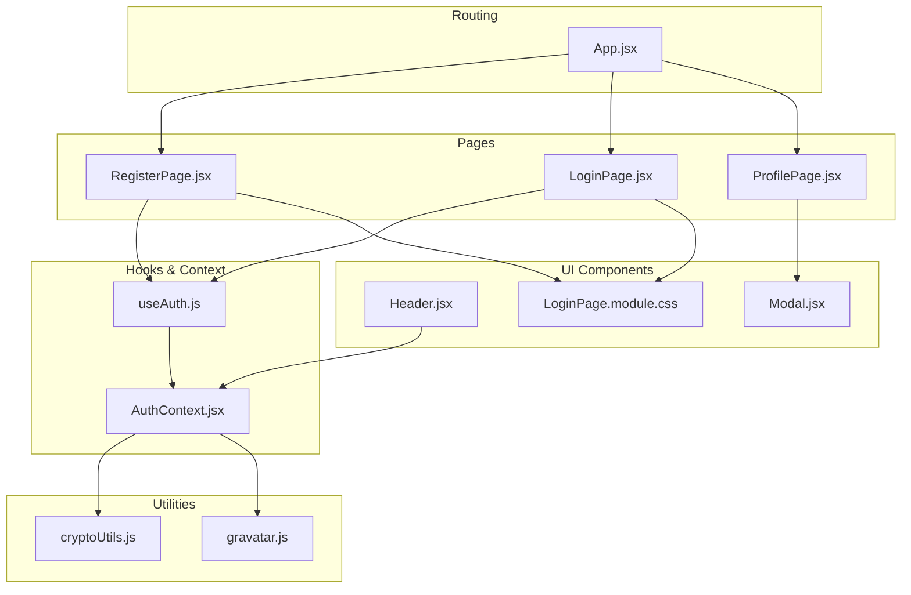
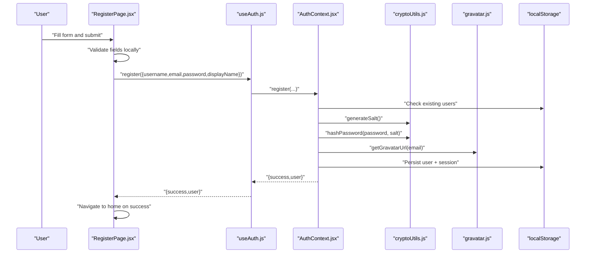
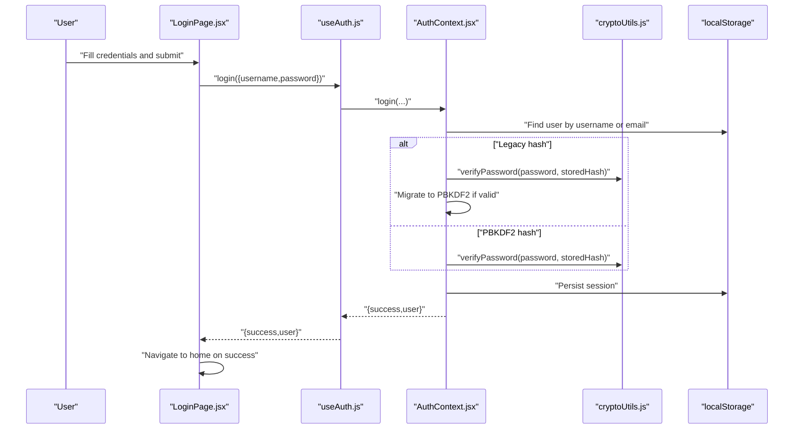
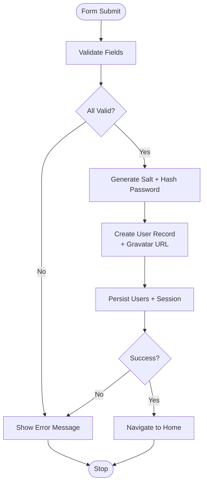
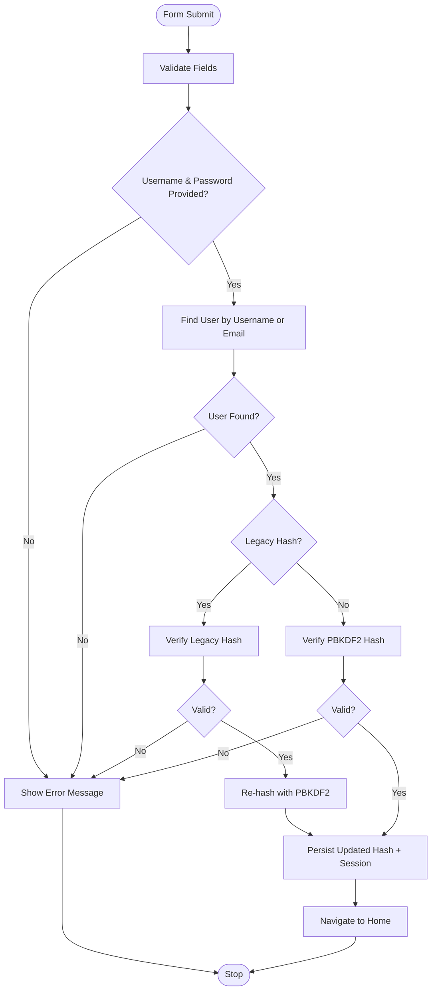
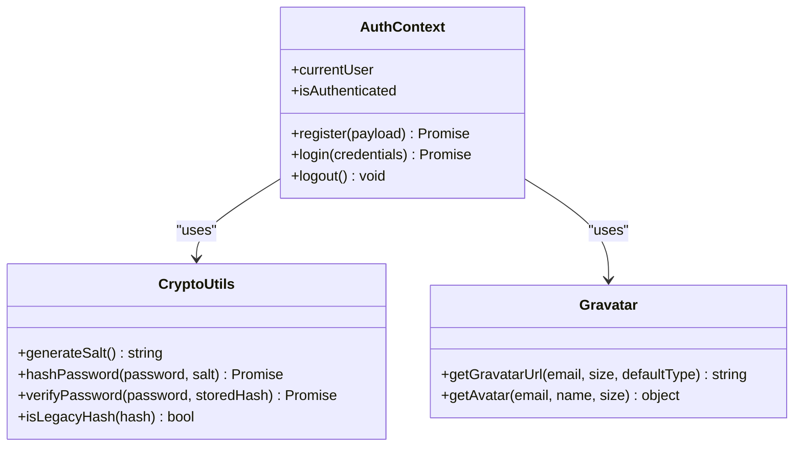
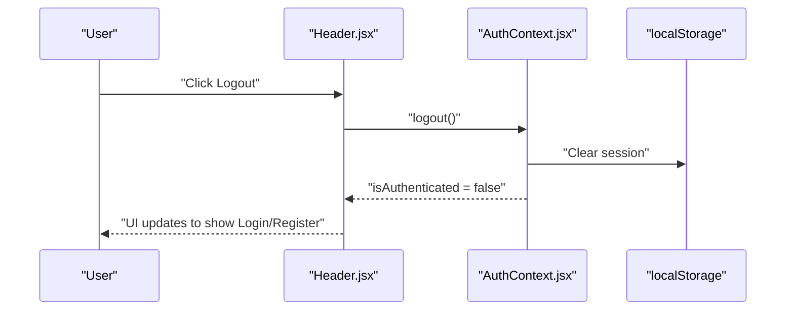
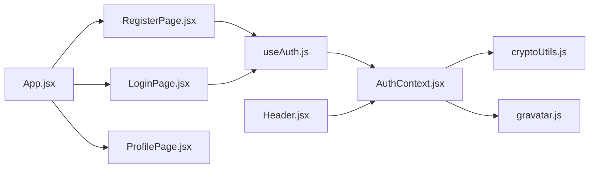

# Registration & Login Flow

<cite>
**Referenced Files in This Document**
- [RegisterPage.jsx](file://src/pages/RegisterPage.jsx)
- [LoginPage.jsx](file://src/pages/LoginPage.jsx)
- [AuthContext.jsx](file://src/contexts/AuthContext.jsx)
- [useAuth.js](file://src/hooks/useAuth.js)
- [cryptoUtils.js](file://src/utils/cryptoUtils.js)
- [gravatar.js](file://src/utils/gravatar.js)
- [LoginPage.module.css](file://src/pages/LoginPage.module.css)
- [App.jsx](file://src/App.jsx)
- [ProfilePage.jsx](file://src/pages/ProfilePage.jsx)
- [Header.jsx](file://src/components/layout/Header.jsx)
- [Modal.jsx](file://src/components/Modal.jsx)
- [ToastContext.jsx](file://src/contexts/ToastContext.jsx)
- [package.json](file://package.json)
</cite>

## Table of Contents
1. [Introduction](#introduction)
2. [Project Structure](#project-structure)
3. [Core Components](#core-components)
4. [Architecture Overview](#architecture-overview)
5. [Detailed Component Analysis](#detailed-component-analysis)
6. [Dependency Analysis](#dependency-analysis)
7. [Performance Considerations](#performance-considerations)
8. [Security Considerations](#security-considerations)
9. [Troubleshooting Guide](#troubleshooting-guide)
10. [Conclusion](#conclusion)

## Introduction
This document explains GameDev Hub’s user registration and login workflows. It covers form validation, duplicate detection, avatar generation via Gravatar, secure password hashing with salt generation, and session management. It also documents UI patterns for modals, forms, and feedback, along with authentication context integration, navigation handling, and error messaging strategies. Security considerations for form submissions, rate limiting, and protection against common authentication vulnerabilities are included, alongside UX guidance for validation, loading states, and error recovery.

## Project Structure
Authentication spans several layers:
- Pages: Registration and login UIs
- Hooks and Context: Authentication state and actions
- Utilities: Password hashing, salt generation, and Gravatar URL generation
- Components: Modal dialog and header with authentication-aware UI
- Routing: Protected navigation and redirects

**Diagram sources**
- [App.jsx:1-51](file://src/App.jsx#L1-L51)
- [RegisterPage.jsx:1-132](file://src/pages/RegisterPage.jsx#L1-L132)
- [LoginPage.jsx:1-82](file://src/pages/LoginPage.jsx#L1-L82)
- [ProfilePage.jsx:1-387](file://src/pages/ProfilePage.jsx#L1-L387)
- [useAuth.js:1-11](file://src/hooks/useAuth.js#L1-L11)
- [AuthContext.jsx:1-105](file://src/contexts/AuthContext.jsx#L1-L105)
- [cryptoUtils.js:1-70](file://src/utils/cryptoUtils.js#L1-L70)
- [gravatar.js:1-35](file://src/utils/gravatar.js#L1-L35)
- [Header.jsx:1-116](file://src/components/layout/Header.jsx#L1-L116)
- [Modal.jsx:1-92](file://src/components/Modal.jsx#L1-L92)
- [LoginPage.module.css:1-105](file://src/pages/LoginPage.module.css#L1-L105)

**Section sources**
- [App.jsx:1-51](file://src/App.jsx#L1-L51)
- [RegisterPage.jsx:1-132](file://src/pages/RegisterPage.jsx#L1-L132)
- [LoginPage.jsx:1-82](file://src/pages/LoginPage.jsx#L1-L82)
- [AuthContext.jsx:1-105](file://src/contexts/AuthContext.jsx#L1-L105)
- [useAuth.js:1-11](file://src/hooks/useAuth.js#L1-L11)
- [cryptoUtils.js:1-70](file://src/utils/cryptoUtils.js#L1-L70)
- [gravatar.js:1-35](file://src/utils/gravatar.js#L1-L35)
- [Header.jsx:1-116](file://src/components/layout/Header.jsx#L1-L116)
- [Modal.jsx:1-92](file://src/components/Modal.jsx#L1-L92)
- [LoginPage.module.css:1-105](file://src/pages/LoginPage.module.css#L1-L105)

## Core Components
- Registration Page: Handles form rendering, client-side validation, submission, loading state, and navigation after success.
- Login Page: Handles username/email or email validation, password verification, and navigation after success.
- Auth Context: Centralizes registration, login, logout, and session persistence; integrates Gravatar and PBKDF2 hashing.
- Auth Hook: Provides access to authentication actions and state.
- Crypto Utilities: Generates salts, hashes passwords with PBKDF2, verifies passwords, and supports legacy hash migration.
- Gravatar Utility: Generates avatar URLs from email and provides fallback initials.
- UI Components: Modal for confirmations, Header with authentication-aware navigation, and CSS for form layouts and feedback.

**Section sources**
- [RegisterPage.jsx:6-132](file://src/pages/RegisterPage.jsx#L6-L132)
- [LoginPage.jsx:6-82](file://src/pages/LoginPage.jsx#L6-L82)
- [AuthContext.jsx:22-101](file://src/contexts/AuthContext.jsx#L22-L101)
- [useAuth.js:4-10](file://src/hooks/useAuth.js#L4-L10)
- [cryptoUtils.js:5-69](file://src/utils/cryptoUtils.js#L5-L69)
- [gravatar.js:10-34](file://src/utils/gravatar.js#L10-L34)
- [Modal.jsx:8-92](file://src/components/Modal.jsx#L8-L92)
- [Header.jsx:37-73](file://src/components/layout/Header.jsx#L37-L73)
- [LoginPage.module.css:1-105](file://src/pages/LoginPage.module.css#L1-L105)

## Architecture Overview
The authentication flow is client-side with local storage-backed sessions and in-memory users. Registration and login leverage PBKDF2 with salt for password hashing and Gravatar for avatars. The UI components react to authentication state changes and provide feedback.

**Diagram sources**
- [RegisterPage.jsx:21-67](file://src/pages/RegisterPage.jsx#L21-L67)
- [useAuth.js:4-10](file://src/hooks/useAuth.js#L4-L10)
- [AuthContext.jsx:22-52](file://src/contexts/AuthContext.jsx#L22-L52)
- [cryptoUtils.js:5-48](file://src/utils/cryptoUtils.js#L5-L48)
- [gravatar.js:10-15](file://src/utils/gravatar.js#L10-L15)

**Diagram sources**
- [LoginPage.jsx:19-39](file://src/pages/LoginPage.jsx#L19-L39)
- [useAuth.js:4-10](file://src/hooks/useAuth.js#L4-L10)
- [AuthContext.jsx:54-86](file://src/contexts/AuthContext.jsx#L54-L86)
- [cryptoUtils.js:50-65](file://src/utils/cryptoUtils.js#L50-L65)

## Detailed Component Analysis

### Registration Flow
- Form fields: username, email, optional display name, password.
- Validation rules:
  - Required fields check.
  - Username length and allowed character set.
  - Email format validation.
  - Password minimum length.
- Submission:
  - Trims inputs and defaults display name to username if omitted.
  - Calls context register with hashed password and Gravatar avatar URL.
  - On success, navigates to home; otherwise displays server-side or duplicate-user errors.
- UI feedback:
  - Error banner shown when validation fails or registration returns an error.
  - Loading state disables the submit button during network-less async operation.

**Diagram sources**
- [RegisterPage.jsx:21-67](file://src/pages/RegisterPage.jsx#L21-L67)
- [AuthContext.jsx:22-52](file://src/contexts/AuthContext.jsx#L22-L52)
- [cryptoUtils.js:25-48](file://src/utils/cryptoUtils.js#L25-L48)
- [gravatar.js:10-15](file://src/utils/gravatar.js#L10-L15)

**Section sources**
- [RegisterPage.jsx:6-132](file://src/pages/RegisterPage.jsx#L6-L132)
- [AuthContext.jsx:22-52](file://src/contexts/AuthContext.jsx#L22-L52)
- [cryptoUtils.js:5-48](file://src/utils/cryptoUtils.js#L5-L48)
- [gravatar.js:10-15](file://src/utils/gravatar.js#L10-L15)
- [LoginPage.module.css:84-92](file://src/pages/LoginPage.module.css#L84-L92)

### Login Flow
- Accepts username or email in the username field.
- Validates presence of username and password.
- Calls context login and navigates on success; otherwise shows error.
- Supports legacy hash migration to PBKDF2 with constant-time verification.

**Diagram sources**
- [LoginPage.jsx:19-39](file://src/pages/LoginPage.jsx#L19-L39)
- [AuthContext.jsx:54-86](file://src/contexts/AuthContext.jsx#L54-L86)
- [cryptoUtils.js:50-65](file://src/utils/cryptoUtils.js#L50-L65)

**Section sources**
- [LoginPage.jsx:6-82](file://src/pages/LoginPage.jsx#L6-L82)
- [AuthContext.jsx:54-86](file://src/contexts/AuthContext.jsx#L54-L86)
- [cryptoUtils.js:50-65](file://src/utils/cryptoUtils.js#L50-L65)

### Authentication Context and State Management
- Persists users and session in localStorage.
- Exposes register, login, logout, current user, and authentication status.
- Generates avatar URL via Gravatar and sets session upon successful auth.
- Handles legacy hash detection and migration to PBKDF2.

**Diagram sources**
- [AuthContext.jsx:13-104](file://src/contexts/AuthContext.jsx#L13-L104)
- [cryptoUtils.js:5-69](file://src/utils/cryptoUtils.js#L5-L69)
- [gravatar.js:10-34](file://src/utils/gravatar.js#L10-L34)

**Section sources**
- [AuthContext.jsx:13-104](file://src/contexts/AuthContext.jsx#L13-L104)
- [cryptoUtils.js:5-69](file://src/utils/cryptoUtils.js#L5-L69)
- [gravatar.js:10-34](file://src/utils/gravatar.js#L10-L34)

### UI Components and Feedback
- Modal: Focus trapping, Escape-to-close, overlay click-to-close, and return focus behavior.
- Header: Shows profile avatar and name when authenticated; otherwise shows login/register buttons.
- Forms: Consistent label/input/error/button layout with loading states and error banners.
- Toast: Context-based notifications for user feedback (used elsewhere in the app).

**Diagram sources**
- [Header.jsx:14-18](file://src/components/layout/Header.jsx#L14-L18)
- [AuthContext.jsx:88-90](file://src/contexts/AuthContext.jsx#L88-L90)

**Section sources**
- [Modal.jsx:8-92](file://src/components/Modal.jsx#L8-L92)
- [Header.jsx:37-73](file://src/components/layout/Header.jsx#L37-L73)
- [LoginPage.module.css:14-104](file://src/pages/LoginPage.module.css#L14-L104)
- [ToastContext.jsx:5-53](file://src/contexts/ToastContext.jsx#L5-L53)

## Dependency Analysis
- Pages depend on the Auth hook to access register/login/logout.
- AuthContext depends on CryptoUtils for hashing and Gravatar for avatar URLs.
- UI components depend on AuthContext for authentication state and navigation.
- Routing lazily loads pages and App wraps children in providers.

**Diagram sources**
- [RegisterPage.jsx:3](file://src/pages/RegisterPage.jsx#L3)
- [LoginPage.jsx:3](file://src/pages/LoginPage.jsx#L3)
- [useAuth.js:2](file://src/hooks/useAuth.js#L2)
- [AuthContext.jsx:8](file://src/contexts/AuthContext.jsx#L8)
- [cryptoUtils.js:4-7](file://src/utils/cryptoUtils.js#L4-L7)
- [gravatar.js:1](file://src/utils/gravatar.js#L1)
- [Header.jsx:9](file://src/components/layout/Header.jsx#L9)
- [App.jsx:17-18](file://src/App.jsx#L17-L18)
- [ProfilePage.jsx:16](file://src/pages/ProfilePage.jsx#L16)

**Section sources**
- [RegisterPage.jsx:1-132](file://src/pages/RegisterPage.jsx#L1-L132)
- [LoginPage.jsx:1-82](file://src/pages/LoginPage.jsx#L1-L82)
- [AuthContext.jsx:1-105](file://src/contexts/AuthContext.jsx#L1-L105)
- [useAuth.js:1-11](file://src/hooks/useAuth.js#L1-L11)
- [gravatar.js:1-35](file://src/utils/gravatar.js#L1-L35)
- [cryptoUtils.js:1-70](file://src/utils/cryptoUtils.js#L1-L70)
- [Header.jsx:1-116](file://src/components/layout/Header.jsx#L1-L116)
- [App.jsx:1-51](file://src/App.jsx#L1-L51)
- [ProfilePage.jsx:1-387](file://src/pages/ProfilePage.jsx#L1-L387)

## Performance Considerations
- Local storage reads/writes occur on every auth action; keep payload minimal.
- PBKDF2 hashing runs in the browser; iteration count balances security vs. responsiveness. Current iteration count is defined in crypto utilities.
- Gravatar URL generation is client-side; consider caching avatar URLs per user to avoid repeated MD5 computation.
- UI updates are immediate due to React state; ensure long-running operations remain off the render thread.

[No sources needed since this section provides general guidance]

## Security Considerations
- Password hashing:
  - Uses PBKDF2 with a random salt and constant-time comparison to prevent timing attacks.
  - Supports legacy hash migration to PBKDF2 for existing users.
- Input validation:
  - Client-side validation improves UX; server-side validation should mirror these rules in production.
- Duplicate detection:
  - Prevents duplicate usernames and emails before persisting.
- Session management:
  - Stores session in localStorage; sensitive apps should consider HttpOnly cookies and CSRF protections.
- Rate limiting:
  - Not implemented in the current code; consider adding client-side throttling and server-side limits to mitigate brute-force attempts.
- Protection against common vulnerabilities:
  - XSS: Escape dynamic content; avoid innerHTML.
  - CSRF: Not applicable for SPA without backend; still important to validate inputs and enforce backend checks if extended.
  - Information disclosure: Avoid leaking detailed error messages that hint at existence of accounts.

**Section sources**
- [cryptoUtils.js:25-65](file://src/utils/cryptoUtils.js#L25-L65)
- [AuthContext.jsx:22-52](file://src/contexts/AuthContext.jsx#L22-L52)
- [AuthContext.jsx:54-86](file://src/contexts/AuthContext.jsx#L54-L86)

## Troubleshooting Guide
- Registration errors:
  - “Username already taken” or “Email already registered”: Triggered when duplicates are detected before hashing.
  - “Please fill in all required fields” or length/format errors: Client-side validation failures.
- Login errors:
  - “User not found” or “Incorrect password”: User lookup or password verification failure.
  - Legacy hash mismatch: Incorrect password for legacy users.
- UI feedback:
  - Error banners appear near the form; ensure they are visible and dismissible.
  - Loading state prevents multiple submissions.
- Navigation:
  - Authenticated users are redirected away from login/register pages.
  - Logout clears session and returns to home.

**Section sources**
- [RegisterPage.jsx:21-67](file://src/pages/RegisterPage.jsx#L21-L67)
- [LoginPage.jsx:19-39](file://src/pages/LoginPage.jsx#L19-L39)
- [AuthContext.jsx:22-52](file://src/contexts/AuthContext.jsx#L22-L52)
- [AuthContext.jsx:54-86](file://src/contexts/AuthContext.jsx#L54-L86)
- [LoginPage.module.css:84-92](file://src/pages/LoginPage.module.css#L84-L92)

## Conclusion
GameDev Hub’s authentication system combines client-side validation, PBKDF2-based password hashing with salt generation, and Gravatar integration to deliver a secure and user-friendly experience. The AuthContext centralizes state and actions, while pages and components provide clear feedback and navigation. To enhance security further, consider implementing server-side validation, rate limiting, and stronger session controls. The modular design allows easy extension for advanced features like two-factor authentication and audit logs.