# User Authentication

<cite>
**Referenced Files in This Document**
- [AuthContext.jsx](file://src/contexts/AuthContext.jsx)
- [useAuth.js](file://src/hooks/useAuth.js)
- [cryptoUtils.js](file://src/utils/cryptoUtils.js)
- [useLocalStorage.js](file://src/hooks/useLocalStorage.js)
- [LoginPage.jsx](file://src/pages/LoginPage.jsx)
- [RegisterPage.jsx](file://src/pages/RegisterPage.jsx)
- [ProfilePage.jsx](file://src/pages/ProfilePage.jsx)
- [Header.jsx](file://src/components/layout/Header.jsx)
- [SubmitPage.jsx](file://src/pages/SubmitPage.jsx)
- [RatingWidget.jsx](file://src/components/RatingWidget.jsx)
- [ReviewSection.jsx](file://src/components/ReviewSection.jsx)
- [gravatar.js](file://src/utils/gravatar.js)
- [App.jsx](file://src/App.jsx)
</cite>

## Table of Contents
1. [Introduction](#introduction)
2. [Project Structure](#project-structure)
3. [Core Components](#core-components)
4. [Architecture Overview](#architecture-overview)
5. [Detailed Component Analysis](#detailed-component-analysis)
6. [Dependency Analysis](#dependency-analysis)
7. [Performance Considerations](#performance-considerations)
8. [Troubleshooting Guide](#troubleshooting-guide)
9. [Conclusion](#conclusion)

## Introduction
This document explains GameDev Hub’s user authentication system. It covers user registration with PBKDF2 password hashing (100,000 iterations, SHA-256), login and session management, authentication state via a React Context and a custom hook, password security including legacy hash migration, and profile management features such as bookmarks, submission history, and account settings. It also documents integration with tutorial submission, rating, and review posting, along with security considerations and session persistence using localStorage.

## Project Structure
Authentication spans several layers:
- Context and hook for global auth state
- Pages for login and registration with form validation
- Utilities for password hashing and local storage
- Profile page for user-centric features
- UI components integrating auth state (navigation, rating, reviews)
- Integration points for tutorial submission and voting

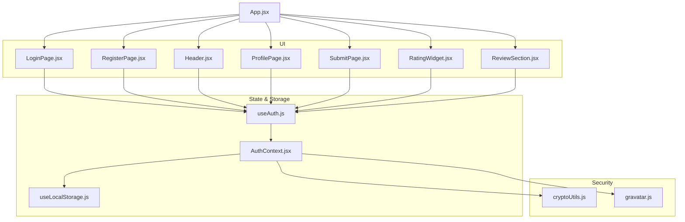

**Diagram sources**
- [App.jsx:1-51](file://src/App.jsx#L1-L51)
- [Header.jsx:1-116](file://src/components/layout/Header.jsx#L1-L116)
- [LoginPage.jsx:1-82](file://src/pages/LoginPage.jsx#L1-L82)
- [RegisterPage.jsx:1-132](file://src/pages/RegisterPage.jsx#L1-L132)
- [ProfilePage.jsx:1-387](file://src/pages/ProfilePage.jsx#L1-L387)
- [SubmitPage.jsx:1-388](file://src/pages/SubmitPage.jsx#L1-L388)
- [RatingWidget.jsx:1-84](file://src/components/RatingWidget.jsx#L1-L84)
- [ReviewSection.jsx:1-131](file://src/components/ReviewSection.jsx#L1-L131)
- [AuthContext.jsx:1-105](file://src/contexts/AuthContext.jsx#L1-L105)
- [useAuth.js:1-11](file://src/hooks/useAuth.js#L1-L11)
- [useLocalStorage.js:1-29](file://src/hooks/useLocalStorage.js#L1-L29)
- [cryptoUtils.js:1-70](file://src/utils/cryptoUtils.js#L1-L70)
- [gravatar.js:1-35](file://src/utils/gravatar.js#L1-L35)

**Section sources**
- [App.jsx:1-51](file://src/App.jsx#L1-L51)

## Core Components
- AuthContext: Provides authentication state, registration, login, and logout. Manages users and session in localStorage and computes current user from session.
- useAuth: Custom hook to consume AuthContext values.
- cryptoUtils: Implements PBKDF2 hashing with 100,000 iterations and SHA-256, salt generation, password verification, and legacy hash detection/migration.
- useLocalStorage: Hook to persist data in browser localStorage with safe read/write and error handling.
- LoginPage and RegisterPage: Form-driven flows with client-side validation and loading/error states.
- ProfilePage: Displays bookmarks, completed tutorials, submissions, and followed tags; supports editing/deleting submissions.
- Header: Renders navigation and auth controls; triggers logout and navigates after logout.
- Integration components: SubmitPage, RatingWidget, ReviewSection conditionally render or enable actions based on authentication state.

**Section sources**
- [AuthContext.jsx:1-105](file://src/contexts/AuthContext.jsx#L1-L105)
- [useAuth.js:1-11](file://src/hooks/useAuth.js#L1-L11)
- [cryptoUtils.js:1-70](file://src/utils/cryptoUtils.js#L1-L70)
- [useLocalStorage.js:1-29](file://src/hooks/useLocalStorage.js#L1-L29)
- [LoginPage.jsx:1-82](file://src/pages/LoginPage.jsx#L1-L82)
- [RegisterPage.jsx:1-132](file://src/pages/RegisterPage.jsx#L1-L132)
- [ProfilePage.jsx:1-387](file://src/pages/ProfilePage.jsx#L1-L387)
- [Header.jsx:1-116](file://src/components/layout/Header.jsx#L1-L116)
- [SubmitPage.jsx:1-388](file://src/pages/SubmitPage.jsx#L1-L388)
- [RatingWidget.jsx:1-84](file://src/components/RatingWidget.jsx#L1-L84)
- [ReviewSection.jsx:1-131](file://src/components/ReviewSection.jsx#L1-L131)

## Architecture Overview
The authentication system centers on a React Context that encapsulates:
- Users: in-memory array persisted to localStorage
- Session: current logged-in user identifier and login timestamp
- Derived current user: resolved from session and users
- Public actions: register, login, logout

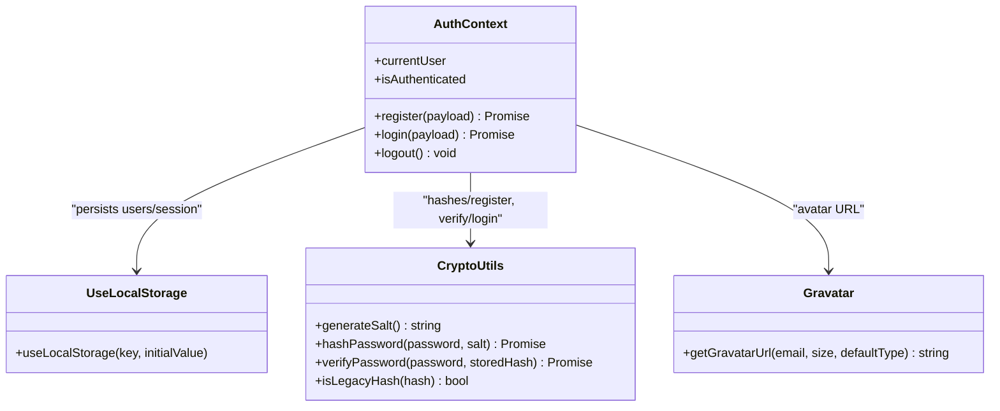

**Diagram sources**
- [AuthContext.jsx:1-105](file://src/contexts/AuthContext.jsx#L1-L105)
- [cryptoUtils.js:1-70](file://src/utils/cryptoUtils.js#L1-L70)
- [useLocalStorage.js:1-29](file://src/hooks/useLocalStorage.js#L1-L29)
- [gravatar.js:1-35](file://src/utils/gravatar.js#L1-L35)

## Detailed Component Analysis

### AuthContext and useAuth
- Responsibilities:
  - Manage users and session in localStorage via a custom hook
  - Compute current user from session and users
  - Registration: deduplicate by username/email, generate salt, hash password, create user record, set session
  - Login: resolve user by username or email, support legacy hash migration to PBKDF2, set session
  - Logout: clear session
- State shape:
  - users: array of user objects with id, username, email, passwordHash, displayName, avatarUrl, createdAt
  - session: { userId, loginAt } or null
- Security:
  - PBKDF2 with 100,000 iterations and SHA-256
  - Constant-time comparison during verification
  - Legacy hash detection and transparent migration

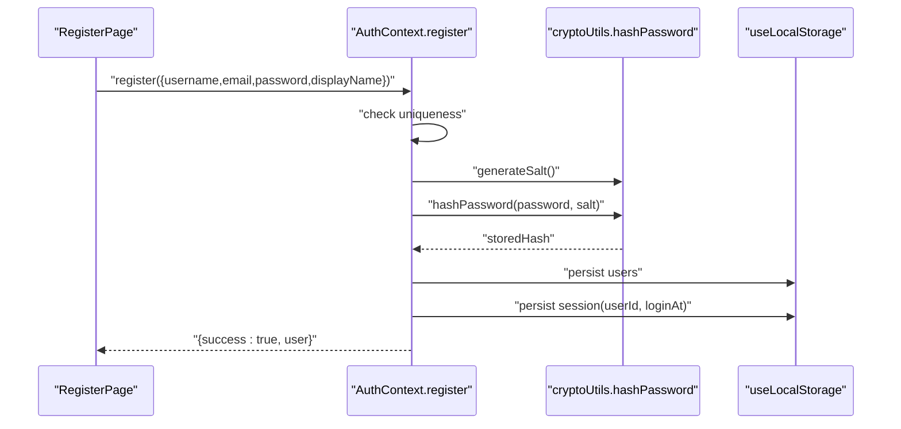

**Diagram sources**
- [RegisterPage.jsx:21-67](file://src/pages/RegisterPage.jsx#L21-L67)
- [AuthContext.jsx:22-52](file://src/contexts/AuthContext.jsx#L22-L52)
- [cryptoUtils.js:25-48](file://src/utils/cryptoUtils.js#L25-L48)
- [useLocalStorage.js:3-28](file://src/hooks/useLocalStorage.js#L3-L28)

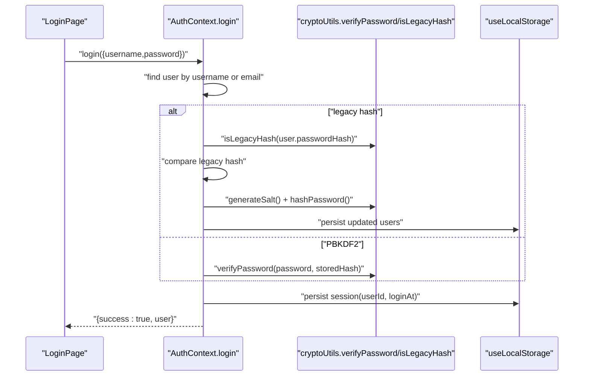

**Diagram sources**
- [LoginPage.jsx:19-39](file://src/pages/LoginPage.jsx#L19-L39)
- [AuthContext.jsx:54-86](file://src/contexts/AuthContext.jsx#L54-L86)
- [cryptoUtils.js:50-69](file://src/utils/cryptoUtils.js#L50-L69)
- [useLocalStorage.js:3-28](file://src/hooks/useLocalStorage.js#L3-L28)

**Section sources**
- [AuthContext.jsx:13-105](file://src/contexts/AuthContext.jsx#L13-L105)
- [useAuth.js:4-10](file://src/hooks/useAuth.js#L4-L10)
- [cryptoUtils.js:1-70](file://src/utils/cryptoUtils.js#L1-L70)
- [useLocalStorage.js:1-29](file://src/hooks/useLocalStorage.js#L1-L29)

### Password Security and Migration
- PBKDF2 parameters:
  - Iterations: 100,000
  - Hash function: SHA-256
  - Salt: 16-byte random value encoded as hex
- Verification:
  - Stored format: "pbkdf2:salt:hex"
  - Legacy hashes: non-prefixed values are detected and migrated
  - Constant-time comparison prevents timing attacks
- Migration:
  - On successful legacy login, re-hash with PBKDF2 and update user record

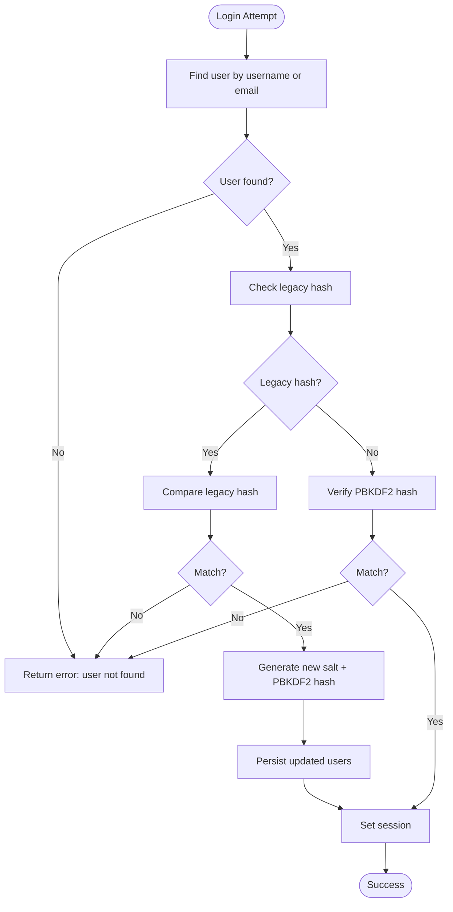

**Diagram sources**
- [AuthContext.jsx:54-86](file://src/contexts/AuthContext.jsx#L54-L86)
- [cryptoUtils.js:50-69](file://src/utils/cryptoUtils.js#L50-L69)

**Section sources**
- [cryptoUtils.js:1-70](file://src/utils/cryptoUtils.js#L1-L70)
- [AuthContext.jsx:63-80](file://src/contexts/AuthContext.jsx#L63-L80)

### Session Management and Persistence
- Persistence:
  - Users and session stored in localStorage via a custom hook
  - Safe initialization with try/catch and fallback to initial values
- Restoration:
  - On app load, localStorage values are read and hydrated into state
- Logout:
  - Clears session; navigation handled by header component

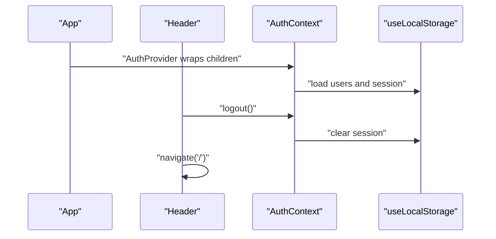

**Diagram sources**
- [App.jsx:21-47](file://src/App.jsx#L21-L47)
- [Header.jsx:14-18](file://src/components/layout/Header.jsx#L14-L18)
- [AuthContext.jsx:13-105](file://src/contexts/AuthContext.jsx#L13-L105)
- [useLocalStorage.js:3-28](file://src/hooks/useLocalStorage.js#L3-L28)

**Section sources**
- [useLocalStorage.js:1-29](file://src/hooks/useLocalStorage.js#L1-L29)
- [AuthContext.jsx:14-20](file://src/contexts/AuthContext.jsx#L14-L20)
- [Header.jsx:14-18](file://src/components/layout/Header.jsx#L14-L18)

### Registration Flow and Validation
- Fields validated on client:
  - Username length (3–20), allowed characters (letters, digits, underscore)
  - Email format
  - Password minimum length (6)
- Behavior:
  - On success, redirects to home; on error, displays message
  - Loading state prevents duplicate submissions

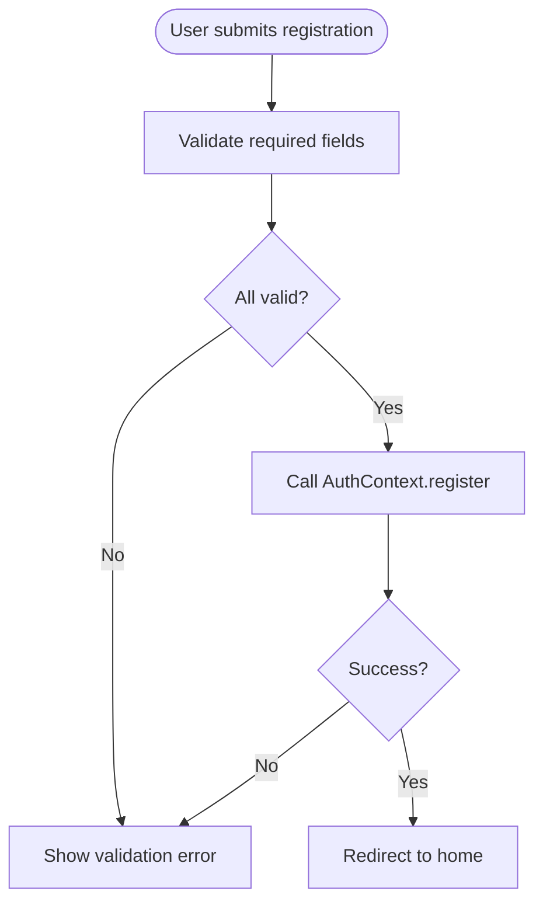

**Diagram sources**
- [RegisterPage.jsx:21-67](file://src/pages/RegisterPage.jsx#L21-L67)
- [AuthContext.jsx:22-52](file://src/contexts/AuthContext.jsx#L22-L52)

**Section sources**
- [RegisterPage.jsx:25-48](file://src/pages/RegisterPage.jsx#L25-L48)
- [AuthContext.jsx:22-52](file://src/contexts/AuthContext.jsx#L22-L52)

### Login Flow and Error Handling
- Inputs:
  - Accepts username or email
  - Trims whitespace
- Validation:
  - Prevents empty fields
- Behavior:
  - On success, navigates to home
  - On failure, displays server-side or validation error
  - Loading state disabled button while authenticating

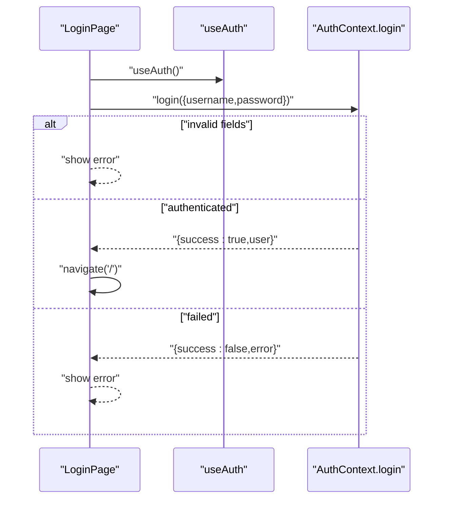

**Diagram sources**
- [LoginPage.jsx:19-39](file://src/pages/LoginPage.jsx#L19-L39)
- [AuthContext.jsx:54-86](file://src/contexts/AuthContext.jsx#L54-L86)

**Section sources**
- [LoginPage.jsx:19-39](file://src/pages/LoginPage.jsx#L19-L39)
- [AuthContext.jsx:54-86](file://src/contexts/AuthContext.jsx#L54-L86)

### Profile Management Features
- Tabs:
  - Bookmarks, Completed, My Submissions, Tags
- Submissions:
  - View owned submissions
  - Edit submission metadata (title, description, URL, category, difficulty, platform, engine version, tags, duration)
  - Delete submission with confirmation modal
- Tags:
  - View followed tags and unfollow
- Navigation:
  - Unauthenticated users prompted to log in

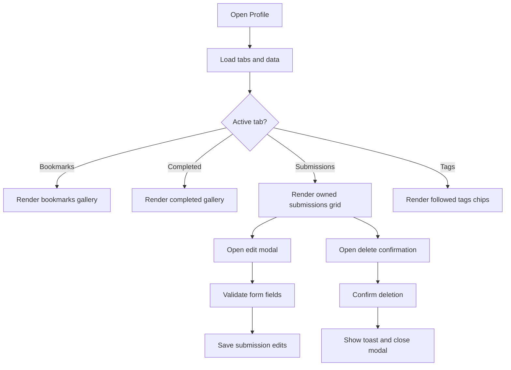

**Diagram sources**
- [ProfilePage.jsx:54-276](file://src/pages/ProfilePage.jsx#L54-L276)

**Section sources**
- [ProfilePage.jsx:54-276](file://src/pages/ProfilePage.jsx#L54-L276)

### Integration with Tutorial Submission, Ratings, and Reviews
- Tutorial submission:
  - Requires authentication; unauthenticated users are prompted to log in
  - On submit, attaches author identity (id, name) and persists submission
- Rating widget:
  - Requires authentication; unauthenticated users are prompted to log in
  - Supports keyboard navigation and click-based ratings
- Reviews:
  - Requires authentication to post
  - Supports sorting by helpfulness or newest and voting on reviews

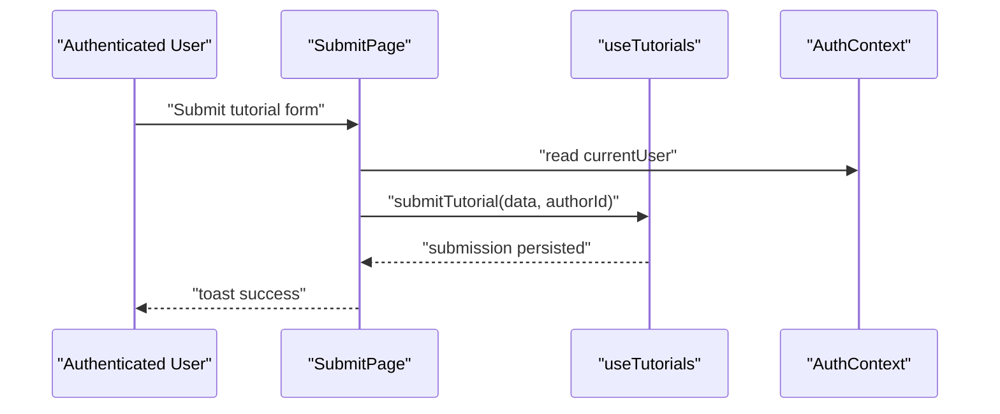

**Diagram sources**
- [SubmitPage.jsx:10-173](file://src/pages/SubmitPage.jsx#L10-L173)
- [AuthContext.jsx:17-20](file://src/contexts/AuthContext.jsx#L17-L20)

**Section sources**
- [SubmitPage.jsx:43-52](file://src/pages/SubmitPage.jsx#L43-L52)
- [RatingWidget.jsx:11-17](file://src/components/RatingWidget.jsx#L11-L17)
- [ReviewSection.jsx:58-62](file://src/components/ReviewSection.jsx#L58-L62)

## Dependency Analysis
- AuthContext depends on:
  - useLocalStorage for persistence
  - cryptoUtils for hashing and verification
  - gravatar for avatar URLs
- UI components depend on useAuth to access authentication state and actions
- Pages enforce authentication gating for protected routes

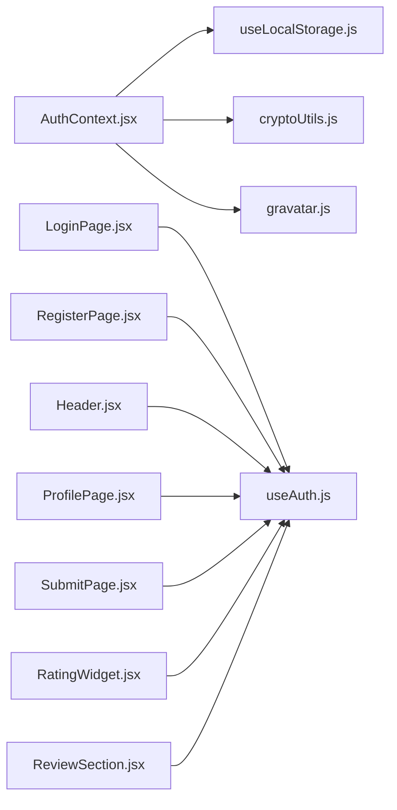

**Diagram sources**
- [AuthContext.jsx:1-105](file://src/contexts/AuthContext.jsx#L1-L105)
- [useLocalStorage.js:1-29](file://src/hooks/useLocalStorage.js#L1-L29)
- [cryptoUtils.js:1-70](file://src/utils/cryptoUtils.js#L1-L70)
- [gravatar.js:1-35](file://src/utils/gravatar.js#L1-L35)
- [LoginPage.jsx:1-82](file://src/pages/LoginPage.jsx#L1-L82)
- [RegisterPage.jsx:1-132](file://src/pages/RegisterPage.jsx#L1-L132)
- [Header.jsx:1-116](file://src/components/layout/Header.jsx#L1-L116)
- [ProfilePage.jsx:1-387](file://src/pages/ProfilePage.jsx#L1-L387)
- [SubmitPage.jsx:1-388](file://src/pages/SubmitPage.jsx#L1-L388)
- [RatingWidget.jsx:1-84](file://src/components/RatingWidget.jsx#L1-L84)
- [ReviewSection.jsx:1-131](file://src/components/ReviewSection.jsx#L1-L131)

**Section sources**
- [AuthContext.jsx:1-105](file://src/contexts/AuthContext.jsx#L1-L105)
- [useAuth.js:1-11](file://src/hooks/useAuth.js#L1-L11)

## Performance Considerations
- PBKDF2 cost:
  - 100,000 iterations provide strong resistance to brute-force but increase CPU time during registration/login
  - Consider adjusting iterations based on device capability if needed
- Local storage:
  - Batch updates and avoid frequent writes; the current implementation writes on register/login and user migration
- Rendering:
  - Profile tabs and galleries should leverage pagination or virtualization for large datasets

## Troubleshooting Guide
- Common errors:
  - Duplicate username or email during registration
  - Incorrect password or user not found during login
  - Validation failures on registration (length, format, allowed characters)
- Symptoms and fixes:
  - Registration shows “Username already taken” or “Email already registered”: prompt user to change credentials
  - Login shows “User not found” or “Incorrect password”: confirm credentials and network connectivity
  - Validation errors on registration: adjust input to meet constraints
- Session issues:
  - If logout does not redirect, verify header’s logout handler and navigation logic
  - If session persists unexpectedly, inspect localStorage keys and provider initialization

**Section sources**
- [AuthContext.jsx:27-32](file://src/contexts/AuthContext.jsx#L27-L32)
- [AuthContext.jsx:59-60](file://src/contexts/AuthContext.jsx#L59-L60)
- [RegisterPage.jsx:30-48](file://src/pages/RegisterPage.jsx#L30-L48)
- [Header.jsx:14-18](file://src/components/layout/Header.jsx#L14-L18)

## Conclusion
GameDev Hub’s authentication system combines a robust PBKDF2-based password scheme with a clean React Context pattern for state management. It ensures secure password handling, smooth user onboarding, and seamless integration with tutorial submission, rating, and review features. The design leverages localStorage for persistence and provides clear guards for protected functionality, while offering a migration path for legacy accounts.