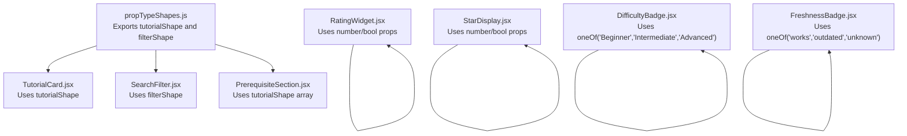
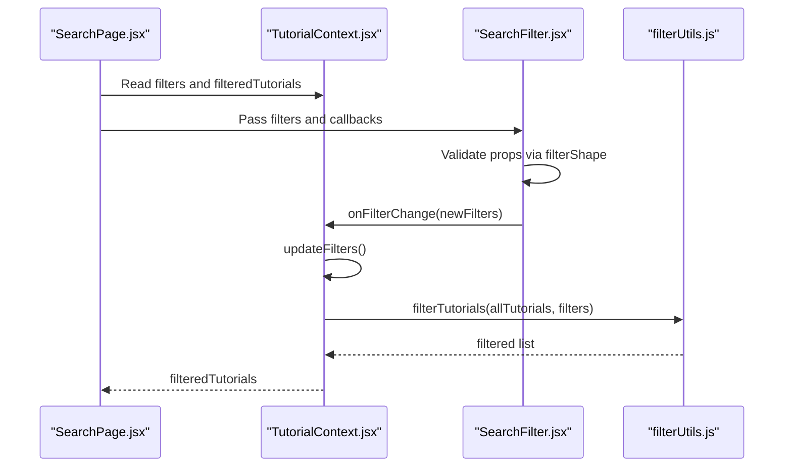
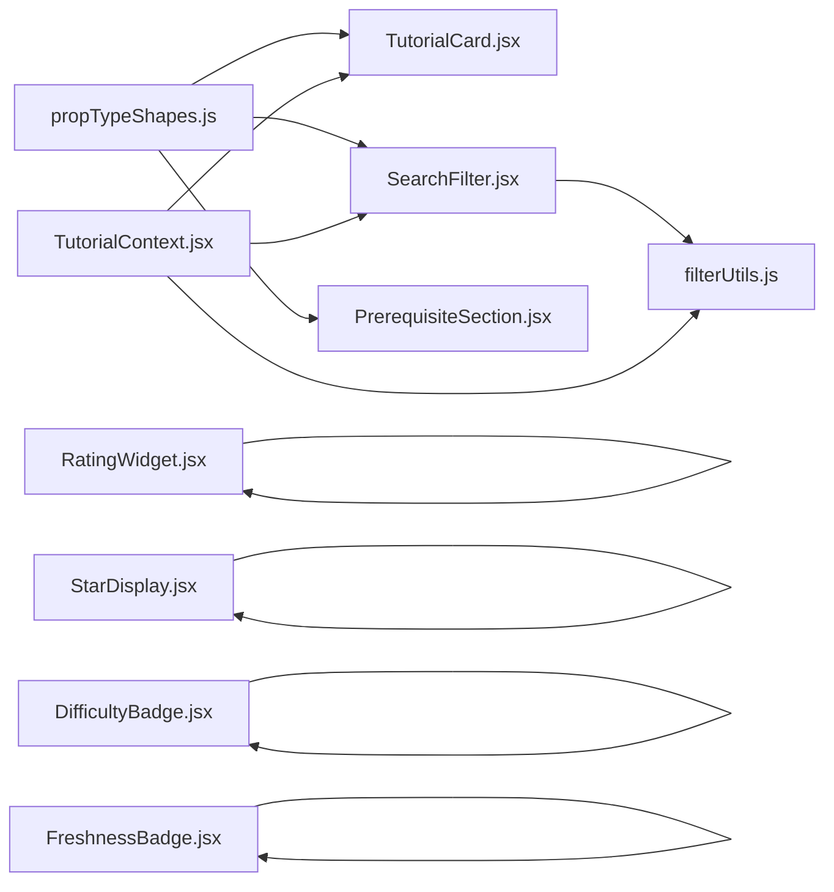

# Component Validation

<cite>
**Referenced Files in This Document**
- [propTypeShapes.js](file://src/utils/propTypeShapes.js)
- [tutorials.js](file://src/data/tutorials.js)
- [constants.js](file://src/data/constants.js)
- [TutorialCard.jsx](file://src/components/TutorialCard.jsx)
- [SearchFilter.jsx](file://src/components/SearchFilter.jsx)
- [PrerequisiteSection.jsx](file://src/components/PrerequisiteSection.jsx)
- [RatingWidget.jsx](file://src/components/RatingWidget.jsx)
- [StarDisplay.jsx](file://src/components/StarDisplay.jsx)
- [DifficultyBadge.jsx](file://src/components/DifficultyBadge.jsx)
- [FreshnessBadge.jsx](file://src/components/FreshnessBadge.jsx)
- [SearchPage.jsx](file://src/pages/SearchPage.jsx)
- [TutorialContext.jsx](file://src/contexts/TutorialContext.jsx)
- [filterUtils.js](file://src/utils/filterUtils.js)
</cite>

## Table of Contents
1. [Introduction](#introduction)
2. [Project Structure](#project-structure)
3. [Core Components](#core-components)
4. [Architecture Overview](#architecture-overview)
5. [Detailed Component Analysis](#detailed-component-analysis)
6. [Dependency Analysis](#dependency-analysis)
7. [Performance Considerations](#performance-considerations)
8. [Troubleshooting Guide](#troubleshooting-guide)
9. [Conclusion](#conclusion)

## Introduction
This document describes the component validation module used across the application’s React components. It focuses on shared PropTypes definitions that ensure consistent prop validation for tutorial objects, filter state, and related UI components. It also documents the tutorial object shape, filter state shape, and related structures such as ratings and reviews. Guidance is included for PropTypes usage patterns, development versus production behavior, and debugging techniques for prop validation errors.

## Project Structure
The validation module centers around a single shared file exporting reusable PropTypes shapes. Components import these shapes to validate incoming props, ensuring predictable data contracts across the UI.

**Diagram sources**
- [propTypeShapes.js:1-37](file://src/utils/propTypeShapes.js#L1-L37)
- [TutorialCard.jsx:107-109](file://src/components/TutorialCard.jsx#L107-L109)
- [SearchFilter.jsx:232-236](file://src/components/SearchFilter.jsx#L232-L236)
- [PrerequisiteSection.jsx:39-40](file://src/components/PrerequisiteSection.jsx#L39-L40)
- [RatingWidget.jsx:79-83](file://src/components/RatingWidget.jsx#L79-L83)
- [StarDisplay.jsx:44-48](file://src/components/StarDisplay.jsx#L44-L48)
- [DifficultyBadge.jsx:19-21](file://src/components/DifficultyBadge.jsx#L19-L21)
- [FreshnessBadge.jsx:29-31](file://src/components/FreshnessBadge.jsx#L29-L31)

**Section sources**
- [propTypeShapes.js:1-37](file://src/utils/propTypeShapes.js#L1-L37)

## Core Components
This section documents the shared PropTypes definitions and their usage across components.

- Shared tutorial shape definition
  - Purpose: Validates tutorial objects passed to components such as cards, prerequisite lists, and detail views.
  - Key fields validated: identifiers, strings, arrays, numbers, booleans, nested author object, and optional fields.
  - Validation rules: Required fields are marked as required; optional fields may be omitted.
  - Usage: Imported by components that render tutorial data.

- Shared filter state shape definition
  - Purpose: Validates the filter object used by the search/filter UI and context.
  - Key fields validated: search query, arrays of selected categories/difficulties/platforms/engine versions, duration range selector, and minimum rating threshold.
  - Validation rules: All fields are optional; defaults are handled by the context provider.
  - Usage: Passed from page components to filter UI and consumed by filtering utilities.

**Section sources**
- [propTypeShapes.js:3-26](file://src/utils/propTypeShapes.js#L3-L26)
- [propTypeShapes.js:28-36](file://src/utils/propTypeShapes.js#L28-L36)

## Architecture Overview
The validation architecture ties together shared PropTypes with page components, UI components, and the tutorial context. The context manages filter state and tutorial data, while components validate their props using the shared shapes.

**Diagram sources**
- [SearchPage.jsx:12-103](file://src/pages/SearchPage.jsx#L12-L103)
- [TutorialContext.jsx:435-444](file://src/contexts/TutorialContext.jsx#L435-L444)
- [SearchFilter.jsx:19-236](file://src/components/SearchFilter.jsx#L19-L236)
- [filterUtils.js:1-60](file://src/utils/filterUtils.js#L1-L60)

## Detailed Component Analysis

### Shared PropTypes Definitions
- tutorialShape
  - Fields: id, title, description, url, thumbnailUrl, category, difficulty, platform, engineVersion, tags, estimatedDuration, seriesId, seriesOrder, prerequisites, author, viewCount, averageRating, ratingCount, isFeatured.
  - Nested author: id (optional), name (required).
  - Validation rules: Required fields are required; optional fields may be omitted.
  - Usage pattern: Import and apply as PropTypes.shape(...) to component props that receive tutorial objects.

- filterShape
  - Fields: searchQuery (string), categories (array of strings), difficulties (array of strings), platforms (array of strings), engineVersions (array of strings), durationRange (string), minRating (number).
  - Validation rules: All fields are optional; components should handle missing or empty arrays gracefully.
  - Usage pattern: Import and apply as PropTypes.shape(...) to props expecting filter state.

Integration examples:
- TutorialCard expects a single tutorial object validated by tutorialShape.
- SearchFilter expects a filter object validated by filterShape and two callback functions.
- PrerequisiteSection expects an array of tutorials validated by tutorialShape.

**Section sources**
- [propTypeShapes.js:3-26](file://src/utils/propTypeShapes.js#L3-L26)
- [propTypeShapes.js:28-36](file://src/utils/propTypeShapes.js#L28-L36)
- [TutorialCard.jsx:107-109](file://src/components/TutorialCard.jsx#L107-L109)
- [SearchFilter.jsx:232-236](file://src/components/SearchFilter.jsx#L232-L236)
- [PrerequisiteSection.jsx:39-40](file://src/components/PrerequisiteSection.jsx#L39-L40)

### Tutorial Object Shape
- Purpose: Defines the canonical structure for tutorial records used across the app.
- Fields:
  - Identifiers: id, seriesId.
  - Metadata: title, description, url, thumbnailUrl, category, difficulty, platform, engineVersion, tags, estimatedDuration, author.
  - Relationships: prerequisites (array of tutorial ids), seriesId, seriesOrder.
  - Analytics: viewCount, averageRating, ratingCount, isFeatured.
  - Timestamps: createdAt (used by sorting utilities).
- Notes: The dataset includes additional fields (e.g., videoId) that are not part of the PropTypes but are present in the data source.

Validation rules:
- Required: id, title, url, category, difficulty, platform, author.name.
- Optional: thumbnailUrl, engineVersion, tags, estimatedDuration, seriesId, seriesOrder, prerequisites, viewCount, averageRating, ratingCount, isFeatured.

**Section sources**
- [propTypeShapes.js:3-26](file://src/utils/propTypeShapes.js#L3-L26)
- [tutorials.js:1-522](file://src/data/tutorials.js#L1-L522)

### Filter State Shape
- Purpose: Defines the shape of the filter object used by the search UI and context.
- Fields:
  - searchQuery: string for text search.
  - categories, difficulties, platforms, engineVersions: arrays of selected values.
  - durationRange: string mapped to predefined ranges.
  - minRating: number threshold for minimum rating.
- Defaults and normalization:
  - The context initializes filters with sensible defaults and merges updates via a callback.
  - Sorting and filtering utilities rely on these fields to compute results.

Validation rules:
- All fields are optional; components should guard against missing or empty arrays.

**Section sources**
- [propTypeShapes.js:28-36](file://src/utils/propTypeShapes.js#L28-L36)
- [TutorialContext.jsx:8-16](file://src/contexts/TutorialContext.jsx#L8-L16)
- [TutorialContext.jsx:435-444](file://src/contexts/TutorialContext.jsx#L435-L444)
- [filterUtils.js:1-60](file://src/utils/filterUtils.js#L1-L60)

### Rating and Review Object Structures
- Ratings:
  - Stored in local storage under a tutorialId-keyed map with userId keys.
  - Used to compute updated average ratings and counts in the context.
  - UI component accepts currentRating and onRate callback.

- Reviews:
  - Stored as an array of review objects with fields: id, tutorialId, userId, username, text, createdAt.
  - Voting stored per review with userId keys for up/down votes.
  - UI component renders reviews, supports sorting, voting, and posting.

Validation rules:
- Ratings: number values; widget enforces numeric inputs.
- Reviews: strings for text and usernames; dates for timestamps.

**Section sources**
- [TutorialContext.jsx:19-25](file://src/contexts/TutorialContext.jsx#L19-L25)
- [TutorialContext.jsx:90-124](file://src/contexts/TutorialContext.jsx#L90-L124)
- [TutorialContext.jsx:204-257](file://src/contexts/TutorialContext.jsx#L204-L257)
- [RatingWidget.jsx:79-83](file://src/components/RatingWidget.jsx#L79-L83)
- [ReviewSection.jsx:7-12](file://src/components/ReviewSection.jsx#L7-L12)

### Component-Level Validation Patterns
- TutorialCard
  - Validates a single tutorial via tutorialShape.isRequired.
  - Uses nested fields (author.name, tags, series info) safely.

- SearchFilter
  - Validates filters via filterShape.isRequired.
  - Validates callbacks via PropTypes.func.isRequired.

- PrerequisiteSection
  - Validates an array of tutorials via PropTypes.arrayOf(tutorialShape).

- Additional UI components
  - StarDisplay validates rating and optional count/compact flags.
  - DifficultyBadge validates difficulty via PropTypes.oneOf([...]).
  - FreshnessBadge validates consensus via PropTypes.oneOf([...]).

**Section sources**
- [TutorialCard.jsx:107-109](file://src/components/TutorialCard.jsx#L107-L109)
- [SearchFilter.jsx:232-236](file://src/components/SearchFilter.jsx#L232-L236)
- [PrerequisiteSection.jsx:39-40](file://src/components/PrerequisiteSection.jsx#L39-L40)
- [StarDisplay.jsx:44-48](file://src/components/StarDisplay.jsx#L44-L48)
- [DifficultyBadge.jsx:19-21](file://src/components/DifficultyBadge.jsx#L19-L21)
- [FreshnessBadge.jsx:29-31](file://src/components/FreshnessBadge.jsx#L29-L31)

## Dependency Analysis
The validation module is consumed by multiple components and integrates with the tutorial context and filtering utilities.

**Diagram sources**
- [propTypeShapes.js:1-37](file://src/utils/propTypeShapes.js#L1-L37)
- [TutorialCard.jsx:107-109](file://src/components/TutorialCard.jsx#L107-L109)
- [SearchFilter.jsx:232-236](file://src/components/SearchFilter.jsx#L232-L236)
- [PrerequisiteSection.jsx:39-40](file://src/components/PrerequisiteSection.jsx#L39-L40)
- [RatingWidget.jsx:79-83](file://src/components/RatingWidget.jsx#L79-L83)
- [StarDisplay.jsx:44-48](file://src/components/StarDisplay.jsx#L44-L48)
- [DifficultyBadge.jsx:19-21](file://src/components/DifficultyBadge.jsx#L19-L21)
- [FreshnessBadge.jsx:29-31](file://src/components/FreshnessBadge.jsx#L29-L31)
- [TutorialContext.jsx:435-444](file://src/contexts/TutorialContext.jsx#L435-L444)
- [filterUtils.js:1-60](file://src/utils/filterUtils.js#L1-L60)

**Section sources**
- [propTypeShapes.js:1-37](file://src/utils/propTypeShapes.js#L1-L37)
- [TutorialContext.jsx:435-444](file://src/contexts/TutorialContext.jsx#L435-L444)
- [filterUtils.js:1-60](file://src/utils/filterUtils.js#L1-L60)

## Performance Considerations
- Prefer validating only at component boundaries to avoid redundant checks inside loops.
- Keep PropTypes definitions close to where components are used to minimize import overhead.
- Use memoization for derived data (e.g., filtered lists) to reduce re-computation when props are unchanged.

## Troubleshooting Guide
Common issues and resolutions:
- PropTypes warnings for missing required fields
  - Symptom: Warning indicating a required field is missing on a tutorial or filter object.
  - Resolution: Ensure the data source includes required fields or provide defaults before passing to components.

- Type mismatches (e.g., number vs string)
  - Symptom: Warning about incorrect prop types.
  - Resolution: Normalize data types in the context or utilities before validation.

- Arrays and nested objects
  - Symptom: Warnings for arrays or nested objects not matching expected shapes.
  - Resolution: Verify that arrays contain the correct element types and nested objects include required keys.

- Development vs production behavior
  - Behavior: PropTypes validation runs in development builds and is stripped in production for performance.
  - Recommendation: Keep validation enabled during development and rely on tests to catch runtime issues in production-like environments.

Debugging techniques:
- Temporarily log props in components to inspect actual shapes.
- Use React DevTools to inspect component props and context values.
- Add defensive checks in components to handle missing or malformed data gracefully.

**Section sources**
- [TutorialCard.jsx:107-109](file://src/components/TutorialCard.jsx#L107-L109)
- [SearchFilter.jsx:232-236](file://src/components/SearchFilter.jsx#L232-L236)
- [PrerequisiteSection.jsx:39-40](file://src/components/PrerequisiteSection.jsx#L39-L40)

## Conclusion
The component validation module centralizes PropTypes definitions for tutorial and filter objects, enabling consistent prop validation across the application. By importing shared shapes into components and leveraging the tutorial context and filtering utilities, the system ensures predictable data contracts, reduces runtime errors, and improves maintainability. Adopting the recommended patterns and debugging techniques will help sustain high code quality as the application evolves.