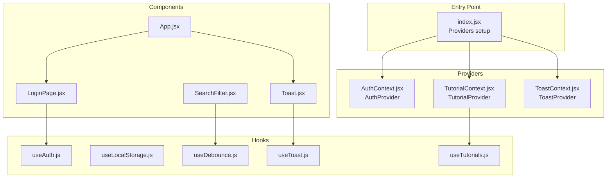
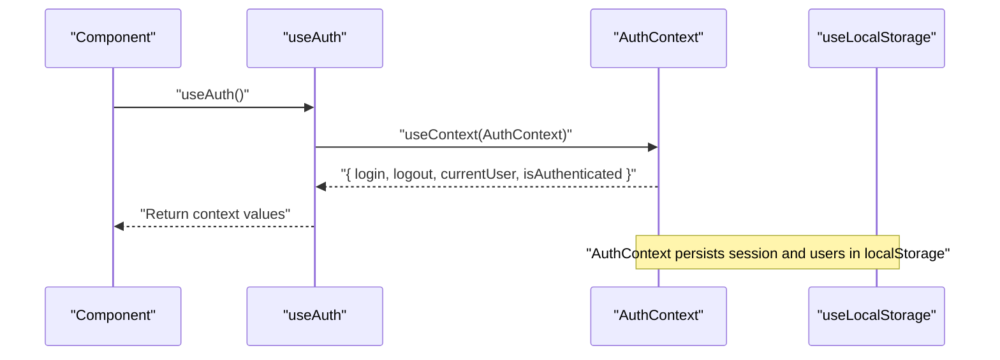
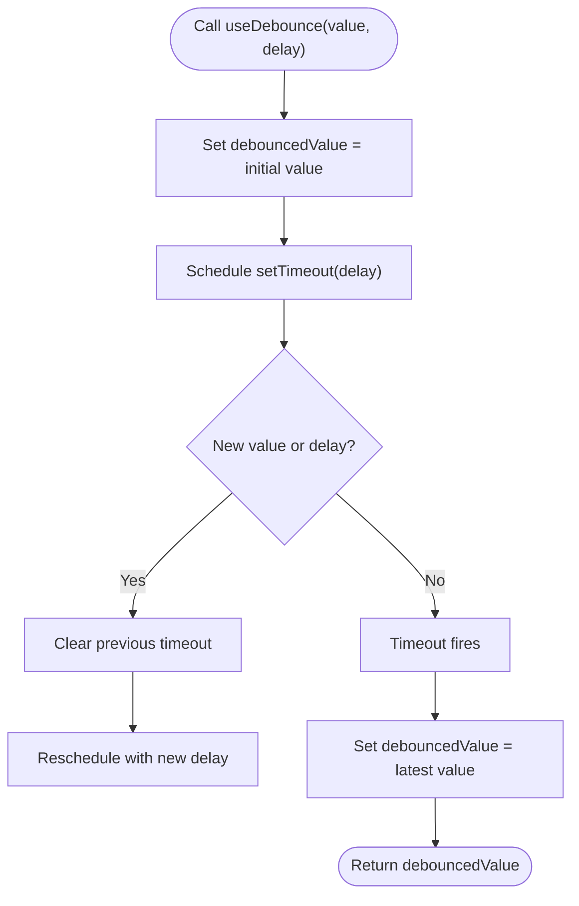
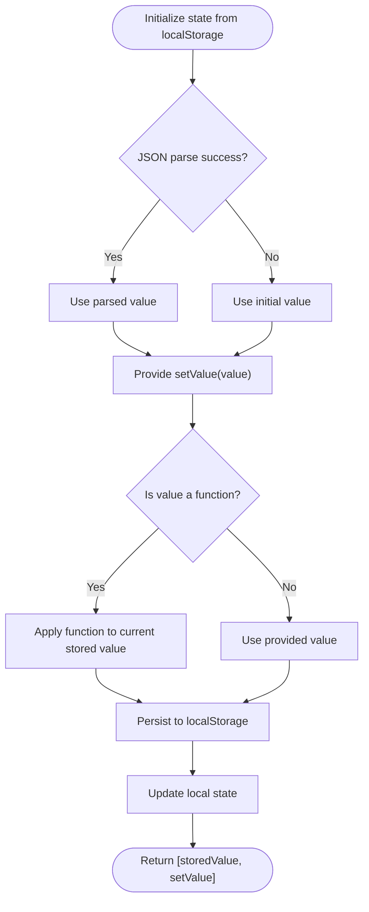
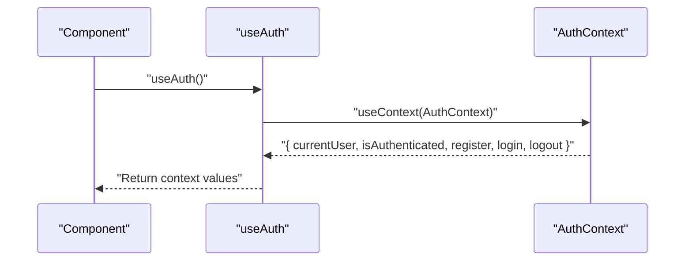
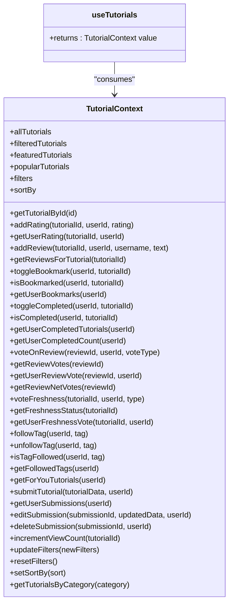
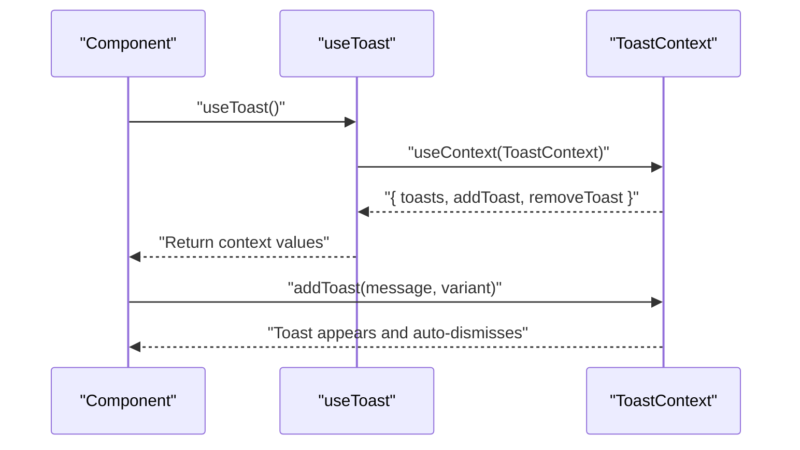
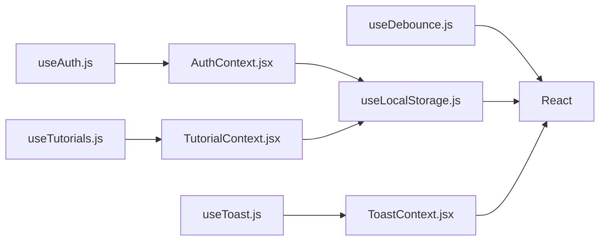

# Custom Hooks

<cite>
**Referenced Files in This Document**
- [useDebounce.js](file://src/hooks/useDebounce.js)
- [useLocalStorage.js](file://src/hooks/useLocalStorage.js)
- [useAuth.js](file://src/hooks/useAuth.js)
- [useTutorials.js](file://src/hooks/useTutorials.js)
- [useToast.js](file://src/hooks/useToast.js)
- [AuthContext.jsx](file://src/contexts/AuthContext.jsx)
- [TutorialContext.jsx](file://src/contexts/TutorialContext.jsx)
- [ToastContext.jsx](file://src/contexts/ToastContext.jsx)
- [index.jsx](file://src/index.jsx)
- [App.jsx](file://src/App.jsx)
- [LoginPage.jsx](file://src/pages/LoginPage.jsx)
- [Toast.jsx](file://src/components/Toast.jsx)
- [SearchFilter.jsx](file://src/components/SearchFilter.jsx)
</cite>

## Table of Contents
1. [Introduction](#introduction)
2. [Project Structure](#project-structure)
3. [Core Components](#core-components)
4. [Architecture Overview](#architecture-overview)
5. [Detailed Component Analysis](#detailed-component-analysis)
6. [Dependency Analysis](#dependency-analysis)
7. [Performance Considerations](#performance-considerations)
8. [Troubleshooting Guide](#troubleshooting-guide)
9. [Conclusion](#conclusion)

## Introduction
This document provides comprehensive documentation for the custom hooks module used across the application. It covers:
- useDebounce for performance optimization via delayed updates
- useLocalStorage for robust browser storage with serialization/deserialization
- useAuth for authentication state management and session persistence
- useTutorials for centralized tutorial data fetching and state management
- useToast for notification management and user feedback

It explains hook signatures, dependency arrays, side effects, composition patterns, performance considerations, and integration with React components and context providers.

## Project Structure
The custom hooks live under src/hooks and are consumed by components and context providers. Providers are initialized in the application entry point and wrap the app shell.

**Diagram sources**
- [index.jsx:11-24](file://src/index.jsx#L11-L24)
- [AuthContext.jsx:13-104](file://src/contexts/AuthContext.jsx#L13-L104)
- [TutorialContext.jsx:18-541](file://src/contexts/TutorialContext.jsx#L18-L541)
- [ToastContext.jsx:5-50](file://src/contexts/ToastContext.jsx#L5-L50)
- [useDebounce.js:3-15](file://src/hooks/useDebounce.js#L3-L15)
- [useLocalStorage.js:3-28](file://src/hooks/useLocalStorage.js#L3-L28)
- [useAuth.js:4-10](file://src/hooks/useAuth.js#L4-L10)
- [useTutorials.js:4-10](file://src/hooks/useTutorials.js#L4-L10)
- [useToast.js:4-10](file://src/hooks/useToast.js#L4-L10)
- [App.jsx:21-48](file://src/App.jsx#L21-L48)
- [LoginPage.jsx:6-39](file://src/pages/LoginPage.jsx#L6-L39)
- [SearchFilter.jsx:19-36](file://src/components/SearchFilter.jsx#L19-L36)
- [Toast.jsx:5-31](file://src/components/Toast.jsx#L5-L31)

**Section sources**
- [index.jsx:11-24](file://src/index.jsx#L11-L24)
- [App.jsx:21-48](file://src/App.jsx#L21-L48)

## Core Components
This section documents each hook’s purpose, signature, dependencies, side effects, and usage patterns.

- useDebounce
  - Purpose: Debounce rapid updates to a value to reduce re-renders and expensive computations.
  - Signature: useDebounce(value, delay = 300)
  - Dependencies: [value, delay]
  - Side effects: Schedules a timeout to update the debounced value; cleans up on unmount.
  - Practical usage: Debounce search queries before triggering filters or API calls.
  - Example reference: [SearchFilter.jsx:21-36](file://src/components/SearchFilter.jsx#L21-L36)

- useLocalStorage
  - Purpose: Persist state to browser localStorage with safe JSON serialization/deserialization.
  - Signature: useLocalStorage(key, initialValue)
  - Returns: [storedValue, setValue]
  - Dependencies: Derived from key and storedValue
  - Side effects: Reads initial value from localStorage; writes updates to localStorage; warns on errors.
  - Practical usage: Persist user preferences, filters, and small application state.
  - Example reference: [AuthContext.jsx:14-15](file://src/contexts/AuthContext.jsx#L14-L15), [TutorialContext.jsx:19-25](file://src/contexts/TutorialContext.jsx#L19-L25)

- useAuth
  - Purpose: Consume authentication state and actions from AuthContext.
  - Signature: useAuth()
  - Returns: { currentUser, isAuthenticated, register, login, logout }
  - Dependencies: None (consumes context)
  - Side effects: Throws if used outside AuthProvider.
  - Practical usage: Handle login/logout flows and protect routes.
  - Example reference: [LoginPage.jsx:11-39](file://src/pages/LoginPage.jsx#L11-L39)

- useTutorials
  - Purpose: Consume tutorial data and feature-rich state from TutorialContext.
  - Signature: useTutorials()
  - Returns: Comprehensive set of getters, setters, and helpers for tutorials, ratings, bookmarks, reviews, votes, and filters.
  - Dependencies: None (consumes context)
  - Side effects: Throws if used outside TutorialProvider.
  - Practical usage: Manage tutorial lists, user interactions, and persisted features.
  - Example reference: [TutorialContext.jsx:453-536](file://src/contexts/TutorialContext.jsx#L453-L536)

- useToast
  - Purpose: Consume toast notifications from ToastContext.
  - Signature: useToast()
  - Returns: { toasts, addToast(message, variant), removeToast(id) }
  - Dependencies: None (consumes context)
  - Side effects: Throws if used outside ToastProvider.
  - Practical usage: Show user feedback and notifications.
  - Example reference: [Toast.jsx:6-28](file://src/components/Toast.jsx#L6-L28)

**Section sources**
- [useDebounce.js:3-15](file://src/hooks/useDebounce.js#L3-L15)
- [useLocalStorage.js:3-28](file://src/hooks/useLocalStorage.js#L3-L28)
- [useAuth.js:4-10](file://src/hooks/useAuth.js#L4-L10)
- [useTutorials.js:4-10](file://src/hooks/useTutorials.js#L4-L10)
- [useToast.js:4-10](file://src/hooks/useToast.js#L4-L10)
- [SearchFilter.jsx:21-36](file://src/components/SearchFilter.jsx#L21-L36)
- [LoginPage.jsx:11-39](file://src/pages/LoginPage.jsx#L11-L39)
- [Toast.jsx:6-28](file://src/components/Toast.jsx#L6-L28)

## Architecture Overview
The hooks integrate with context providers to deliver cross-cutting concerns:
- useLocalStorage powers persistence for authentication sessions and tutorial-related features.
- useAuth exposes login/register/logout and derived authentication state.
- useTutorials centralizes tutorial data, filtering, sorting, and user-driven features.
- useToast manages transient notifications with automatic dismissal and manual controls.
- useDebounce optimizes UI responsiveness by throttling frequent updates.

**Diagram sources**
- [useAuth.js:4-10](file://src/hooks/useAuth.js#L4-L10)
- [AuthContext.jsx:13-104](file://src/contexts/AuthContext.jsx#L13-L104)
- [useLocalStorage.js:3-28](file://src/hooks/useLocalStorage.js#L3-L28)

## Detailed Component Analysis

### useDebounce
- Implementation pattern: Uses a timeout to delay updating the debounced value after the last change. Cleanup clears the timeout on unmount or dependency change.
- Complexity: O(1) per update; memory overhead proportional to number of pending timers.
- Dependency array: [value, delay] ensures re-debounce on either input change or delay change.
- Performance implications: Reduces render cycles and network/API calls during rapid input changes.
- Practical usage example: Debouncing search input before recomputing filters.
  - Reference: [SearchFilter.jsx:21-36](file://src/components/SearchFilter.jsx#L21-L36)

**Diagram sources**
- [useDebounce.js:6-12](file://src/hooks/useDebounce.js#L6-L12)

**Section sources**
- [useDebounce.js:3-15](file://src/hooks/useDebounce.js#L3-L15)
- [SearchFilter.jsx:21-36](file://src/components/SearchFilter.jsx#L21-L36)

### useLocalStorage
- Implementation pattern: Initializes state from localStorage with JSON parsing; provides a setter that serializes and writes to localStorage; guards against parsing/storage errors.
- Complexity: O(1) for reads/writes; JSON operations add overhead proportional to serialized payload size.
- Dependency array: [key, storedValue] ensures setter closure captures current stored value for functional updates.
- Serialization/deserialization: Uses JSON.stringify and JSON.parse around localStorage operations.
- Practical usage example: Persisting filters, bookmarks, and user preferences.
  - References: [AuthContext.jsx:14-15](file://src/contexts/AuthContext.jsx#L14-L15), [TutorialContext.jsx:19-25](file://src/contexts/TutorialContext.jsx#L19-L25)

**Diagram sources**
- [useLocalStorage.js:4-25](file://src/hooks/useLocalStorage.js#L4-L25)

**Section sources**
- [useLocalStorage.js:3-28](file://src/hooks/useLocalStorage.js#L3-L28)
- [AuthContext.jsx:14-15](file://src/contexts/AuthContext.jsx#L14-L15)
- [TutorialContext.jsx:19-25](file://src/contexts/TutorialContext.jsx#L19-L25)

### useAuth
- Implementation pattern: Thin consumer hook that validates it is used inside AuthProvider and returns the context value.
- Complexity: O(1); throws if used outside provider.
- Dependency array: None; depends on context.
- Integration: Exposes login, logout, register, and derived state (currentUser, isAuthenticated).
- Practical usage example: Protecting routes and rendering auth-dependent UI.
  - References: [LoginPage.jsx:11-39](file://src/pages/LoginPage.jsx#L11-L39)

**Diagram sources**
- [useAuth.js:4-10](file://src/hooks/useAuth.js#L4-L10)
- [AuthContext.jsx:92-101](file://src/contexts/AuthContext.jsx#L92-L101)

**Section sources**
- [useAuth.js:4-10](file://src/hooks/useAuth.js#L4-L10)
- [AuthContext.jsx:92-101](file://src/contexts/AuthContext.jsx#L92-L101)
- [LoginPage.jsx:11-39](file://src/pages/LoginPage.jsx#L11-L39)

### useTutorials
- Implementation pattern: Consumer hook returning the entire TutorialContext value for tutorial data, filtering, sorting, and user features.
- Complexity: Depends on memoized computations in provider; getters/setters are O(1).
- Dependency array: None; depends on context.
- Features exposed: Tutorial lists, filters, sorting, ratings, reviews, bookmarks, completion tracking, review voting, freshness voting, tag following, and submission management.
- Practical usage example: Rendering filtered tutorial galleries and managing user interactions.
  - References: [TutorialContext.jsx:453-536](file://src/contexts/TutorialContext.jsx#L453-L536)

**Diagram sources**
- [TutorialContext.jsx:18-541](file://src/contexts/TutorialContext.jsx#L18-L541)
- [useTutorials.js:4-10](file://src/hooks/useTutorials.js#L4-L10)

**Section sources**
- [useTutorials.js:4-10](file://src/hooks/useTutorials.js#L4-L10)
- [TutorialContext.jsx:453-536](file://src/contexts/TutorialContext.jsx#L453-L536)

### useToast
- Implementation pattern: Consumer hook returning toasts array and control functions for adding/removing notifications.
- Complexity: O(1) for add/remove; list operations bounded by max toasts.
- Dependency array: None; depends on context.
- Behavior: Automatic dismissal after a fixed interval; manual dismissal supported; cleanup clears pending timeouts on unmount.
- Practical usage example: Showing feedback messages and allowing user dismissal.
  - References: [Toast.jsx:6-28](file://src/components/Toast.jsx#L6-L28)

**Diagram sources**
- [useToast.js:4-10](file://src/hooks/useToast.js#L4-L10)
- [ToastContext.jsx:27-40](file://src/contexts/ToastContext.jsx#L27-L40)
- [Toast.jsx:6-28](file://src/components/Toast.jsx#L6-L28)

**Section sources**
- [useToast.js:4-10](file://src/hooks/useToast.js#L4-L10)
- [ToastContext.jsx:27-40](file://src/contexts/ToastContext.jsx#L27-L40)
- [Toast.jsx:6-28](file://src/components/Toast.jsx#L6-L28)

## Dependency Analysis
The hooks depend on React’s built-in primitives and context providers. Providers encapsulate state and side effects, while hooks expose a clean interface to components.

**Diagram sources**
- [useDebounce.js:1](file://src/hooks/useDebounce.js#L1)
- [useLocalStorage.js:1](file://src/hooks/useLocalStorage.js#L1)
- [useAuth.js:1](file://src/hooks/useAuth.js#L1)
- [useTutorials.js:1](file://src/hooks/useTutorials.js#L1)
- [useToast.js:1](file://src/hooks/useToast.js#L1)
- [AuthContext.jsx:1](file://src/contexts/AuthContext.jsx#L1)
- [TutorialContext.jsx:1](file://src/contexts/TutorialContext.jsx#L1)
- [ToastContext.jsx:1](file://src/contexts/ToastContext.jsx#L1)

**Section sources**
- [useDebounce.js:1](file://src/hooks/useDebounce.js#L1)
- [useLocalStorage.js:1](file://src/hooks/useLocalStorage.js#L1)
- [useAuth.js:1](file://src/hooks/useAuth.js#L1)
- [useTutorials.js:1](file://src/hooks/useTutorials.js#L1)
- [useToast.js:1](file://src/hooks/useToast.js#L1)

## Performance Considerations
- useDebounce
  - Tune delay to balance responsiveness and performance. Higher delays reduce work but increase perceived latency.
  - Ensure cleanup prevents memory leaks and redundant timers.
  - Reference: [useDebounce.js:6-12](file://src/hooks/useDebounce.js#L6-L12)

- useLocalStorage
  - Keep payloads small to minimize JSON overhead and localStorage limits.
  - Avoid synchronous heavy operations in setters; batch updates when possible.
  - Reference: [useLocalStorage.js:14-25](file://src/hooks/useLocalStorage.js#L14-L25)

- useAuth and useTutorials
  - Memoize derived values and callbacks in providers to avoid unnecessary recalculations.
  - Reference: [AuthContext.jsx:17-20](file://src/contexts/AuthContext.jsx#L17-L20), [TutorialContext.jsx:37-71](file://src/contexts/TutorialContext.jsx#L37-L71)

- useToast
  - Limit concurrent toasts to prevent UI thrashing; provider caps list length.
  - Reference: [ToastContext.jsx:30-33](file://src/contexts/ToastContext.jsx#L30-L33)

[No sources needed since this section provides general guidance]

## Troubleshooting Guide
- Error: “useX must be used within a XProvider”
  - Cause: Hook used outside its respective provider.
  - Fix: Wrap components with the appropriate provider in the application root.
  - References: [useAuth.js:6-8](file://src/hooks/useAuth.js#L6-L8), [useTutorials.js:6-8](file://src/hooks/useTutorials.js#L6-L8), [useToast.js:6-8](file://src/hooks/useToast.js#L6-L8)

- useLocalStorage errors
  - Symptom: Warnings when reading/writing localStorage.
  - Cause: Corrupted data or unsupported environment.
  - Fix: Validate keys and payloads; handle exceptions gracefully.
  - Reference: [useLocalStorage.js:8-11](file://src/hooks/useLocalStorage.js#L8-L11), [useLocalStorage.js:20-22](file://src/hooks/useLocalStorage.js#L20-L22)

- useDebounce not firing
  - Symptom: Immediate updates despite hook usage.
  - Cause: Incorrect dependency array or missing delay argument.
  - Fix: Ensure [value, delay] and pass a numeric delay.
  - Reference: [useDebounce.js:11-12](file://src/hooks/useDebounce.js#L11-L12)

- Toasts not clearing
  - Symptom: Persistent notifications.
  - Cause: Manual dismissal or provider cleanup not triggered.
  - Fix: Call removeToast; ensure provider unmounts to clear timeouts.
  - Reference: [ToastContext.jsx:9-14](file://src/contexts/ToastContext.jsx#L9-L14), [ToastContext.jsx:16-25](file://src/contexts/ToastContext.jsx#L16-L25)

**Section sources**
- [useAuth.js:6-8](file://src/hooks/useAuth.js#L6-L8)
- [useTutorials.js:6-8](file://src/hooks/useTutorials.js#L6-L8)
- [useToast.js:6-8](file://src/hooks/useToast.js#L6-L8)
- [useLocalStorage.js:8-11](file://src/hooks/useLocalStorage.js#L8-L11)
- [useLocalStorage.js:20-22](file://src/hooks/useLocalStorage.js#L20-L22)
- [useDebounce.js:11-12](file://src/hooks/useDebounce.js#L11-L12)
- [ToastContext.jsx:9-14](file://src/contexts/ToastContext.jsx#L9-L14)
- [ToastContext.jsx:16-25](file://src/contexts/ToastContext.jsx#L16-L25)

## Conclusion
The custom hooks module delivers focused, reusable logic for performance optimization, persistence, authentication, tutorial management, and notifications. By composing these hooks with context providers and following the recommended patterns, components remain declarative, maintainable, and efficient.

[No sources needed since this section summarizes without analyzing specific files]