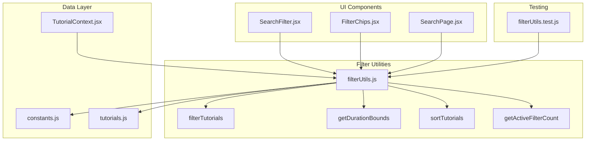
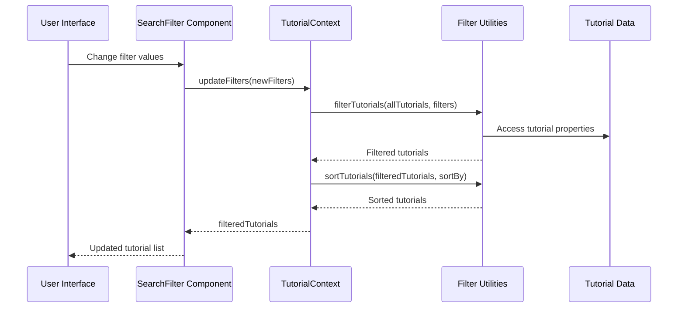
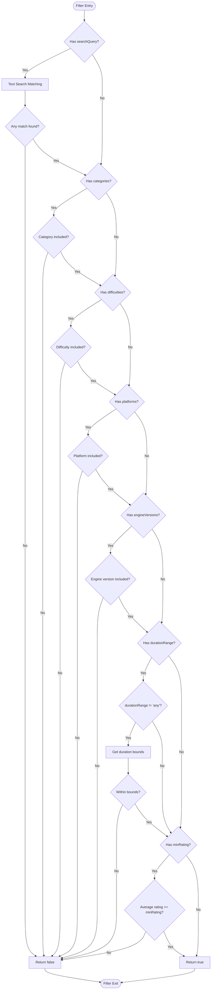
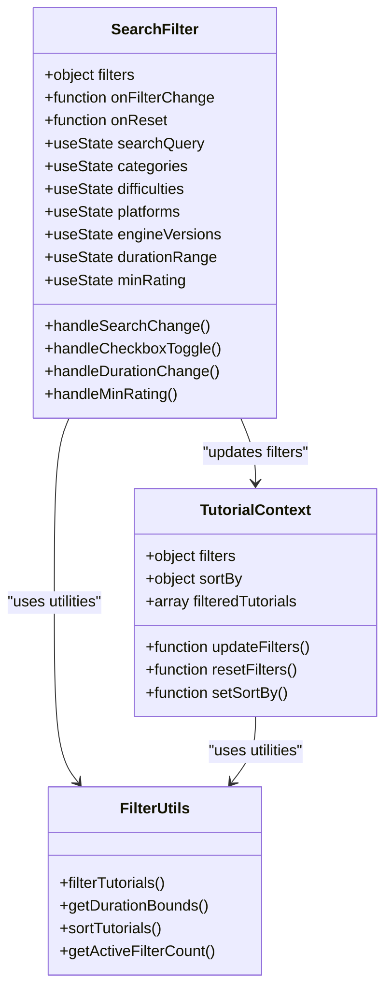
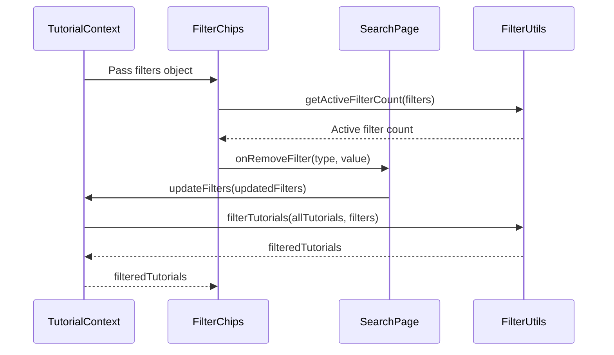
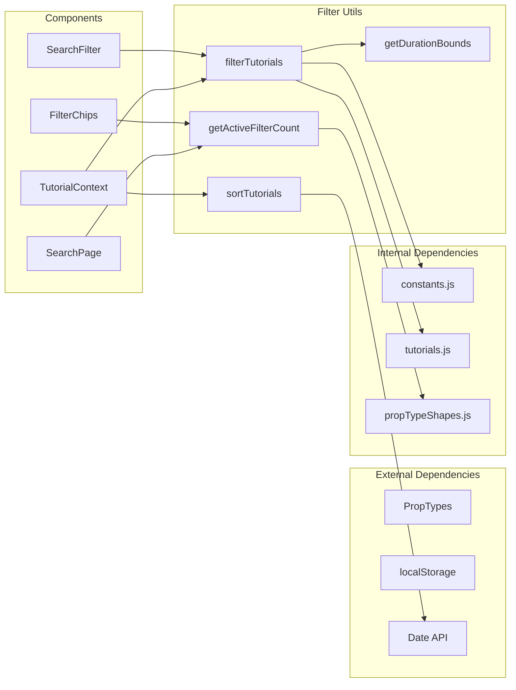

# Filter Utilities

<cite>
**Referenced Files in This Document**
- [filterUtils.js](file://src/utils/filterUtils.js)
- [SearchFilter.jsx](file://src/components/SearchFilter.jsx)
- [FilterChips.jsx](file://src/components/FilterChips.jsx)
- [SearchPage.jsx](file://src/pages/SearchPage.jsx)
- [TutorialContext.jsx](file://src/contexts/TutorialContext.jsx)
- [constants.js](file://src/data/constants.js)
- [propTypeShapes.js](file://src/utils/propTypeShapes.js)
- [filterUtils.test.js](file://src/utils/__tests__/filterUtils.test.js)
- [tutorials.js](file://src/data/tutorials.js)
</cite>

## Table of Contents
1. [Introduction](#introduction)
2. [Project Structure](#project-structure)
3. [Core Components](#core-components)
4. [Architecture Overview](#architecture-overview)
5. [Detailed Component Analysis](#detailed-component-analysis)
6. [Dependency Analysis](#dependency-analysis)
7. [Performance Considerations](#performance-considerations)
8. [Troubleshooting Guide](#troubleshooting-guide)
9. [Conclusion](#conclusion)

## Introduction
This document provides comprehensive technical documentation for the filter utilities module that powers the tutorial discovery experience. The module implements multi-criteria filtering, duration range conversion, sorting algorithms, and active filter counting. It integrates seamlessly with the SearchFilter and FilterChips components to deliver a robust search and filtering interface.

## Project Structure
The filter utilities are part of a larger tutorial management system with clear separation of concerns:

**Diagram sources**
- [filterUtils.js:1-99](file://src/utils/filterUtils.js#L1-L99)
- [SearchFilter.jsx:1-237](file://src/components/SearchFilter.jsx#L1-L237)
- [FilterChips.jsx:1-76](file://src/components/FilterChips.jsx#L1-L76)
- [SearchPage.jsx:1-141](file://src/pages/SearchPage.jsx#L1-L141)
- [TutorialContext.jsx:1-542](file://src/contexts/TutorialContext.jsx#L1-L542)

**Section sources**
- [filterUtils.js:1-99](file://src/utils/filterUtils.js#L1-L99)
- [SearchFilter.jsx:1-237](file://src/components/SearchFilter.jsx#L1-L237)
- [FilterChips.jsx:1-76](file://src/components/FilterChips.jsx#L1-L76)
- [SearchPage.jsx:1-141](file://src/pages/SearchPage.jsx#L1-L141)
- [TutorialContext.jsx:1-542](file://src/contexts/TutorialContext.jsx#L1-L542)

## Core Components

### filterTutorials Function
The primary filtering function that applies multiple criteria to tutorial datasets.

**Function Signature:** `filterTutorials(tutorials, filters)`

**Parameters:**
- `tutorials`: Array of tutorial objects containing properties like title, description, tags, author, category, difficulty, platform, engineVersion, estimatedDuration, averageRating, viewCount, createdAt
- `filters`: Object containing filter criteria with optional properties:
  - `searchQuery`: String for text-based search across title, description, tags, and author
  - `categories`: Array of category values to filter by
  - `difficulties`: Array of difficulty levels to filter by
  - `platforms`: Array of platform values to filter by
  - `engineVersions`: Array of engine version strings to filter by
  - `durationRange`: String representing duration range ('any', 'short', 'medium', 'long', 'extra-long')
  - `minRating`: Number threshold for minimum average rating

**Return Value:** Array of tutorial objects that match all active filter criteria

**Processing Logic:**
The function performs sequential filtering with early exits for optimal performance:
1. Text search matching against title, description, tags, and author
2. Category filtering using array inclusion checks
3. Difficulty filtering with multi-value support
4. Platform filtering with array inclusion
5. Engine version filtering with exact string matching
6. Duration range filtering using boundary calculations
7. Minimum rating threshold checking

**Section sources**
- [filterUtils.js:1-60](file://src/utils/filterUtils.js#L1-L60)

### getDurationBounds Function
Converts duration range strings to numeric bounds for comparison.

**Function Signature:** `getDurationBounds(rangeValue)`

**Parameters:**
- `rangeValue`: String representing duration range ('any', 'short', 'medium', 'long', 'extra-long')

**Return Value:** Object with `min` and `max` properties defining the numeric bounds

**Duration Range Mapping:**
- 'short': { min: 0, max: 15 }
- 'medium': { min: 15, max: 60 }
- 'long': { min: 60, max: 180 }
- 'extra-long': { min: 180, max: Infinity }
- Unknown values: { min: 0, max: Infinity }

**Section sources**
- [filterUtils.js:62-70](file://src/utils/filterUtils.js#L62-L70)

### sortTutorials Function
Applies sorting algorithms to tutorial arrays based on specified criteria.

**Function Signature:** `sortTutorials(tutorials, sortBy)`

**Parameters:**
- `tutorials`: Array of tutorial objects to sort
- `sortBy`: String specifying sort criteria ('newest', 'popular', 'highest-rated', 'most-viewed')

**Return Value:** New sorted array (original array remains unmodified)

**Sorting Algorithms:**
- 'newest': Sort by createdAt descending (most recent first)
- 'popular': Sort by viewCount descending (most popular first)
- 'highest-rated': Sort by averageRating descending (highest rated first)
- 'most-viewed': Sort by viewCount descending (alias of popular)
- Default: Return unmodified copy

**Section sources**
- [filterUtils.js:72-86](file://src/utils/filterUtils.js#L72-L86)

### getActiveFilterCount Function
Counts the number of active filters to display filter indicators.

**Function Signature:** `getActiveFilterCount(filters)`

**Parameters:**
- `filters`: Object containing current filter state

**Return Value:** Number representing total active filter criteria

**Active Filter Counting Rules:**
- searchQuery: Counts as 1 if present
- categories: Counts each individual category selected
- difficulties: Counts each individual difficulty selected
- platforms: Counts each individual platform selected
- engineVersions: Counts each individual engine version selected
- durationRange: Counts as 1 if not 'any'
- minRating: Counts as 1 if greater than 0

**Section sources**
- [filterUtils.js:88-98](file://src/utils/filterUtils.js#L88-L98)

## Architecture Overview

**Diagram sources**
- [SearchFilter.jsx:66-80](file://src/components/SearchFilter.jsx#L66-L80)
- [TutorialContext.jsx:68-71](file://src/contexts/TutorialContext.jsx#L68-L71)
- [filterUtils.js:1-99](file://src/utils/filterUtils.js#L1-L99)
- [tutorials.js:1-522](file://src/data/tutorials.js#L1-L522)

## Detailed Component Analysis

### Filter Implementation Details

**Diagram sources**
- [filterUtils.js:1-60](file://src/utils/filterUtils.js#L1-L60)

### Integration with SearchFilter Component

The SearchFilter component provides the user interface for filter manipulation:

**Diagram sources**
- [SearchFilter.jsx:19-237](file://src/components/SearchFilter.jsx#L19-L237)
- [filterUtils.js:1-99](file://src/utils/filterUtils.js#L1-L99)
- [TutorialContext.jsx:435-444](file://src/contexts/TutorialContext.jsx#L435-L444)

**Section sources**
- [SearchFilter.jsx:19-237](file://src/components/SearchFilter.jsx#L19-L237)
- [TutorialContext.jsx:435-444](file://src/contexts/TutorialContext.jsx#L435-L444)

### Filter Chips Component Integration

The FilterChips component displays active filters as removable chips:

**Diagram sources**
- [FilterChips.jsx:6-76](file://src/components/FilterChips.jsx#L6-L76)
- [SearchPage.jsx:92-103](file://src/pages/SearchPage.jsx#L92-L103)
- [filterUtils.js:88-98](file://src/utils/filterUtils.js#L88-L98)

**Section sources**
- [FilterChips.jsx:6-76](file://src/components/FilterChips.jsx#L6-L76)
- [SearchPage.jsx:92-103](file://src/pages/SearchPage.jsx#L92-L103)

## Dependency Analysis

**Diagram sources**
- [filterUtils.js:1-99](file://src/utils/filterUtils.js#L1-L99)
- [SearchFilter.jsx:1-7](file://src/components/SearchFilter.jsx#L1-L7)
- [FilterChips.jsx:1-4](file://src/components/FilterChips.jsx#L1-L4)
- [SearchPage.jsx:1-10](file://src/pages/SearchPage.jsx#L1-L10)
- [TutorialContext.jsx:1-5](file://src/contexts/TutorialContext.jsx#L1-L5)

**Section sources**
- [filterUtils.js:1-99](file://src/utils/filterUtils.js#L1-L99)
- [constants.js:1-71](file://src/data/constants.js#L1-L71)
- [propTypeShapes.js:28-36](file://src/utils/propTypeShapes.js#L28-L36)

## Performance Considerations

### Algorithmic Complexity
- **filterTutorials**: O(n × m) where n is number of tutorials and m is number of active filters
- **getDurationBounds**: O(1) constant time dictionary lookup
- **sortTutorials**: O(n log n) using JavaScript's built-in sort
- **getActiveFilterCount**: O(k) where k is number of filter arrays

### Optimization Strategies
1. **Early Exit Pattern**: Filter function returns immediately when text search fails
2. **Array Operations**: Uses efficient array methods (filter, includes, some)
3. **Immutable Sorting**: Creates new arrays to avoid mutating original data
4. **Memoization**: TutorialContext uses useMemo for computed values

### Memory Management
- All functions return new arrays rather than modifying originals
- No persistent state maintained between function calls
- Minimal temporary variables created during execution

### Edge Cases Handled
- Empty filter arrays are safely handled with length checks
- Unknown duration range values default to full range
- Missing tutorial properties are handled gracefully
- Case-insensitive text matching prevents false negatives

## Troubleshooting Guide

### Common Issues and Solutions

**Issue: Filters not applying correctly**
- Verify filter objects are properly structured with correct property names
- Ensure filter arrays are not null or undefined
- Check that tutorial objects contain required properties

**Issue: Duration filters not working**
- Confirm durationRange values match predefined constants
- Verify estimatedDuration properties exist on tutorial objects
- Check that getDurationBounds returns expected bounds

**Issue: Sorting not functioning**
- Ensure sortBy values match supported options
- Verify tutorial objects have required properties (createdAt, viewCount, averageRating)
- Check that sortTutorials receives proper array format

**Issue: Performance degradation with large datasets**
- Consider implementing pagination for tutorial lists
- Optimize filter combinations to reduce unnecessary comparisons
- Monitor active filter count to prevent excessive filtering

### Testing Coverage
The filter utilities are comprehensively tested with scenarios covering:
- Text search across multiple tutorial properties
- Multi-value category and difficulty filtering
- Duration range boundary testing
- Minimum rating threshold validation
- Combined filter scenarios
- Sorting algorithm correctness
- Active filter counting accuracy

**Section sources**
- [filterUtils.test.js:56-252](file://src/utils/__tests__/filterUtils.test.js#L56-L252)

## Conclusion

The filter utilities module provides a robust foundation for tutorial discovery with comprehensive multi-criteria filtering, flexible duration range handling, and efficient sorting capabilities. The implementation demonstrates good separation of concerns, with clear interfaces between the filtering logic, UI components, and data management. The module's design supports extensibility while maintaining performance characteristics suitable for typical tutorial dataset sizes. Integration with the SearchFilter and FilterChips components creates a cohesive user experience for discovering relevant educational content.