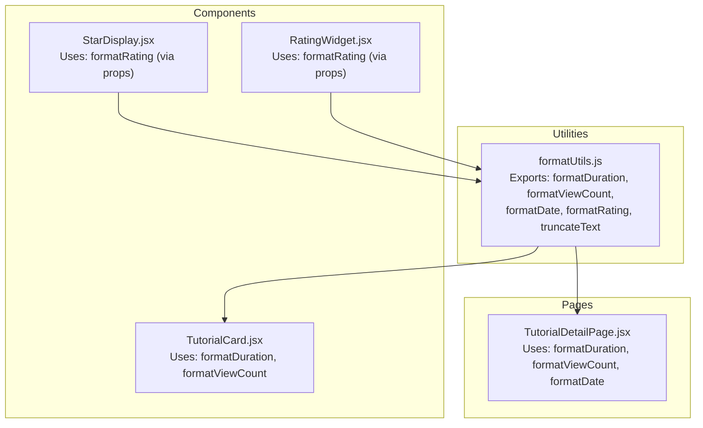
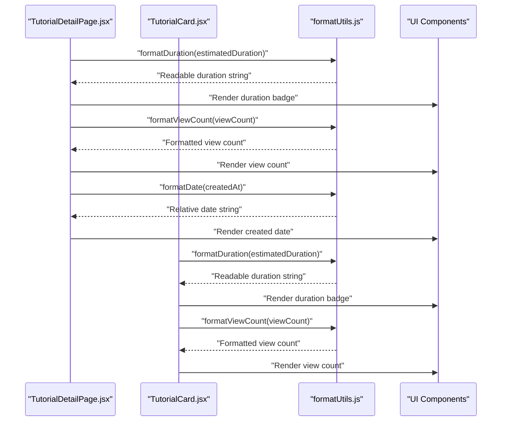
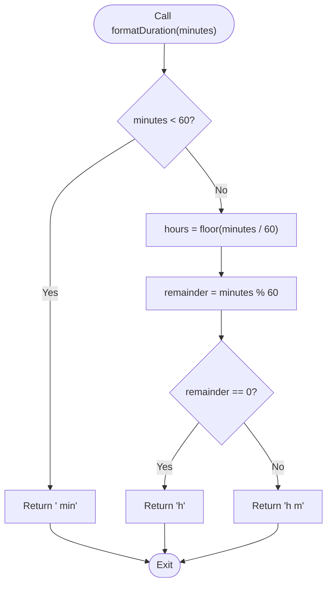
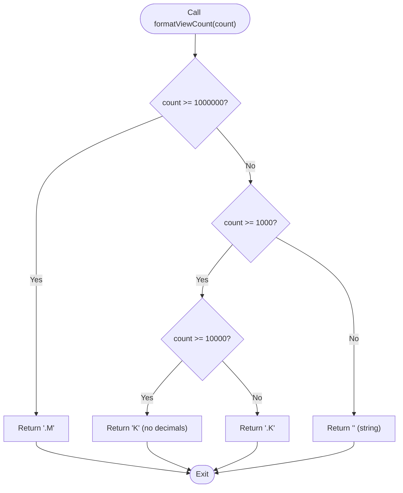
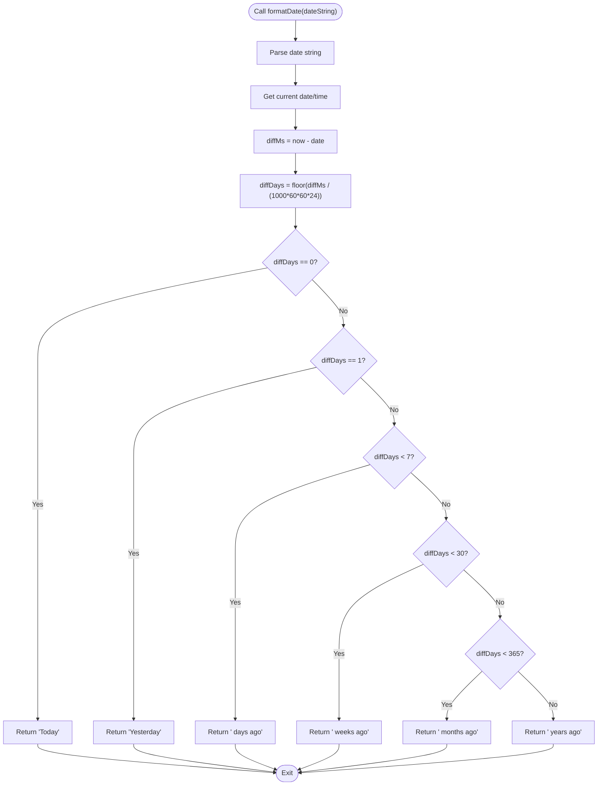
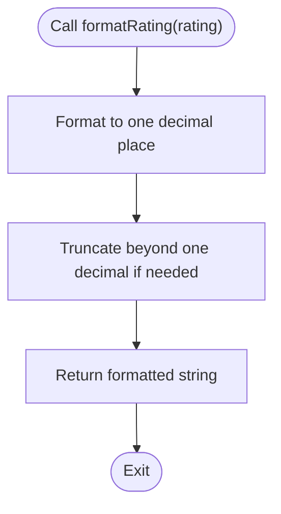
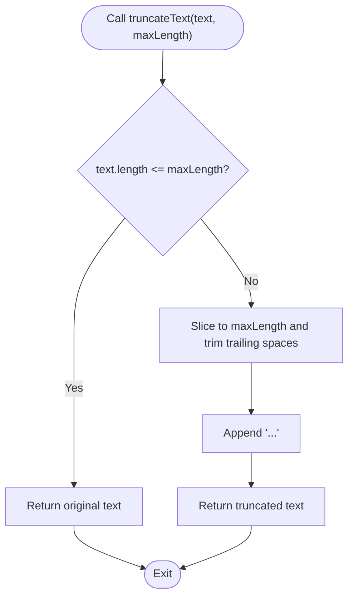
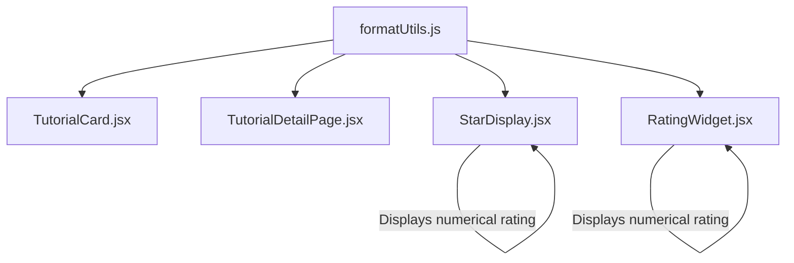
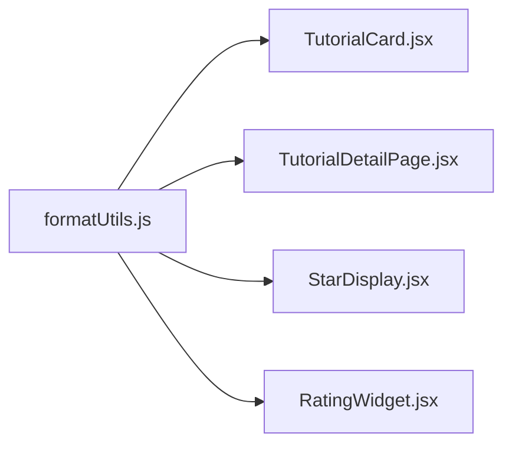

# Formatting Utilities

<cite>
**Referenced Files in This Document**
- [formatUtils.js](file://src/utils/formatUtils.js)
- [formatUtils.test.js](file://src/utils/__tests__/formatUtils.test.js)
- [TutorialCard.jsx](file://src/components/TutorialCard.jsx)
- [TutorialDetailPage.jsx](file://src/pages/TutorialDetailPage.jsx)
- [StarDisplay.jsx](file://src/components/StarDisplay.jsx)
- [RatingWidget.jsx](file://src/components/RatingWidget.jsx)
- [propTypeShapes.js](file://src/utils/propTypeShapes.js)
</cite>

## Table of Contents
1. [Introduction](#introduction)
2. [Project Structure](#project-structure)
3. [Core Components](#core-components)
4. [Architecture Overview](#architecture-overview)
5. [Detailed Component Analysis](#detailed-component-analysis)
6. [Dependency Analysis](#dependency-analysis)
7. [Performance Considerations](#performance-considerations)
8. [Troubleshooting Guide](#troubleshooting-guide)
9. [Conclusion](#conclusion)

## Introduction
This document provides comprehensive documentation for the formatting utilities module used throughout the application. It covers duration formatting, view count formatting, date formatting, rating display formatting, and text truncation. The documentation explains function signatures, formatting options, locale considerations, and practical usage examples, while addressing internationalization support, performance optimization, and integration with UI components.

## Project Structure
The formatting utilities are centralized in a dedicated module and consumed by various UI components and pages. The module exports five pure functions that transform raw data into user-friendly display strings.

**Diagram sources**
- [formatUtils.js:1-45](file://src/utils/formatUtils.js#L1-L45)
- [TutorialCard.jsx:6,53,98](file://src/components/TutorialCard.jsx#L6,L53,L98)
- [TutorialDetailPage.jsx:6,205,208,211](file://src/pages/TutorialDetailPage.jsx#L6,L205,L208,L211)
- [StarDisplay.jsx:37](file://src/components/StarDisplay.jsx#L37)
- [RatingWidget.jsx:72-74](file://src/components/RatingWidget.jsx#L72-L74)

**Section sources**
- [formatUtils.js:1-45](file://src/utils/formatUtils.js#L1-L45)
- [TutorialCard.jsx:6,53,98](file://src/components/TutorialCard.jsx#L6,L53,L98)
- [TutorialDetailPage.jsx:6,205,208,211](file://src/pages/TutorialDetailPage.jsx#L6,L205,L208,L211)
- [StarDisplay.jsx:37](file://src/components/StarDisplay.jsx#L37)
- [RatingWidget.jsx:72-74](file://src/components/RatingWidget.jsx#L72-L74)

## Core Components
This section documents each formatting function, including its purpose, parameters, return values, formatting rules, and usage examples.

### Duration Formatting: formatDuration
Purpose: Convert a duration in minutes to a human-readable string, displaying hours and minutes when applicable.

- Function signature: formatDuration(minutes)
- Parameters:
  - minutes: number (non-negative integer representing minutes)
- Return value: string
- Formatting rules:
  - If minutes < 60: returns "<minutes> min"
  - If minutes is divisible by 60: returns "<hours>h"
  - Otherwise: returns "<hours>h <minutes>m"
- Edge cases:
  - minutes = 0: returns "0 min"
- Example usage locations:
  - Tutorial card duration badge
  - Tutorial detail page metadata

**Section sources**
- [formatUtils.js:1-11](file://src/utils/formatUtils.js#L1-L11)
- [formatUtils.test.js:10-34](file://src/utils/__tests__/formatUtils.test.js#L10-L34)
- [TutorialCard.jsx:53](file://src/components/TutorialCard.jsx#L53)
- [TutorialDetailPage.jsx:205](file://src/pages/TutorialDetailPage.jsx#L205)

### View Count Formatting: formatViewCount
Purpose: Format large numeric view counts using K (thousands) and M (millions) suffixes with appropriate precision.

- Function signature: formatViewCount(count)
- Parameters:
  - count: number (non-negative integer)
- Return value: string
- Formatting rules:
  - If count >= 1,000,000: returns "<count/1,000,000>.<0 or 1 digits>M"
  - Else if count >= 1,000: returns "<count/1,000>.<0 or 1 digits>K"
  - Else: returns "<count>" (as string)
- Precision behavior:
  - For counts >= 10,000, displays no decimal places
  - For counts < 10,000, displays one decimal place
- Example usage locations:
  - Tutorial card stats
  - Tutorial detail page metadata

**Section sources**
- [formatUtils.js:13-21](file://src/utils/formatUtils.js#L13-L21)
- [formatUtils.test.js:36-60](file://src/utils/__tests__/formatUtils.test.js#L36-L60)
- [TutorialCard.jsx:98](file://src/components/TutorialCard.jsx#L98)
- [TutorialDetailPage.jsx:208](file://src/pages/TutorialDetailPage.jsx#L208)

### Date Formatting: formatDate
Purpose: Convert a date string to a relative textual representation indicating recency.

- Function signature: formatDate(dateString)
- Parameters:
  - dateString: string (ISO-like date string parsed by Date constructor)
- Return value: string
- Relative time rules (based on difference in days):
  - Today: "Today"
  - Yesterday: "Yesterday"
  - Less than 7 days ago: "<N> days ago"
  - Less than 30 days ago: "<N> weeks ago"
  - Less than 365 days ago: "<N> months ago"
  - Otherwise: "<N> years ago"
- Notes:
  - Uses local time zone and system clock
  - Tests mock the system time for deterministic behavior
- Example usage locations:
  - Tutorial detail page metadata

**Section sources**
- [formatUtils.js:23-35](file://src/utils/formatUtils.js#L23-L35)
- [formatUtils.test.js:62-95](file://src/utils/__tests__/formatUtils.test.js#L62-L95)
- [TutorialDetailPage.jsx:211](file://src/pages/TutorialDetailPage.jsx#L211)

### Rating Display Formatting: formatRating
Purpose: Format a numeric rating to a fixed one-decimal-place string representation.

- Function signature: formatRating(rating)
- Parameters:
  - rating: number (typically 0.0 to 5.0)
- Return value: string
- Formatting rules:
  - Returns rating formatted to exactly one decimal place
  - Truncates beyond one decimal place if necessary
- Example usage locations:
  - Star display component (numerical rating)
  - Rating widget component (numerical rating)

**Section sources**
- [formatUtils.js:37-39](file://src/utils/formatUtils.js#L37-L39)
- [formatUtils.test.js:97-109](file://src/utils/__tests__/formatUtils.test.js#L97-L109)
- [StarDisplay.jsx:37](file://src/components/StarDisplay.jsx#L37)
- [RatingWidget.jsx:72-74](file://src/components/RatingWidget.jsx#L72-L74)

### Text Truncation: truncateText
Purpose: Truncate text to a maximum length and append an ellipsis when necessary.

- Function signature: truncateText(text, maxLength)
- Parameters:
  - text: string
  - maxLength: number (non-negative integer)
- Return value: string
- Behavior:
  - If text length <= maxLength: returns text unchanged
  - Otherwise: returns trimmed slice up to maxLength plus "..."
- Example usage locations:
  - Various UI components requiring responsive text display

**Section sources**
- [formatUtils.js:41-44](file://src/utils/formatUtils.js#L41-L44)
- [formatUtils.test.js:111-123](file://src/utils/__tests__/formatUtils.test.js#L111-L123)

## Architecture Overview
The formatting utilities are pure functions that transform data into display-ready strings. They are consumed by UI components and pages, maintaining a clean separation between data and presentation.

**Diagram sources**
- [TutorialDetailPage.jsx:6,205,208,211](file://src/pages/TutorialDetailPage.jsx#L6,L205,L208,L211)
- [TutorialCard.jsx:6,53,98](file://src/components/TutorialCard.jsx#L6,L53,L98)
- [formatUtils.js:1-45](file://src/utils/formatUtils.js#L1-L45)

## Detailed Component Analysis

### Duration Formatting Flow

**Diagram sources**
- [formatUtils.js:1-11](file://src/utils/formatUtils.js#L1-L11)

**Section sources**
- [formatUtils.js:1-11](file://src/utils/formatUtils.js#L1-L11)
- [formatUtils.test.js:10-34](file://src/utils/__tests__/formatUtils.test.js#L10-L34)

### View Count Formatting Flow

**Diagram sources**
- [formatUtils.js:13-21](file://src/utils/formatUtils.js#L13-L21)

**Section sources**
- [formatUtils.js:13-21](file://src/utils/formatUtils.js#L13-L21)
- [formatUtils.test.js:36-60](file://src/utils/__tests__/formatUtils.test.js#L36-L60)

### Date Formatting Flow

**Diagram sources**
- [formatUtils.js:23-35](file://src/utils/formatUtils.js#L23-L35)

**Section sources**
- [formatUtils.js:23-35](file://src/utils/formatUtils.js#L23-L35)
- [formatUtils.test.js:62-95](file://src/utils/__tests__/formatUtils.test.js#L62-L95)

### Rating Display Formatting Flow

**Diagram sources**
- [formatUtils.js:37-39](file://src/utils/formatUtils.js#L37-L39)

**Section sources**
- [formatUtils.js:37-39](file://src/utils/formatUtils.js#L37-L39)
- [formatUtils.test.js:97-109](file://src/utils/__tests__/formatUtils.test.js#L97-L109)

### Text Truncation Flow

**Diagram sources**
- [formatUtils.js:41-44](file://src/utils/formatUtils.js#L41-L44)

**Section sources**
- [formatUtils.js:41-44](file://src/utils/formatUtils.js#L41-L44)
- [formatUtils.test.js:111-123](file://src/utils/__tests__/formatUtils.test.js#L111-L123)

### Integration with UI Components
The formatting utilities integrate with UI components through explicit function calls. The following diagram shows how components consume these utilities.

**Diagram sources**
- [TutorialCard.jsx:6,53,98](file://src/components/TutorialCard.jsx#L6,L53,L98)
- [TutorialDetailPage.jsx:6,205,208,211](file://src/pages/TutorialDetailPage.jsx#L6,L205,L208,L211)
- [StarDisplay.jsx:37](file://src/components/StarDisplay.jsx#L37)
- [RatingWidget.jsx:72-74](file://src/components/RatingWidget.jsx#L72-L74)
- [formatUtils.js:1-45](file://src/utils/formatUtils.js#L1-L45)

**Section sources**
- [TutorialCard.jsx:6,53,98](file://src/components/TutorialCard.jsx#L6,L53,L98)
- [TutorialDetailPage.jsx:6,205,208,211](file://src/pages/TutorialDetailPage.jsx#L6,L205,L208,L211)
- [StarDisplay.jsx:37](file://src/components/StarDisplay.jsx#L37)
- [RatingWidget.jsx:72-74](file://src/components/RatingWidget.jsx#L72-L74)
- [formatUtils.js:1-45](file://src/utils/formatUtils.js#L1-L45)

## Dependency Analysis
The formatting utilities module is a standalone, dependency-free module that depends only on JavaScript built-ins. Components depend on this module for display formatting, maintaining low coupling and high cohesion.

**Diagram sources**
- [formatUtils.js:1-45](file://src/utils/formatUtils.js#L1-L45)
- [TutorialCard.jsx:6,53,98](file://src/components/TutorialCard.jsx#L6,L53,L98)
- [TutorialDetailPage.jsx:6,205,208,211](file://src/pages/TutorialDetailPage.jsx#L6,L205,L208,L211)
- [StarDisplay.jsx:37](file://src/components/StarDisplay.jsx#L37)
- [RatingWidget.jsx:72-74](file://src/components/RatingWidget.jsx#L72-L74)

**Section sources**
- [formatUtils.js:1-45](file://src/utils/formatUtils.js#L1-L45)
- [TutorialCard.jsx:6,53,98](file://src/components/TutorialCard.jsx#L6,L53,L98)
- [TutorialDetailPage.jsx:6,205,208,211](file://src/pages/TutorialDetailPage.jsx#L6,L205,L208,L211)
- [StarDisplay.jsx:37](file://src/components/StarDisplay.jsx#L37)
- [RatingWidget.jsx:72-74](file://src/components/RatingWidget.jsx#L72-L74)

## Performance Considerations
- Pure functions: All formatting functions are pure, avoiding side effects and enabling easy caching and reuse.
- Minimal allocations: Functions operate on primitive values and return strings without creating complex objects.
- Efficient calculations: Duration and view count formatting use simple arithmetic and string conversion.
- No external dependencies: Reduces bundle size and avoids runtime dependency overhead.
- Test coverage: Unit tests ensure correctness and prevent regressions that could impact performance.

## Troubleshooting Guide
Common issues and resolutions:

- Incorrect date formatting:
  - Ensure the input date string is parseable by the Date constructor.
  - Verify the system time is correct; tests demonstrate mocking system time for determinism.
- Unexpected view count formatting:
  - Confirm the count is a non-negative number.
  - Note precision rules: no decimals for counts >= 10,000; one decimal otherwise.
- Duration formatting edge cases:
  - Zero minutes should render as "0 min".
  - Exactly divisible by 60 should render as "<hours>h" without minutes.
- Rating formatting:
  - Always renders exactly one decimal place; unexpected values may indicate incorrect input ranges.
- Text truncation:
  - If the text length equals maxLength, it is returned unchanged.
  - Truncation trims trailing spaces before appending ellipsis.

**Section sources**
- [formatUtils.js:1-45](file://src/utils/formatUtils.js#L1-L45)
- [formatUtils.test.js:10-123](file://src/utils/__tests__/formatUtils.test.js#L10-L123)

## Conclusion
The formatting utilities module provides a focused set of pure functions that transform raw data into user-friendly display strings. Their simplicity, test coverage, and clear integration patterns make them reliable building blocks for UI components. The module supports the application’s internationalization goals by relying on native JavaScript formatting and local time zone handling, while maintaining performance and ease of maintenance.