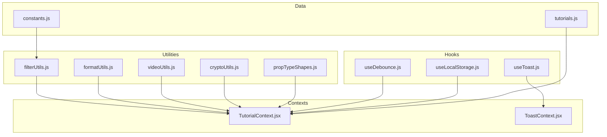
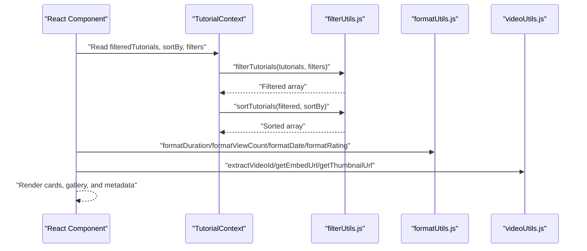
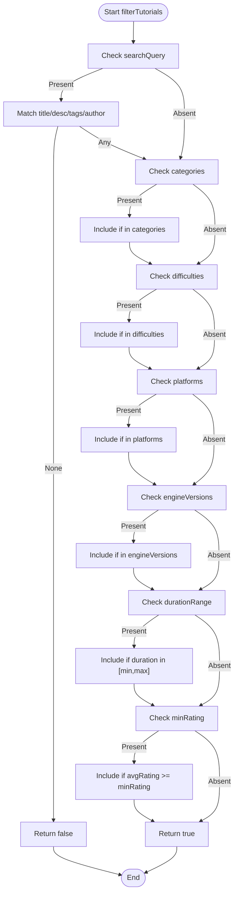
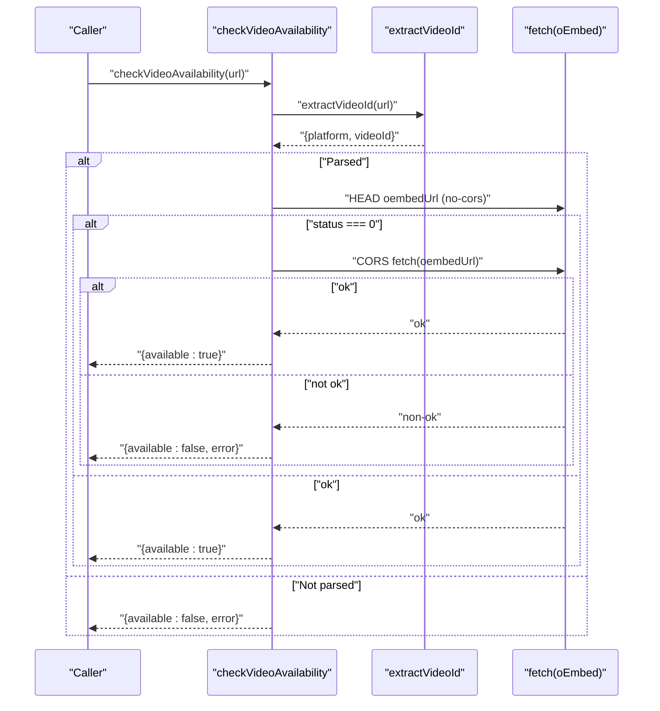
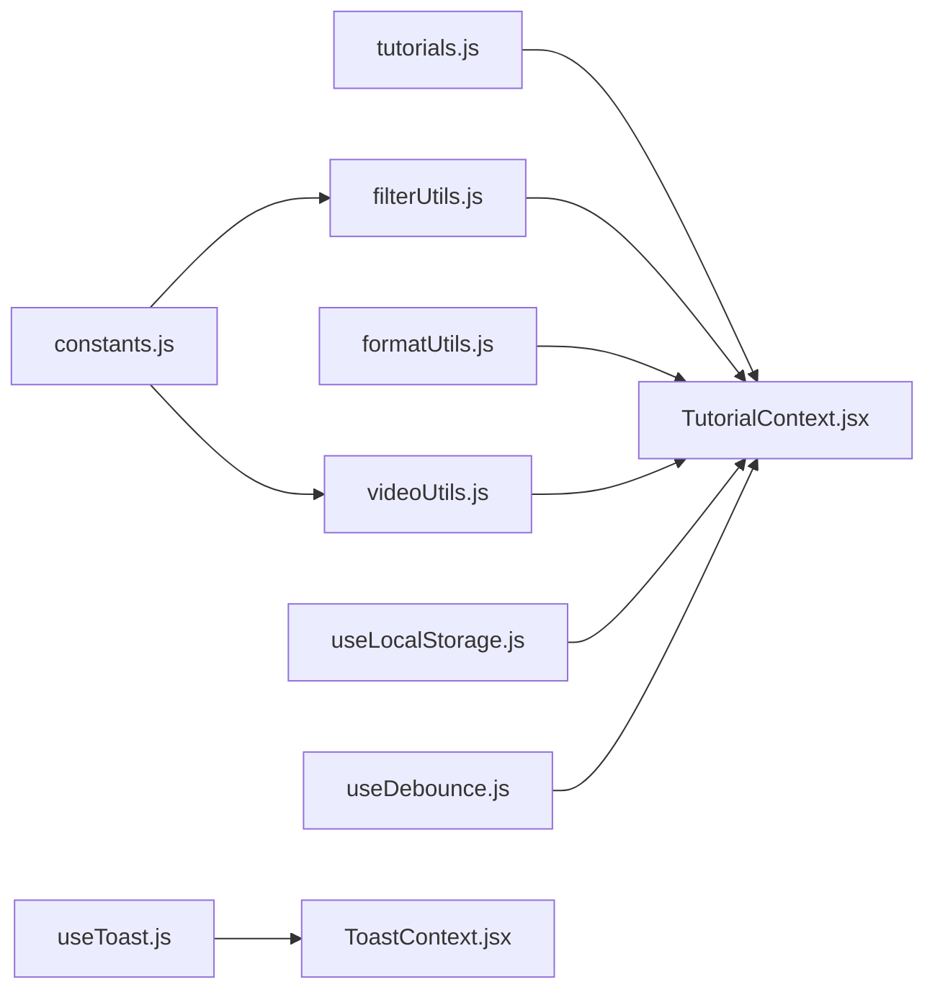

# Utility Functions

<cite>
**Referenced Files in This Document**
- [filterUtils.js](file://src/utils/filterUtils.js)
- [formatUtils.js](file://src/utils/formatUtils.js)
- [videoUtils.js](file://src/utils/videoUtils.js)
- [cryptoUtils.js](file://src/utils/cryptoUtils.js)
- [propTypeShapes.js](file://src/utils/propTypeShapes.js)
- [useDebounce.js](file://src/hooks/useDebounce.js)
- [useLocalStorage.js](file://src/hooks/useLocalStorage.js)
- [useToast.js](file://src/hooks/useToast.js)
- [constants.js](file://src/data/constants.js)
- [tutorials.js](file://src/data/tutorials.js)
- [TutorialContext.jsx](file://src/contexts/TutorialContext.jsx)
- [ToastContext.jsx](file://src/contexts/ToastContext.jsx)
- [filterUtils.test.js](file://src/utils/__tests__/filterUtils.test.js)
- [formatUtils.test.js](file://src/utils/__tests__/formatUtils.test.js)
- [videoUtils.test.js](file://src/utils/__tests__/videoUtils.test.js)
</cite>

## Table of Contents
1. [Introduction](#introduction)
2. [Project Structure](#project-structure)
3. [Core Components](#core-components)
4. [Architecture Overview](#architecture-overview)
5. [Detailed Component Analysis](#detailed-component-analysis)
6. [Dependency Analysis](#dependency-analysis)
7. [Performance Considerations](#performance-considerations)
8. [Troubleshooting Guide](#troubleshooting-guide)
9. [Conclusion](#conclusion)
10. [Appendices](#appendices)

## Introduction
This document provides comprehensive documentation for GameDev Hub’s utility functions and helper modules. It covers:
- Tutorial filtering and sorting algorithms
- Display formatting helpers for durations, counts, dates, ratings, and text
- Video URL parsing, embedding, thumbnails, validation, sanitization, and availability checks
- Password hashing with PBKDF2 via the Web Crypto API and legacy hash migration
- Shared PropTypes for component validation
- Custom hooks for debouncing, local storage persistence, and toast notifications
- Integration patterns with React components and context providers

## Project Structure
The utilities reside under src/utils and are consumed by contexts and components. The tests under src/utils/__tests__ validate behavior and edge cases.

**Diagram sources**
- [filterUtils.js:1-99](file://src/utils/filterUtils.js#L1-L99)
- [formatUtils.js:1-45](file://src/utils/formatUtils.js#L1-L45)
- [videoUtils.js:1-119](file://src/utils/videoUtils.js#L1-L119)
- [cryptoUtils.js:1-70](file://src/utils/cryptoUtils.js#L1-L70)
- [propTypeShapes.js:1-37](file://src/utils/propTypeShapes.js#L1-L37)
- [useDebounce.js:1-16](file://src/hooks/useDebounce.js#L1-L16)
- [useLocalStorage.js:1-29](file://src/hooks/useLocalStorage.js#L1-L29)
- [useToast.js:1-11](file://src/hooks/useToast.js#L1-L11)
- [TutorialContext.jsx:1-542](file://src/contexts/TutorialContext.jsx#L1-L542)
- [ToastContext.jsx:1-53](file://src/contexts/ToastContext.jsx#L1-L53)
- [constants.js:1-71](file://src/data/constants.js#L1-L71)
- [tutorials.js:1-522](file://src/data/tutorials.js#L1-L522)

**Section sources**
- [filterUtils.js:1-99](file://src/utils/filterUtils.js#L1-L99)
- [formatUtils.js:1-45](file://src/utils/formatUtils.js#L1-L45)
- [videoUtils.js:1-119](file://src/utils/videoUtils.js#L1-L119)
- [cryptoUtils.js:1-70](file://src/utils/cryptoUtils.js#L1-L70)
- [propTypeShapes.js:1-37](file://src/utils/propTypeShapes.js#L1-L37)
- [useDebounce.js:1-16](file://src/hooks/useDebounce.js#L1-L16)
- [useLocalStorage.js:1-29](file://src/hooks/useLocalStorage.js#L1-L29)
- [useToast.js:1-11](file://src/hooks/useToast.js#L1-L11)
- [TutorialContext.jsx:1-542](file://src/contexts/TutorialContext.jsx#L1-L542)
- [ToastContext.jsx:1-53](file://src/contexts/ToastContext.jsx#L1-L53)
- [constants.js:1-71](file://src/data/constants.js#L1-L71)
- [tutorials.js:1-522](file://src/data/tutorials.js#L1-L522)

## Core Components
- filterUtils.js: Filtering, sorting, duration bounds, and filter counting
- formatUtils.js: Display formatting for durations, views, dates, ratings, and text truncation
- videoUtils.js: URL parsing, embed/thumbnail generation, validation, sanitization, and availability checks
- cryptoUtils.js: PBKDF2-based password hashing, salt generation, and legacy hash detection/verification
- propTypeShapes.js: Shared PropTypes for tutorial and filter shapes
- useDebounce.js: Debounced state updates
- useLocalStorage.js: Persistent state with localStorage
- useToast.js: Accessor hook for toast notifications

**Section sources**
- [filterUtils.js:1-99](file://src/utils/filterUtils.js#L1-L99)
- [formatUtils.js:1-45](file://src/utils/formatUtils.js#L1-L45)
- [videoUtils.js:1-119](file://src/utils/videoUtils.js#L1-L119)
- [cryptoUtils.js:1-70](file://src/utils/cryptoUtils.js#L1-L70)
- [propTypeShapes.js:1-37](file://src/utils/propTypeShapes.js#L1-L37)
- [useDebounce.js:1-16](file://src/hooks/useDebounce.js#L1-L16)
- [useLocalStorage.js:1-29](file://src/hooks/useLocalStorage.js#L1-L29)
- [useToast.js:1-11](file://src/hooks/useToast.js#L1-L11)

## Architecture Overview
The utilities are consumed by contexts that manage application-wide state. TutorialContext applies filtering and sorting to tutorials and persists filters and sort preferences. ToastContext manages global notifications.

**Diagram sources**
- [TutorialContext.jsx:67-71](file://src/contexts/TutorialContext.jsx#L67-L71)
- [filterUtils.js:1-99](file://src/utils/filterUtils.js#L1-L99)
- [formatUtils.js:1-45](file://src/utils/formatUtils.js#L1-L45)
- [videoUtils.js:1-119](file://src/utils/videoUtils.js#L1-L119)

## Detailed Component Analysis

### filterUtils.js
Implements tutorial filtering, sorting, duration bounds calculation, and filter counting.

- filterTutorials(tutorials, filters): Applies multiple filter criteria including text search across title, description, tags, and author; category, difficulty, platform, engine version arrays; duration range; and minimum rating. Returns a new filtered array.
- getDurationBounds(rangeValue): Converts a duration range string to numeric bounds. Supports short, medium, long, extra-long, and falls back to full range for unknown values.
- sortTutorials(tutorials, sortBy): Sorts by newest, popular, highest-rated, or most-viewed. Returns a new sorted array without mutating input.
- getActiveFilterCount(filters): Counts active filters. Ignores empty arrays and durationRange "any", and minRating 0.

Usage examples and behavior validated by tests:
- Combined filters, duration ranges, and minimum rating thresholds
- Sorting modes and fallback behavior for unknown sort keys
- Active filter count aggregation across multiple filter types

Edge cases and error handling:
- Case-insensitive text search
- Graceful handling of missing optional fields (e.g., author.name)
- Unknown duration range defaults to full range
- Unknown sort returns a copy without mutation

Performance considerations:
- Linear pass per filter type; overall O(n*m) where n is tutorial count and m is number of active filters
- Sorting uses native comparator; O(n log n)
- Duration bounds lookup is O(1)

**Section sources**
- [filterUtils.js:1-99](file://src/utils/filterUtils.js#L1-L99)
- [filterUtils.test.js:1-253](file://src/utils/__tests__/filterUtils.test.js#L1-L253)
- [constants.js:47-53](file://src/data/constants.js#L47-L53)

#### Algorithm Flow: filterTutorials

**Diagram sources**
- [filterUtils.js:1-60](file://src/utils/filterUtils.js#L1-L60)

### formatUtils.js
Provides display-friendly formatting for UI consumption.

- formatDuration(minutes): Formats minutes to "X min", "Nh", or "Nh Xm". Rounds minutes when hours are exact.
- formatViewCount(count): Formats counts with K/M suffixes; no decimals for thousands and above.
- formatDate(dateString): Computes relative time ("Today", "Yesterday", "X days ago", "X weeks ago", "X months ago", "X years ago") based on current time.
- formatRating(rating): Formats to one decimal place.
- truncateText(text, maxLength): Truncates long text and appends ellipsis while trimming trailing spaces.

Behavior validated by tests:
- Edge cases for zero, exact hour boundaries, and boundary thresholds
- Relative date calculations under mocked time
- Decimal rounding and truncation semantics

**Section sources**
- [formatUtils.js:1-45](file://src/utils/formatUtils.js#L1-L45)
- [formatUtils.test.js:1-124](file://src/utils/__tests__/formatUtils.test.js#L1-L124)

### videoUtils.js
Handles YouTube and Vimeo URL parsing, embed/thumbnail generation, validation, sanitization, and availability checks.

- extractVideoId(url): Parses supported platforms and returns { platform, videoId } or null.
- getThumbnailUrl(url): Returns YouTube thumbnail URL; Vimeo returns null (requires API).
- getEmbedUrl(url): Returns embed URL for supported platforms or null.
- isValidVideoUrl(url): Boolean wrapper around extractVideoId.
- getVideoPlatformName(url): Returns platform name or "Unknown".
- sanitizeUrl(url): Validates protocol and returns sanitized URL or "#" for unsafe inputs.
- checkVideoAvailability(url): Uses oEmbed endpoints to verify video availability; handles no-cors and network issues with graceful fallback.

Integration patterns:
- Used by components that render video players and thumbnails
- Called during form validation and pre-publish checks

**Section sources**
- [videoUtils.js:1-119](file://src/utils/videoUtils.js#L1-L119)
- [videoUtils.test.js:1-135](file://src/utils/__tests__/videoUtils.test.js#L1-L135)
- [constants.js:55-70](file://src/data/constants.js#L55-L70)

#### Sequence: checkVideoAvailability

**Diagram sources**
- [videoUtils.js:67-118](file://src/utils/videoUtils.js#L67-L118)

### cryptoUtils.js
Implements secure password hashing and verification using Web Crypto API PBKDF2.

- generateSalt(): Generates a 16-byte random salt and returns lowercase hex string.
- hashPassword(password, salt): Derives a 256-bit key using PBKDF2 with SHA-256, 100k iterations, and returns a prefixed string "pbkdf2:salt:hex".
- verifyPassword(password, storedHash): Splits stored hash, re-hashes with stored salt, and performs constant-time comparison; returns boolean.
- isLegacyHash(hash): Detects non-prefixed legacy hashes.

Security considerations:
- PBKDF2 with high iteration count and SHA-256
- Constant-time comparison to prevent timing attacks
- Salt per password to mitigate rainbow table attacks

**Section sources**
- [cryptoUtils.js:1-70](file://src/utils/cryptoUtils.js#L1-L70)

### propTypeShapes.js
Defines reusable PropTypes for tutorial and filter objects to enforce component contracts across 12+ components.

- tutorialShape: Defines required and optional fields for tutorial items including author shape, counts, ratings, and metadata.
- filterShape: Defines filter object structure for search, categories, difficulties, platforms, engine versions, duration range, and minimum rating.

Usage:
- Imported by components to validate props and improve DX

**Section sources**
- [propTypeShapes.js:1-37](file://src/utils/propTypeShapes.js#L1-L37)

### Custom Hooks

#### useDebounce.js
- Purpose: Debounces a value change over a configurable delay.
- Parameters: value (any), delay (number, default 300ms)
- Returns: debouncedValue (any)
- Behavior: Clears previous timers; sets new timeout on value/delay changes.

Performance considerations:
- Prevents excessive re-renders during rapid input changes
- Cleanup on unmount prevents memory leaks

**Section sources**
- [useDebounce.js:1-16](file://src/hooks/useDebounce.js#L1-L16)

#### useLocalStorage.js
- Purpose: Provides state synchronized with localStorage with safe parsing and stringify.
- Parameters: key (string), initialValue (any)
- Returns: [storedValue, setValue]
- Behavior: Reads initial value from localStorage; setValue persists to storage; wraps updates in try/catch with warnings.

Error handling:
- Catches and warns on read/write failures
- Falls back to initial value on error

**Section sources**
- [useLocalStorage.js:1-29](file://src/hooks/useLocalStorage.js#L1-L29)

#### useToast.js
- Purpose: Accessor hook to consume ToastContext.
- Returns: context object
- Behavior: Throws if used outside ToastProvider

Integration:
- Used by components to trigger notifications

**Section sources**
- [useToast.js:1-11](file://src/hooks/useToast.js#L1-L11)
- [ToastContext.jsx:1-53](file://src/contexts/ToastContext.jsx#L1-L53)

## Dependency Analysis
- filterUtils.js depends on constants.js for duration range definitions and tutorials.js for data structure.
- TutorialContext.jsx composes filterUtils.js and formatUtils.js to compute filteredTutorials and renders formatted metadata.
- videoUtils.js depends on constants.js for platform patterns.
- useLocalStorage.js integrates with React state and localStorage.
- useToast.js depends on ToastContext.jsx.

**Diagram sources**
- [constants.js:47-70](file://src/data/constants.js#L47-L70)
- [filterUtils.js:1-99](file://src/utils/filterUtils.js#L1-L99)
- [formatUtils.js:1-45](file://src/utils/formatUtils.js#L1-L45)
- [videoUtils.js:1-119](file://src/utils/videoUtils.js#L1-L119)
- [TutorialContext.jsx:67-71](file://src/contexts/TutorialContext.jsx#L67-L71)
- [useLocalStorage.js:1-29](file://src/hooks/useLocalStorage.js#L1-L29)
- [useDebounce.js:1-16](file://src/hooks/useDebounce.js#L1-L16)
- [useToast.js:1-11](file://src/hooks/useToast.js#L1-L11)
- [ToastContext.jsx:1-53](file://src/contexts/ToastContext.jsx#L1-L53)

**Section sources**
- [constants.js:1-71](file://src/data/constants.js#L1-L71)
- [filterUtils.js:1-99](file://src/utils/filterUtils.js#L1-L99)
- [formatUtils.js:1-45](file://src/utils/formatUtils.js#L1-L45)
- [videoUtils.js:1-119](file://src/utils/videoUtils.js#L1-L119)
- [TutorialContext.jsx:1-542](file://src/contexts/TutorialContext.jsx#L1-L542)
- [useLocalStorage.js:1-29](file://src/hooks/useLocalStorage.js#L1-L29)
- [useDebounce.js:1-16](file://src/hooks/useDebounce.js#L1-L16)
- [useToast.js:1-11](file://src/hooks/useToast.js#L1-L11)
- [ToastContext.jsx:1-53](file://src/contexts/ToastContext.jsx#L1-L53)

## Performance Considerations
- filterUtils.js: Prefer batching filter updates and memoizing results (already done in TutorialContext). Keep filters minimal to reduce O(n*m) cost.
- formatUtils.js: Formatting functions are O(1); negligible overhead.
- videoUtils.js: URL parsing is linear in number of patterns; avoid repeated extractions by caching results per URL.
- cryptoUtils.js: PBKDF2 cost is fixed; tune iterations carefully. Avoid hashing on hot paths.
- useLocalStorage.js: Batch updates to minimize storage writes; handle exceptions gracefully.
- useDebounce.js: Choose appropriate delay to balance responsiveness and performance.

## Troubleshooting Guide
- Filtering yields no results:
  - Verify filters are not mutually exclusive (e.g., durationRange "any" ignored intentionally).
  - Confirm tutorial fields exist (title, description, tags, author.name).
- Sorting does nothing:
  - Ensure sortBy is one of the supported values.
- Video embeds fail:
  - Confirm URL matches supported patterns; check platform-specific embed URLs.
  - Use isValidVideoUrl before rendering.
- Toasts not appearing:
  - Ensure useToast is called within ToastProvider.
- Local storage errors:
  - Inspect browser storage quota and security policies; catch and handle errors from useLocalStorage.

**Section sources**
- [filterUtils.test.js:148-160](file://src/utils/__tests__/filterUtils.test.js#L148-L160)
- [videoUtils.test.js:72-88](file://src/utils/__tests__/videoUtils.test.js#L72-L88)
- [useToast.js:5-9](file://src/hooks/useToast.js#L5-L9)
- [useLocalStorage.js:5-11](file://src/hooks/useLocalStorage.js#L5-L11)

## Conclusion
These utilities provide robust, reusable functionality for filtering, formatting, video handling, cryptography, and state management. Their integration with contexts ensures consistent behavior across components, while tests validate correctness and edge cases. Adopt the recommended patterns for performance and error handling to maintain reliability at scale.

## Appendices

### API Definitions and Signatures

- filterUtils.js
  - filterTutorials(tutorials: Tutorial[], filters: Filters): Tutorial[]
  - getDurationBounds(rangeValue: string): { min: number, max: number }
  - sortTutorials(tutorials: Tutorial[], sortBy: string): Tutorial[]
  - getActiveFilterCount(filters: Filters): number

- formatUtils.js
  - formatDuration(minutes: number): string
  - formatViewCount(count: number): string
  - formatDate(dateString: string): string
  - formatRating(rating: number): string
  - truncateText(text: string, maxLength: number): string

- videoUtils.js
  - extractVideoId(url: string): { platform: string, videoId: string } | null
  - getThumbnailUrl(url: string): string | null
  - getEmbedUrl(url: string): string | null
  - isValidVideoUrl(url: string): boolean
  - getVideoPlatformName(url: string): string
  - sanitizeUrl(url: string): string
  - checkVideoAvailability(url: string): Promise<{ available: boolean, error?: string }>

- cryptoUtils.js
  - generateSalt(): string
  - hashPassword(password: string, salt: string): Promise<string>
  - verifyPassword(password: string, storedHash: string): Promise<boolean>
  - isLegacyHash(hash: string): boolean

- propTypeShapes.js
  - tutorialShape: PropTypes.shape
  - filterShape: PropTypes.shape

- Custom Hooks
  - useDebounce(value: any, delay?: number): any
  - useLocalStorage(key: string, initialValue: any): [any, (value: any) => void]
  - useToast(): { addToast(message: string, variant?: string): string, removeToast(id: string): void }

**Section sources**
- [filterUtils.js:1-99](file://src/utils/filterUtils.js#L1-L99)
- [formatUtils.js:1-45](file://src/utils/formatUtils.js#L1-L45)
- [videoUtils.js:1-119](file://src/utils/videoUtils.js#L1-L119)
- [cryptoUtils.js:1-70](file://src/utils/cryptoUtils.js#L1-L70)
- [propTypeShapes.js:1-37](file://src/utils/propTypeShapes.js#L1-L37)
- [useDebounce.js:1-16](file://src/hooks/useDebounce.js#L1-L16)
- [useLocalStorage.js:1-29](file://src/hooks/useLocalStorage.js#L1-L29)
- [useToast.js:1-11](file://src/hooks/useToast.js#L1-L11)