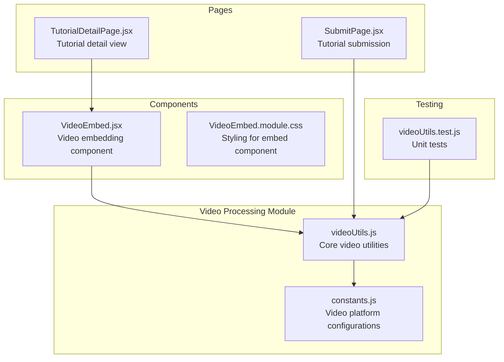
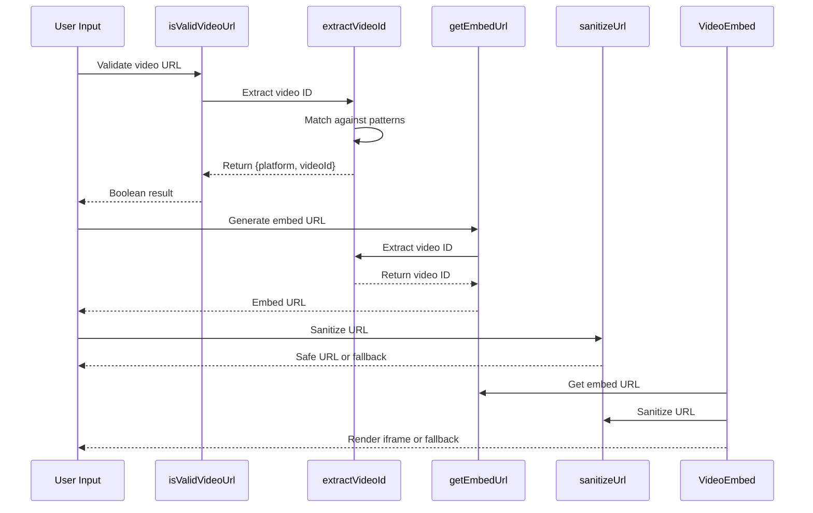
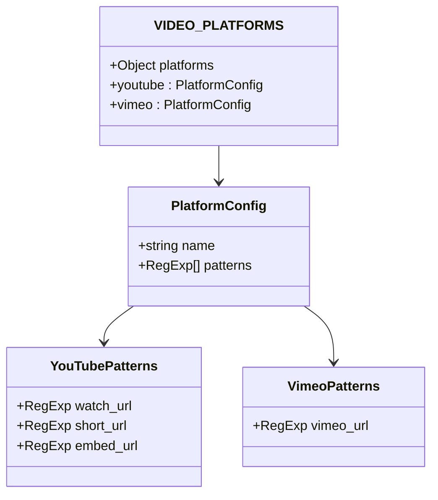
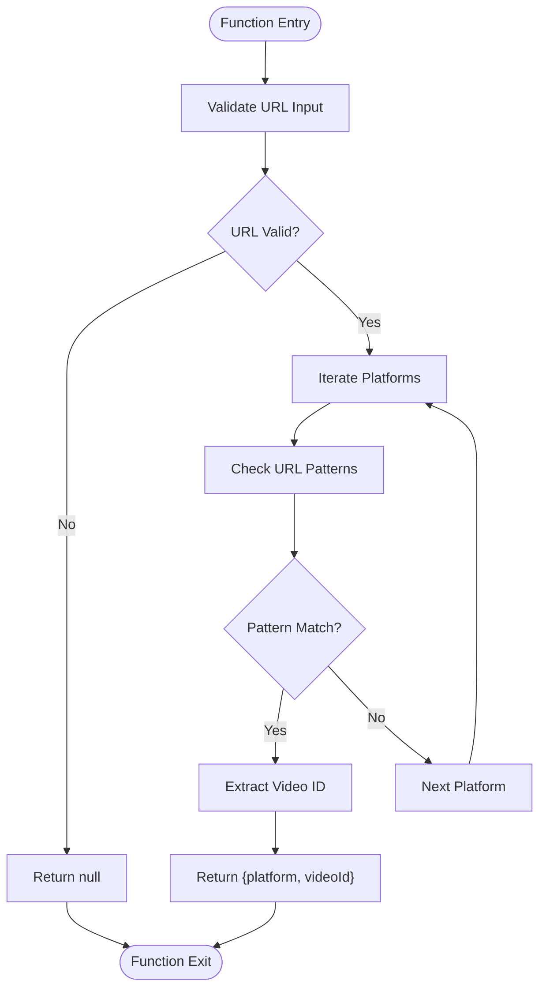
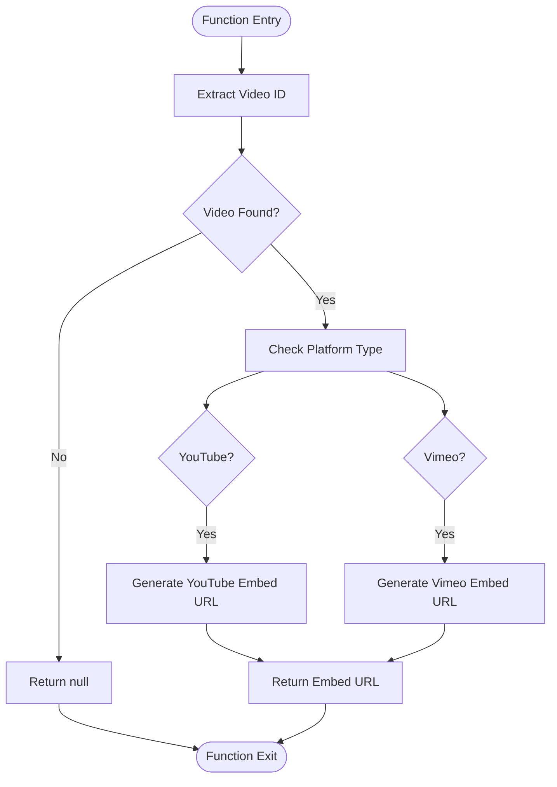
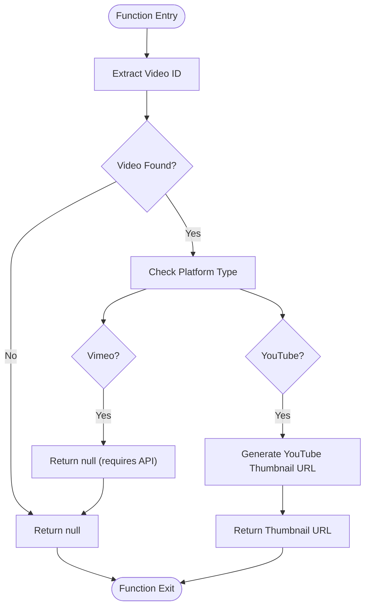
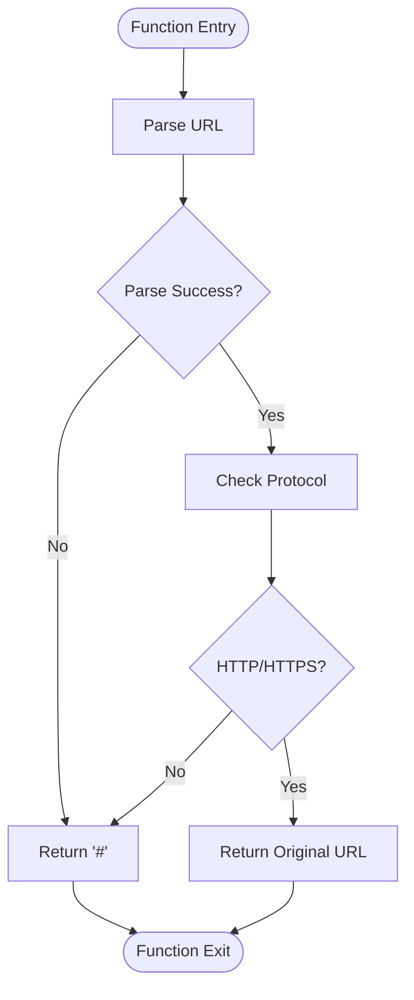
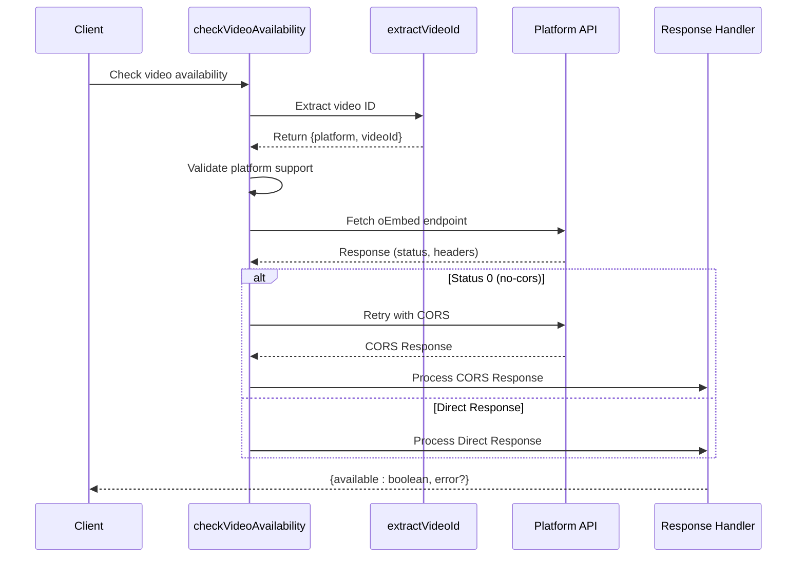
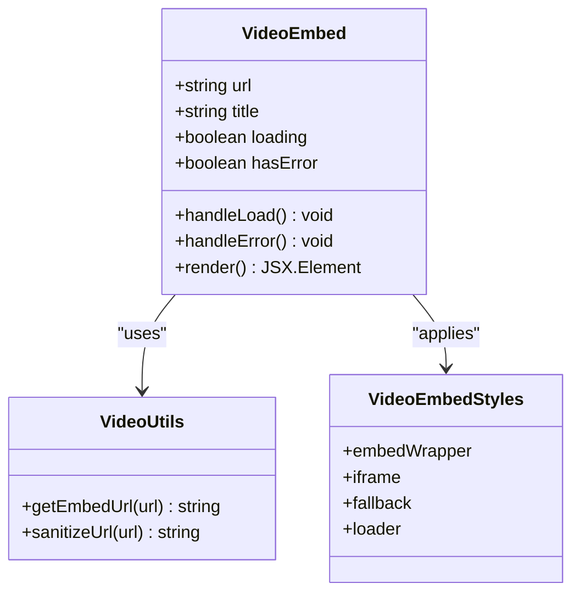
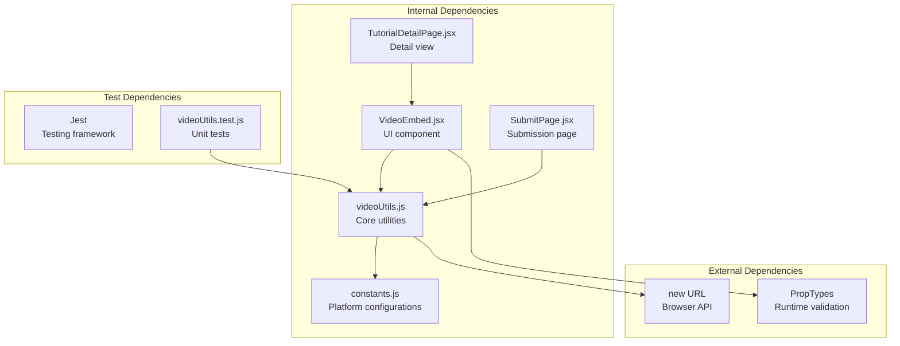

# Video Processing Utilities

<cite>
**Referenced Files in This Document**
- [videoUtils.js](file://src/utils/videoUtils.js)
- [constants.js](file://src/data/constants.js)
- [VideoEmbed.jsx](file://src/components/VideoEmbed.jsx)
- [VideoEmbed.module.css](file://src/components/VideoEmbed.module.css)
- [videoUtils.test.js](file://src/utils/__tests__/videoUtils.test.js)
- [TutorialDetailPage.jsx](file://src/pages/TutorialDetailPage.jsx)
- [SubmitPage.jsx](file://src/pages/SubmitPage.jsx)
</cite>

## Table of Contents
1. [Introduction](#introduction)
2. [Project Structure](#project-structure)
3. [Core Components](#core-components)
4. [Architecture Overview](#architecture-overview)
5. [Detailed Component Analysis](#detailed-component-analysis)
6. [Dependency Analysis](#dependency-analysis)
7. [Performance Considerations](#performance-considerations)
8. [Troubleshooting Guide](#troubleshooting-guide)
9. [Conclusion](#conclusion)

## Introduction

The Video Processing Utilities module provides comprehensive video URL parsing, validation, and embedding functionality for YouTube and Vimeo videos. This module serves as the foundation for video processing workflows throughout the application, enabling seamless integration of external video content while maintaining security and reliability standards.

The module consists of several key functions that work together to extract video identifiers, generate embed URLs, validate video accessibility, and sanitize user-provided URLs. It integrates deeply with the VideoEmbed component and various page components to provide a robust video viewing experience.

## Project Structure

The video processing utilities are organized within the application's utility layer alongside other specialized processing functions:

**Diagram sources**
- [videoUtils.js:1-119](file://src/utils/videoUtils.js#L1-L119)
- [constants.js:55-70](file://src/data/constants.js#L55-L70)
- [VideoEmbed.jsx:1-87](file://src/components/VideoEmbed.jsx#L1-L87)

**Section sources**
- [videoUtils.js:1-119](file://src/utils/videoUtils.js#L1-L119)
- [constants.js:55-70](file://src/data/constants.js#L55-L70)

## Core Components

The video processing utilities module provides five primary functions that handle different aspects of video URL processing:

### Extract Video ID Function
The `extractVideoId` function serves as the core parsing mechanism, supporting multiple video platform formats through configurable patterns.

### Embed URL Generation
The `getEmbedUrl` function generates iframe-compatible URLs for embedding videos from supported platforms.

### Thumbnail Extraction
The `getThumbnailUrl` function retrieves thumbnail URLs for YouTube videos, with platform-specific handling for Vimeo.

### URL Validation and Sanitization
The `isValidVideoUrl` and `sanitizeUrl` functions provide validation and security filtering for video URLs.

### Video Availability Checking
The `checkVideoAvailability` function performs asynchronous validation of video accessibility using platform-specific APIs.

**Section sources**
- [videoUtils.js:3-13](file://src/utils/videoUtils.js#L3-L13)
- [videoUtils.js:28-39](file://src/utils/videoUtils.js#L28-L39)
- [videoUtils.js:15-26](file://src/utils/videoUtils.js#L15-L26)
- [videoUtils.js:41-60](file://src/utils/videoUtils.js#L41-L60)
- [videoUtils.js:67-118](file://src/utils/videoUtils.js#L67-L118)

## Architecture Overview

The video processing utilities follow a modular architecture with clear separation of concerns:

**Diagram sources**
- [videoUtils.js:41-43](file://src/utils/videoUtils.js#L41-L43)
- [videoUtils.js:3-13](file://src/utils/videoUtils.js#L3-L13)
- [videoUtils.js:28-39](file://src/utils/videoUtils.js#L28-L39)
- [videoUtils.js:50-60](file://src/utils/videoUtils.js#L50-L60)
- [VideoEmbed.jsx:6-8](file://src/components/VideoEmbed.jsx#L6-L8)

The architecture ensures that video processing functions are reusable across different components while maintaining consistent behavior and error handling.

## Detailed Component Analysis

### Video Platform Configuration

The module relies on a centralized configuration system that defines supported video platforms and their URL patterns:

**Diagram sources**
- [constants.js:55-70](file://src/data/constants.js#L55-L70)
- [constants.js:56-62](file://src/data/constants.js#L56-L62)
- [constants.js:64-68](file://src/data/constants.js#L64-L68)

**Section sources**
- [constants.js:55-70](file://src/data/constants.js#L55-L70)

### Video ID Extraction Algorithm

The extraction process follows a systematic approach to identify and parse video identifiers from various URL formats:

**Diagram sources**
- [videoUtils.js:3-13](file://src/utils/videoUtils.js#L3-L13)

The algorithm efficiently processes multiple platform patterns and returns structured results containing both platform identification and extracted video IDs.

**Section sources**
- [videoUtils.js:3-13](file://src/utils/videoUtils.js#L3-L13)

### Embed URL Generation Process

The embed URL generation function creates platform-specific iframe-compatible URLs:

**Diagram sources**
- [videoUtils.js:28-39](file://src/utils/videoUtils.js#L28-L39)

**Section sources**
- [videoUtils.js:28-39](file://src/utils/videoUtils.js#L28-L39)

### Thumbnail Extraction Implementation

The thumbnail extraction function provides platform-specific thumbnail URLs with appropriate fallback handling:

**Diagram sources**
- [videoUtils.js:15-26](file://src/utils/videoUtils.js#L15-L26)

**Section sources**
- [videoUtils.js:15-26](file://src/utils/videoUtils.js#L15-L26)

### URL Validation and Sanitization

The validation and sanitization functions implement comprehensive security measures:

**Diagram sources**
- [videoUtils.js:50-60](file://src/utils/videoUtils.js#L50-L60)

**Section sources**
- [videoUtils.js:50-60](file://src/utils/videoUtils.js#L50-L60)

### Video Availability Checking

The asynchronous availability checking function provides robust video validation:

**Diagram sources**
- [videoUtils.js:67-118](file://src/utils/videoUtils.js#L67-L118)

**Section sources**
- [videoUtils.js:67-118](file://src/utils/videoUtils.js#L67-L118)

### VideoEmbed Component Integration

The VideoEmbed component demonstrates practical integration of video utilities:

**Diagram sources**
- [VideoEmbed.jsx:6-87](file://src/components/VideoEmbed.jsx#L6-L87)
- [VideoEmbed.module.css:1-94](file://src/components/VideoEmbed.module.css#L1-L94)

**Section sources**
- [VideoEmbed.jsx:6-87](file://src/components/VideoEmbed.jsx#L6-L87)
- [VideoEmbed.module.css:1-94](file://src/components/VideoEmbed.module.css#L1-L94)

## Dependency Analysis

The video processing utilities module exhibits clean dependency relationships with minimal coupling:

**Diagram sources**
- [videoUtils.js:1](file://src/utils/videoUtils.js#L1)
- [VideoEmbed.jsx:2](file://src/components/VideoEmbed.jsx#L2)
- [SubmitPage.jsx:6](file://src/pages/SubmitPage.jsx#L6)

The module maintains loose coupling through:
- Centralized platform configuration
- Pure function design
- Clear separation of concerns
- Minimal external dependencies

**Section sources**
- [videoUtils.js:1-119](file://src/utils/videoUtils.js#L1-L119)
- [constants.js:55-70](file://src/data/constants.js#L55-L70)

## Performance Considerations

The video processing utilities are designed with performance optimization in mind:

### Algorithmic Complexity
- **Video ID Extraction**: O(P × M) where P is number of platforms and M is average pattern matches
- **URL Validation**: O(1) constant time using browser URL constructor
- **Embed URL Generation**: O(1) constant time with simple string concatenation
- **Thumbnail Extraction**: O(1) constant time with conditional branching

### Memory Efficiency
- Functions use minimal memory allocation
- No caching mechanisms to prevent memory leaks
- String operations optimized for typical URL lengths

### Network Performance
- Asynchronous video availability checking prevents blocking UI
- Graceful fallbacks for network failures
- Efficient pattern matching reduces computational overhead

### Integration Optimizations
- Lazy loading of video components
- Proper error boundaries prevent cascading failures
- CSS-based responsive design minimizes reflows

## Troubleshooting Guide

### Common Issues and Solutions

#### Video URL Parsing Failures
**Symptoms**: `extractVideoId` returns null for valid URLs
**Causes**: Unsupported URL format, malformed URLs, platform not configured
**Solutions**: 
- Verify URL format matches supported patterns
- Check platform configuration in constants
- Use `isValidVideoUrl` before processing

#### Embed URL Generation Problems
**Symptoms**: `getEmbedUrl` returns null unexpectedly
**Causes**: URL parsing failure, unsupported platform
**Solutions**:
- Validate URL with `isValidVideoUrl` first
- Check platform support in VIDEO_PLATFORMS configuration
- Ensure URL contains valid video identifier

#### Thumbnail Retrieval Issues
**Symptoms**: `getThumbnailUrl` returns null for YouTube URLs
**Causes**: Vimeo URLs, unsupported formats
**Solutions**:
- Verify platform is YouTube
- Check URL format matches YouTube patterns
- Note that Vimeo requires API calls for thumbnails

#### Video Availability Checking Failures
**Symptoms**: `checkVideoAvailability` always returns true/false
**Causes**: Network issues, CORS restrictions, platform limitations
**Solutions**:
- Handle network errors gracefully
- Understand CORS limitations in no-cors mode
- Implement retry mechanisms for transient failures

#### Security Vulnerabilities
**Symptoms**: XSS attacks, malicious URL injection
**Causes**: Unsanitized user input
**Solutions**:
- Always use `sanitizeUrl` before rendering
- Validate URLs with `isValidVideoUrl`
- Implement proper error handling

**Section sources**
- [videoUtils.js:41-43](file://src/utils/videoUtils.js#L41-L43)
- [videoUtils.js:50-60](file://src/utils/videoUtils.js#L50-L60)
- [videoUtils.js:67-118](file://src/utils/videoUtils.js#L67-L118)

## Conclusion

The Video Processing Utilities module provides a robust, secure, and efficient solution for handling video URLs throughout the application. Its modular design enables easy maintenance and extension while maintaining strong security practices and performance characteristics.

Key strengths of the implementation include:
- Comprehensive platform support with extensible configuration
- Strong security measures with URL sanitization and validation
- Asynchronous processing for non-blocking user experiences
- Comprehensive testing coverage ensuring reliability
- Clean integration patterns with React components

The module successfully addresses the core requirements for video URL parsing, embed generation, thumbnail extraction, and validation while providing clear error handling and fallback mechanisms. Its design supports future enhancements and maintains compatibility with existing application components.